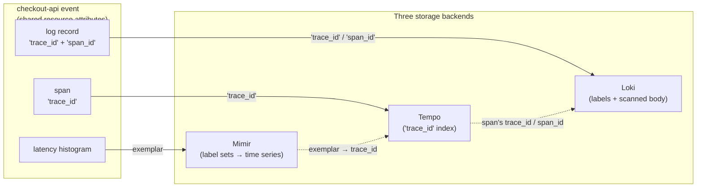

A team once told me they had full observability coverage: metrics in Mimir, logs in Loki, traces in
Tempo, all three pillars, green across the board. Then a single checkout request took nine seconds
and nobody could say why. The p99 latency panel showed the spike. The service logs showed nothing
unusual in the surrounding noise. The traces existed, but nobody could find the one that mattered.
Three pillars, three dashboards, three query languages, and zero ability to answer the only question
that counted: what happened to _this_ request. The three-pillars framing had been followed to the
letter, and it had produced three silos.

---

## TL;DR

"Metrics, logs, and traces" describes three storage backends — Mimir, Loki, Tempo — each with a
different index model, retention window, and per-query cost. That is a data-plane fact, not an
instrumentation strategy. Organizing observability work around the three pillars produces three
separate collection efforts with no shared correlation identifiers, which is why you can see that
something is slow but not why. The fix is to instrument once with OpenTelemetry, stamp the same
resource attributes on all three signals, put `trace_id` and `span_id` into every log record, and
emit exemplars from latency histograms — so a spike in a metric is one click from the trace, and the
trace is one click from its logs.

---

## The Problem

The pillars are a storage taxonomy. Mimir indexes label sets into time series and answers aggregate
questions cheaply. Loki indexes a small label set plus structured metadata and treats the log body
as content to scan. Tempo indexes by `trace_id` and lets you query span attributes with TraceQL.
Three products, three query surfaces, three cost curves.

Because they are separate products, "add observability" gets scoped as three separate tickets, often
to three different people or sprints. The metrics work ships with a Prometheus scrape config. The
logging work ships with a shipper that predates the OpenTelemetry rollout. The tracing work ships
last, if at all, because it needs code changes. Nothing in the pillar framing says the three streams
must share an identifier, so they don't.

At 200+ workloads that compounds into 200 services each emitting three uncorrelated streams: a
metric you can't drill into, logs you full-text search by hope, and traces you can't locate from the
symptom. The measurable cost is diagnosis time. Every incident opens with a manual cross-reference
by wall-clock timestamp and service name across three tools — which is precisely the toil the
tooling was bought to remove. The pillars were populated; the system was not observable.

---

## Correct Design

**Principle: instrument the event, not the pillar.** One OpenTelemetry SDK per service, one set of
resource attributes, correlation identifiers carried into every signal. The three backends then stop
being silos and become three indexes over the same events.

| Signal  | Backend | Index model                                   | Answers alone                         | Blind alone                                 |
| ------- | ------- | --------------------------------------------- | ------------------------------------- | ------------------------------------------- |
| Metrics | Mimir   | label sets → time series                      | is it bad, and since when             | which request, which user, which code path  |
| Logs    | Loki    | labels + structured metadata; body is scanned | what a component said, verbatim       | rate, percentile, or trend without a metric |
| Traces  | Tempo   | `trace_id`; TraceQL over span attrs           | where in the call graph the time went | aggregate behavior; anything not sampled    |

Three moves turn the table's "blind alone" column into a two-click traversal:

```text
  p99 latency panel (Mimir)
        │  exemplar carries a sampled trace_id
        ▼
  the exact trace in that bucket (Tempo)
        │  span's trace_id / span_id
        ▼
  that span's log lines (Loki)   ── all three filtered by the SAME resource attributes ──
```

Drawn as a graph instead of a traversal, the same three backends collapse around one shared
identifier:



```yaml
# Context: OpenTelemetry SDK env — the pillar-shaped setup (three uncorrelated streams)

# [WRONG] logs go through a separate shipper with no trace context; histograms
# have no exemplars; nothing ties the three backends together at query time
OTEL_TRACES_EXPORTER: "otlp"
OTEL_METRICS_EXPORTER: "otlp"
OTEL_LOGS_EXPORTER: "none"            # logs handled by a legacy stdout->Loki shipper
OTEL_METRICS_EXEMPLAR_FILTER: "none"  # p99 spike -> no way to reach a real trace
# resource attributes set ad hoc per signal, so a filter means something
# different in Mimir vs Loki vs Tempo
```

```yaml
# Context: OpenTelemetry SDK env — event-shaped setup (one stream, three indexes)

# [CORRECT] one resource for all signals; trace context injected into log records;
# exemplars on so a metric spike links to a trace that was actually in the bucket
OTEL_SERVICE_NAME: "checkout-api"
OTEL_RESOURCE_ATTRIBUTES: "service.version=1.8.2,deployment.environment=aks-dgeg-checkout-prod"
OTEL_TRACES_EXPORTER: "otlp"
OTEL_METRICS_EXPORTER: "otlp"
OTEL_LOGS_EXPORTER: "otlp"                 # SDK log bridge injects trace_id/span_id
OTEL_METRICS_EXEMPLAR_FILTER: "trace_based" # attach exemplars only when sampled-in
OTEL_EXPORTER_OTLP_ENDPOINT: "http://$(NODE_IP):4317"  # local Alloy DaemonSet
OTEL_PROPAGATORS: "tracecontext,baggage"   # W3C traceparent across every hop
```

The dotted `deployment.environment` stays in OTel semantic-convention form at the SDK; Mimir and
Loki promote it to the `deployment_environment` label on ingest, and an Alloy transform brings Tempo
into line. Keeping the spelling consistent across signals is what makes a single Grafana filter
resolve the same way in all three backends.

### At hyperscale

Above a few hundred services and millions of spans per second, the two-click traversal gains a new
failure mode: tail-based sampling has already evicted the trace the exemplar points to. Two
mitigations become mandatory. Tie exemplar retention to the sampling decision so a kept exemplar
always resolves to a kept trace, and generate span metrics — RED aggregates derived from spans at
the collector — so the metric survives even when its trace does not. Clock discipline also stops
being optional: `trace_id` correlation across a large fleet assumes bounded skew, which quietly
makes NTP an observability dependency.

---

## Conclusion

Stop scoping observability as three workstreams. Scope it as one instrumentation contract — shared
resource attributes, trace context in every log record, exemplars on every latency histogram — and
treat Mimir, Loki, and Tempo as three query surfaces over one event stream. If a new service can't
get from a latency panel to the offending trace to that trace's logs in two clicks, it is not
observable yet, no matter how many of the three pillars are technically populated.

---

_Amit Singh is an Observability Architect and SRE leading a global observability transformation
across 200+ workloads spanning Azure, on-premises, and SAP RISE environments using Grafana Cloud and
OpenTelemetry. He holds a patent in the observability space._

---

**Tags:** #Observability #OpenTelemetry #Tempo #Loki #Mimir
