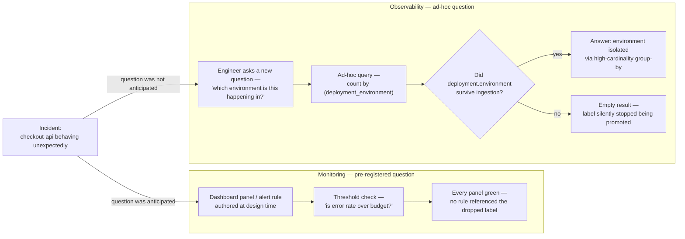

A senior engineer opened a PromQL query we had run dozens of times —
`count by (deployment_environment) (up{service="checkout-api"})` — and it came back empty. No error.
No failed scrape. No alert firing, no SLO out of budget, the on-call channel quiet. Nothing was
broken in the way monitoring understands "broken." A resource-attribute rename upstream had caused
the `deployment_environment` label to stop being promoted onto the series a few deploys earlier, and
because no alert rule and no dashboard panel referenced that label, its disappearance produced
exactly zero signal. The data needed to answer "which environment is this happening in" was gone,
and the system that was supposed to be watching had no opinion about it — because nobody had ever
told it that this was a question worth asking. The mechanics of _why_ the label dropped are a
separate story. The point here is what the gap between "green" and "answerable" actually is.

---

## TL;DR

Monitoring is a finite set of questions you decided to ask in advance — every dashboard panel and
alert rule is a hypothesis about failure, frozen at the moment it was authored. Observability is the
ability to ask a question you did not anticipate, against data you already collected, without
shipping code. The trap is treating your dashboard and alert inventory as _coverage_: if a failure
does not map to a pre-registered question, monitoring stays green while the system misbehaves. The
fix lives upstream of any dashboard — preserve high-cardinality context (resource attributes,
exemplars, span/trace attributes) at ingestion so the data can answer `group by` questions nobody
wrote down yet. Cardinality is the price of keeping that option open, and it should be a deliberate
budget, not an accident.

---

## The Problem

Monitoring works by pre-registration. Someone decides, at design time, how the system is expected to
fail — disk fills, error rate climbs, p99 latency breaches a threshold, a queue backs up — and
encodes each expectation as a panel or an alert expression. This is genuinely valuable and it is not
the thing being criticised here. For _known_ failure modes it is cheap, bounded, and fast.

Its structural limit is that it can only surface the failure modes someone predicted and wired a
check for. A failure nobody drew a panel for is invisible by construction, not by bug. The
`deployment_environment` case is the clean illustration: the label silently fell out of the series'
label set, and from monitoring's point of view _nothing happened_ — no rejected samples, no scrape
failure, no alert, because no rule selected on that label. The absence became visible only the
moment a human asked an ad-hoc question that needed it. Had the metric been pre-aggregated into a
recording rule keyed on `service` and `status` alone, we would never have found out at all — every
`group by (deployment_environment)` would have quietly returned a single bucket, forever.

The distinction people get wrong: observability is not "monitoring 2.0" or a later rung on a
maturity ladder. They are different operations on the same data. Monitoring is a materialised view —
pre-computed, always-on, answers one question instantly. Observability is ad-hoc query — you pay the
cost at question time, but you are not limited to the questions someone pre-computed. You need both,
and neither substitutes for the other.

| Dimension                | Monitoring                                         | Observability                                          |
| ------------------------ | -------------------------------------------------- | ------------------------------------------------------ |
| Question model           | Fixed set, chosen at design time                   | Open-ended, asked at query time                        |
| When the question is set | When the dashboard or alert is authored            | When you type the query, during the incident           |
| Failure modes it catches | The ones someone predicted and instrumented        | The ones nobody predicted — _if_ the data kept context |
| Cardinality posture      | Low — labels pruned and aggregated to bound series | High — context retained on the data                    |
| Cost model               | Cheap, bounded; scales with pre-defined series     | Scales with retained dimensionality and event volume   |
| What "green" means       | Every pre-registered check is within threshold     | Nothing — you still have to ask                        |

---

## Correct Design

**Principle: keep the dimensions you might need to slice by on the data at ingestion. Do not
pre-aggregate away context you cannot reconstruct later.** A dashboard is a view built on top of
observable data; it is not a mechanism for keeping the data observable.

On an OpenTelemetry + Grafana Cloud stack that is three concrete moves. Preserve resource attributes
through the collector instead of blanket-dropping them to control cardinality — decide _per
attribute_, against a cardinality estimate, not with a reflexive `delete`. Attach exemplars to RED
metrics so a spike in an aggregate carries a trace ID to pivot into: the aggregate answers "is it
bad," the exemplar answers "show me one." And generate span metrics that carry the high-cardinality
attributes (`deployment.environment`, `k8s.pod.name`, `service.version`) so a new `group by` works
after the fact in TraceQL even when a metric label has gone missing.

```river
// Context: Grafana Alloy — the "keep cardinality down" reflex applied bluntly

otelcol.processor.transform "strip" {
  error_mode = "ignore"
  metric_statements {
    context = "resource"
    // [WRONG] blanket-deletes resource attributes to shrink series count.
    // Each one is a dimension you can no longer group by later — and
    // deployment.environment is exactly how you'd answer "which env is erroring".
    statements = [
      `delete_key(attributes, "deployment.environment")`,
      `delete_key(attributes, "k8s.pod.name")`,
      `delete_key(attributes, "service.version")`,
    ]
  }
}
```

```yaml
# Context: Mimir recording rule — pre-aggregates the only queryable copy of this signal
groups:
  - name: checkout
    rules:
      # [WRONG] the recorded series keeps only service + status. Once raw samples
      # age out of the retention window, "error rate by deployment_environment"
      # is unanswerable — the dimension was never written down.
      - record: job:http_requests:rate5m
        expr: sum by (service, status) (rate(http_requests_total[5m]))
```

```river
// Context: Grafana Alloy — dimensionality preserved deliberately, with exemplars

otelcol.connector.spanmetrics "gen" {
  // [CORRECT] span metrics carry the attributes you may need to slice by; the
  // dotted keys stay intact so the backend's own promotion logic still matches.
  dimension { name = "deployment.environment" }
  dimension { name = "service.version" }
  histogram { explicit { } }
  exemplars { enabled = true }   // every bucket keeps a trace ID to pivot into
}

otelcol.processor.transform "prune" {
  error_mode = "ignore"
  metric_statements {
    context = "datapoint"
    // [CORRECT] drop ONE attribute, named, because its cardinality was measured
    // (per-request build hash — unbounded). Everything else is kept.
    statements = [`delete_key(attributes, "build.commit_sha")`]
  }
}
```

```text
                      raw telemetry (spans, metrics, logs — with context)
                                          │
                          ingest: keep dimensions deliberately
                          (resource attrs · exemplars · span metrics)
                                          │
                 ┌────────────────────────┴────────────────────────┐
                 ▼                                                 ▼
        MONITORING                                        OBSERVABILITY
   dashboards + alert rules                        ad-hoc query at incident time
   questions fixed at design time                 new group-by / filter / dimension
   cheap · bounded · always-on                    no deploy, no new instrumentation
   "is a known threshold breached?"               "why is THIS cohort different?"
                 │                                                 │
        catches known-unknowns                          catches unknown-unknowns —
                                                    only if the dimension survived ingest
```

Both paths hang off the same ingest step. If ingest drops a dimension, the ad-hoc path cannot
recover it any more than the dashboard can — which is why the interesting decisions are made in the
collector config, not in Grafana. At fleet scale this becomes an economic problem rather than a
config one: retaining every dimension on every service is not affordable, so the choice of which
context to keep turns into a cardinality budget owned by the platform team, priced per attribute
across every service-and-environment combination.

Traced from the single incident that opened this post, the fork between the two paths looks like
this:



---

## Conclusion

Three things to do differently starting tomorrow. Audit what your alerts structurally _cannot_ ask —
list the dimensions your recording rules and alert expressions never reference, and treat any
failure that lives in those dimensions as currently invisible. Stop reporting dashboard count or
alert count as observability coverage; those measure how many questions you froze, not how many you
can answer. And treat every `delete_key` and every `sum by` as a decision that removes a future
question — make it deliberately, with a cardinality estimate, not as a reflex. Monitoring tells you
a known threshold broke. Observability is what you have left when the failure is not one you
predicted.

---

_Amit Singh is an Observability Architect and SRE leading a global observability transformation
across 200+ workloads spanning Azure, on-premises, and SAP RISE environments using Grafana Cloud and
OpenTelemetry. He holds a patent in the observability space._

---

**Tags:** #Observability #OpenTelemetry #SRE #Grafana #Prometheus
