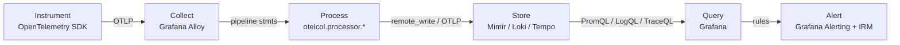

When we ran the platform selection for the platform I lead, we evaluated four complete observability
stacks: self-hosted Prometheus plus Grafana, Azure Monitor, Grafana Enterprise, and Grafana Cloud.
What struck me during the PoC was that the architecture diagram barely changed between them. The
same six boxes, left to right, in the same order. Only the labels inside the boxes changed. A
beginner staring at a wall of tool names — Prometheus, Mimir, Loki, Tempo, Jaeger, Alloy, Fluent
Bit, OpenTelemetry, Grafana — is looking at the labels. The thing worth learning is the boxes.

---

## TL;DR

Modern observability is a six-stage pipeline: instrument → collect → process/route → store → query →
alert. Every product you can name is an implementation of exactly one stage, and the contract at
each stage boundary is stable even when the implementation is not — OTLP between instrument and
collect, `remote_write` or OTLP at the storage edge, PromQL/LogQL/TraceQL at query. Learn the stage
boundaries and their contracts and a vendor migration becomes a slot swap, not a re-learn. Tie your
instrumentation directly to a vendor's proprietary endpoint and every stage downstream is now
load-bearing on that choice.

---

## The Problem

Beginner material is almost always tool-shaped: "install Prometheus, install Grafana, add a data
source, install Loki, install Promtail." You end up able to operate a specific 2021-era stack and
unable to reason about anything else. When the org standardizes on OTLP, or moves to a managed
backend, or adds traces, the knowledge doesn't transfer, because it was never organized around what
each tool _does in the pipeline_ — only around its install steps.

This also produces a worse architectural habit: coupling. If the first thing you learn is "point the
app's metrics at Prometheus," you learn to wire instrumentation straight to a storage backend. That
skips the collect and process stages entirely. Now the application knows the name of your metrics
database. Changing backends, adding a second destination, redacting a field in flight, or batching
to survive a backend blip all become code changes across every service instead of one change in one
collector config. The pipeline has stages for a reason; each boundary is a place you can change one
side without touching the other.

---

## Correct Design

**Principle: know the stage, its job, and the contract at its edge. The implementation in the slot
is a detail you can change later.**

| Stage      | Its job                                  | Contract at its edge                 | This platform's slot           | Other implementations              |
| ---------- | ---------------------------------------- | ------------------------------------ | ------------------------------ | ---------------------------------- |
| Instrument | Emit signals from code + infra           | OTLP (gRPC/HTTP)                     | OpenTelemetry SDK + auto-instr | Prometheus client libs, Micrometer |
| Collect    | Receive locally, add resource attributes | OTLP in; OTLP/`remote_write` out     | Grafana Alloy (DaemonSet)      | OTel Collector, Fluent Bit, Vector |
| Process    | Batch, sample, drop, redact, route       | pipeline stmts / processors          | Alloy `otelcol.processor.*`    | OTel Collector processors          |
| Store      | Index and retain per signal              | `remote_write` / OTLP / TraceQL push | Mimir, Loki, Tempo             | Prometheus, Elasticsearch, Jaeger  |
| Query      | Answer questions over stored signals     | PromQL, LogQL, TraceQL               | Grafana + Mimir/Loki/Tempo     | Prometheus UI, Kibana, Jaeger UI   |
| Alert      | Evaluate rules, route notifications      | Alertmanager API / rules             | Grafana Alerting + IRM         | Alertmanager, PagerDuty rules      |

The same six stages, drawn as a flowchart, with this platform's slot under each stage name and the
contract labeling the edge between them:



The one rule a beginner should internalize first is: instrumentation talks to the collector, never
to the store.

```yaml
# Context: OpenTelemetry SDK env in a service — pipeline stages collapsed

# [WRONG] instrumentation wired straight to a storage backend's ingest URL.
# The app now knows the name of the metrics database. Adding a second
# destination, redacting a field, or surviving a backend blip = code change
# in every service.
OTEL_EXPORTER_OTLP_METRICS_ENDPOINT: "https://prometheus.example.net/api/v1/otlp"
OTEL_EXPORTER_OTLP_METRICS_HEADERS: "Authorization=Bearer <prod-mimir-token>"
```

```yaml
# Context: OpenTelemetry SDK env in a service — stage boundary preserved

# [CORRECT] instrumentation targets the local collector only. Everything
# about routing, auth, batching, redaction, and backend choice lives in one
# Alloy config, changed once instead of per service.
OTEL_EXPORTER_OTLP_ENDPOINT: "http://$(NODE_IP):4317"   # local Alloy DaemonSet
OTEL_RESOURCE_ATTRIBUTES: "service.version=1.4.0,deployment.environment=aks-daia-infra-qa"
# the app carries no backend URL and no backend credential
```

With the boundary intact, the four stacks we evaluated differ only in which product sits in the
Store and Query slots and whether you run it or a vendor does. The migration from a self-hosted
Prometheus to Grafana Cloud Mimir was a change to one `otelcol.exporter` block and a credential —
because the app was talking to Alloy, not to Prometheus.

### At hyperscale

The six boxes don't multiply, but one of them splits. At fleet scale the collect stage becomes a
tier: per-node agents forward to regional gateway collectors that do tail sampling, cardinality
enforcement, and per-tenant routing before anything reaches storage. The boundary contracts are
unchanged — OTLP in, OTLP or `remote_write` out — so the model still holds; there's just a second
collector layer inside the same box. The payoff shows up at the query contract: because PromQL,
LogQL, and TraceQL are stable, swapping a self-hosted store for a managed one doesn't rewrite ten
thousand dashboards.

---

## Conclusion

Before you learn a tool, place it in the pipeline: which stage, what it takes in, what it emits.
Teach new engineers the six stages and the three contracts (OTLP, `remote_write`, the query
languages) before any product name. And never let a service export straight to a storage backend —
put a collector in the middle on day one, so every later decision about routing, cost, and redaction
is a config change instead of a fleet-wide redeploy.

---

_Amit Singh is an Observability Architect and SRE leading a global observability transformation
across 200+ workloads spanning Azure, on-premises, and SAP RISE environments using Grafana Cloud and
OpenTelemetry. He holds a patent in the observability space._

---

**Tags:** #Observability #OpenTelemetry #Alloy #Grafana #PlatformEngineering
