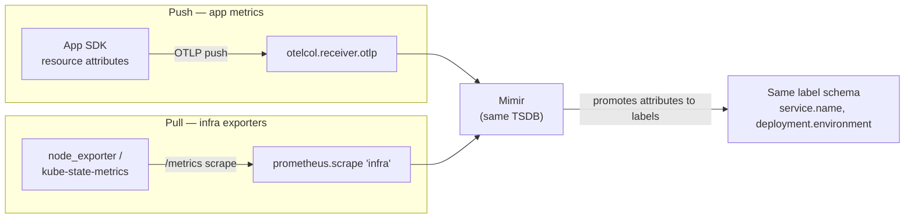

Every team migrating metrics to OpenTelemetry gets stuck on the same question first: do we push or
pull? It's the wrong place to start. For application metrics the answer is push via a collector, and
it's not close. The decisions that actually change how your metrics behave are the ones nobody
argues about: whether resource attributes get promoted to labels or dropped, whether latency
histograms carry exemplars, and whether your instruments export delta or cumulative temporality. Get
the push-pull question "right" and botch those three, and you've built a more complicated
Prometheus.

---

## TL;DR

Push versus pull is a deployment detail; OTLP push through Alloy wins for app metrics because it
decouples the service from the backend and survives backend blips through the collector's queue.
Pull still has a place for infrastructure exporters. The real rethink is threefold: let the
collector promote OpenTelemetry resource attributes to labels instead of hand-writing relabel rules,
turn on exemplars so a metric spike links to a real trace, and choose metric temporality
deliberately rather than inheriting whatever the SDK defaults to. Porting a `prometheus.yml` scrape
plus relabel block straight into an OTLP pipeline reproduces its limitations in a new syntax.

---

## The Problem

Prometheus-era metrics collection has a specific shape: the server scrapes `/metrics` endpoints it
discovers via service discovery, then a stack of `relabel_configs` rewrites, keeps, and drops labels
on the way in. Teams internalize that shape so thoroughly that when they move to OTLP they recreate
it — service discovery becomes a receiver, `relabel_configs` become `metric_relabel`-style processor
rules, and the mental model is unchanged.

That port misses what OTLP actually gives you. In the OpenTelemetry model, identity lives in
_resource attributes_ — `service.name`, `service.namespace`, `deployment.environment`,
`k8s.cluster.name` — set once at the SDK and attached to every metric, log, and span from that
workload. Mimir promotes a defined list of those dotted attributes to Prometheus labels on ingest.
If you instead strip them in a processor and re-derive labels from scratch, you've thrown away the
one mechanism that keeps identity consistent across all three signals, and you're back to
maintaining a relabel stack.

Two more things get left on the floor. Exemplars — the sampled `trace_id` attached to a histogram
bucket — are what turn a p99 spike into a click-through to the trace that caused it; a lifted scrape
config never had them. And metric temporality (delta vs cumulative) is a real choice with real
consequences for restarts, rate math, and cost, but it silently inherits the SDK default when nobody
decides.

---

## Correct Design

**Principle: push app metrics through the collector, let resource attributes carry identity, and
turn on the OTLP-era features a scrape config never had.**

| Concern           | Prometheus-era default                       | OTLP-era choice                                             |
| ----------------- | -------------------------------------------- | ----------------------------------------------------------- |
| Transport         | Server scrapes `/metrics` (pull)             | SDK pushes OTLP to a local Alloy; Alloy `remote_write`s     |
| Identity / labels | `relabel_configs` rewrite scraped labels     | Resource attributes set at SDK; Mimir promotes on ingest    |
| Backend coupling  | App exposes an endpoint the server knows     | App knows only the local collector                          |
| Metric → trace    | Not available                                | Exemplars on histograms                                     |
| Restart behavior  | Cumulative counters; `rate()` handles resets | Choose: cumulative (Prometheus-native) or delta (stateless) |
| Infra exporters   | Pull (node, kube-state, cAdvisor)            | Keep pull — annotations tell Alloy what to scrape           |

```river
// Context: Alloy — a lifted-and-shifted Prometheus scrape + relabel stack

// [WRONG] recreates prometheus.yml in Alloy syntax. Resource attributes are
// discarded and labels are hand-rebuilt; no exemplars; identity now drifts
// from what logs and traces carry for the same workload.
prometheus.scrape "apps" {
  targets    = discovery.kubernetes.pods.targets
  forward_to = [prometheus.relabel.rewrite.receiver]
}
prometheus.relabel "rewrite" {
  rule { source_labels = ["__meta_kubernetes_pod_label_app"], target_label = "service" }
  rule { source_labels = ["__meta_kubernetes_namespace"],     target_label = "ns" }
  forward_to = [prometheus.remote_write.grafana_cloud.receiver]
}
```

```river
// Context: Alloy — OTLP push for app metrics, pull kept only for infra exporters

// [CORRECT] app metrics arrive over OTLP carrying resource attributes; the
// batch processor forwards them and Mimir promotes service.name /
// deployment.environment to labels. Exemplars pass through untouched.
otelcol.receiver.otlp "default" {
  grpc { endpoint = "0.0.0.0:4317" }
  output { metrics = [otelcol.processor.batch.default.input] }
}
otelcol.processor.batch "default" {
  output { metrics = [otelcol.exporter.otlphttp.grafana_cloud.input] }
}
// infra exporters (node_exporter, kube-state-metrics) stay on pull:
prometheus.scrape "infra" {
  targets    = discovery.relabel.annotated.output   // k8s.grafana.com/scrape="true"
  forward_to = [prometheus.remote_write.grafana_cloud.receiver]
}
```

Keep the dotted attribute spelling (`deployment.environment`, not `deployment_environment`) at the
SDK so Mimir's promotion list matches; pre-converting upstream silently fails the match.

Drawn out, push and pull stop looking like competitors — they're two transports feeding the same
backend under the same label contract:



### At hyperscale

At fleet scale the temporality choice stops being academic. Delta metrics are stateless: they
survive collector restarts and horizontal autoscaling of the collect tier without counter-reset
artifacts, which matters when that tier scales in and out on load. Cumulative keeps `rate()` cheap
but pins per-series state somewhere that has to persist across restarts. A large elastic collector
fleet is the case for delta at the SDK, converted to cumulative at the storage edge only if the
backend requires it.

---

## Conclusion

Stop debating push versus pull and make the three decisions that matter: push app metrics through
Alloy, keep infra exporters on pull, and let resource attributes carry identity instead of a relabel
stack. Turn exemplars on for every latency histogram. Pick a metric temporality on purpose and write
down why. If your OTLP pipeline is a transliterated `prometheus.yml`, you did the migration without
getting the upgrade.

---

_Amit Singh is an Observability Architect and SRE leading a global observability transformation
across 200+ workloads spanning Azure, on-premises, and SAP RISE environments using Grafana Cloud and
OpenTelemetry. He holds a patent in the observability space._

---

**Tags:** #Observability #OpenTelemetry #Prometheus #Mimir #Alloy
