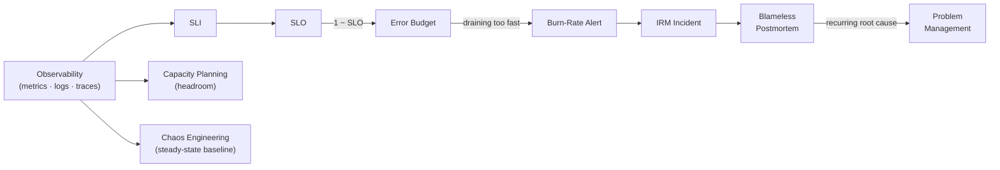

Ask an SRE what they do and you'll hear a list of practices: define SLOs, manage error budgets, run
burn-rate alerts, coordinate incidents, write blameless postmortems, plan capacity, run gamedays.
Every item on that list takes observability data as its input. If the signal layer underneath is
wrong — SLIs computed from metrics with silent gaps, alerts wired to a proxy that says "healthy"
when it isn't — every practice above it inherits the error and dresses it up as rigor. The
reliability work isn't the foundation. The signal layer is.

---

## TL;DR

SRE practices form a dependency chain rooted in observability: raw signals feed SLIs, SLIs feed
SLOs, SLOs feed error budgets, budgets feed burn-rate alerts and release decisions, alerts feed
incident response, incidents feed postmortems and problem management. Capacity planning and chaos
engineering hang off the same root. A defect in the signal layer propagates up the whole chain
silently, because nothing downstream re-checks its inputs. "Reactive to Resilient to Autonomous" is
a description of the signal layer maturing — and correlation and automation only cut alert noise
(80%+ in our case) once the signals were good enough to correlate against.

---

## The Problem

The chain is real and it is directional. An SLI is a ratio of good events to valid events, computed
from metrics or logs. An SLO is a target on that SLI. An error budget is `1 − SLO` over the window.
A burn-rate alert fires when the budget is draining too fast. A release freeze is triggered when the
budget is exhausted. An incident is declared, coordinated in IRM, and closed with a postmortem;
recurring root causes feed problem management. Every arrow in that sentence carries observability
data forward.

The failure mode is that a defect at the root is invisible everywhere above it. If a recording rule
computes an SLI with an `or on() vector(1)` fallback that masks missing data, the SLI reads 100%
during an outage, the SLO looks met, the error budget looks healthy, no burn-rate alert fires, and
the first signal anyone gets is a customer. Every layer did its job correctly on the input it was
given. The input was wrong. Teams adopt SRE practices — write the SLO doc, schedule the gameday — on
top of a signal layer nobody stress-tested, and get the ceremony of reliability without the
property.

---

## Correct Design

**Principle: treat the signal layer as the load-bearing dependency it is. Validate SLIs against
known-bad conditions before anything consumes them, and make missing data fail loud.**

```text
            observability signal layer  (metrics · logs · traces · exemplars)
                          │
             ┌────────────┼───────────────┬─────────────────┐
             ▼            ▼               ▼                 ▼
            SLI      capacity model   chaos steady-state   deploy/DORA signal
             │        (headroom)       baseline
             ▼
            SLO ──► error budget ──► burn-rate alert ──► IRM incident ──► postmortem ──► problem mgmt
```

| SRE practice         | Observability input it requires                    | Failure mode if the input is bad                         |
| -------------------- | -------------------------------------------------- | -------------------------------------------------------- |
| SLO / error budget   | An SLI that is correct under partial data loss     | Budget reads healthy through an outage; no freeze        |
| Burn-rate alerting   | Continuous, gap-free SLI series                    | Alert never fires, or fires on scrape gaps not real burn |
| Incident response    | Correlated metrics/logs/traces per service         | Responders reconstruct state by hand; MTTR inflates      |
| Blameless postmortem | A trustworthy timeline (deploy marks, trace spans) | RCA argues about what happened instead of why            |
| Capacity planning    | Utilization + saturation history with headroom     | Forecasts off a biased baseline; scale late              |
| Chaos engineering    | A measurable steady-state before fault injection   | Can't tell whether the experiment proved anything        |

Every row above traces back to the same root — one dependency graph, not six independent practices:



```yaml
# Context: Mimir recording rule for an availability SLI

# [WRONG] the vector(1) fallback makes "no data" read as "100% good". The SLO,
# the error budget, and every burn-rate alert above it now lie during an outage.
groups:
  - name: slo-checkout
    rules:
      - record: sli:checkout_availability:ratio_rate5m
        expr: |
          sum(rate(http_server_requests_total{service_name="checkout-api",http_status_class!="5xx"}[5m]))
          /
          sum(rate(http_server_requests_total{service_name="checkout-api"}[5m]))
          or on() vector(1)
```

```yaml
# Context: same SLI, made honest about missing data

# [CORRECT] no masking. If the series goes absent, downstream absence alerts
# fire instead of a fake 100%. valid-events denominator is explicit.
groups:
  - name: slo-checkout
    rules:
      - record: sli:checkout_valid:rate5m
        expr: sum(rate(http_server_requests_total{service_name="checkout-api"}[5m]))
      - record: sli:checkout_good:rate5m
        expr: sum(rate(http_server_requests_total{service_name="checkout-api",http_status_class!="5xx"}[5m]))
      - record: sli:checkout_availability:ratio_rate5m
        expr: sli:checkout_good:rate5m / sli:checkout_valid:rate5m
      - alert: CheckoutSLIAbsent
        expr: absent(sli:checkout_valid:rate5m)
        for: 10m
```

### At hyperscale

At thousands of services the signal layer gets its own SLO — freshness, completeness, and
cardinality-within-budget — plus a meta-monitoring path that does not travel through the pipeline it
watches. When every team's SLO is computed by one shared recording-rule engine, that ruler's
evaluation lag is a single point of failure that silently degrades every downstream budget at once,
so the ruler's own lag has to be a paging signal. The chain doesn't get shorter at scale; it gets
more load-bearing.

---

## Conclusion

Before you invest in SLO workshops or gamedays, audit the signal layer they will consume. Write the
known-bad tests: kill a scrape target, drop a label, break a downstream, and confirm the SLI, the
budget, and the burn-rate alert all react the way you expect. Make missing data page, not resolve.
An SRE practice built on an unverified signal layer isn't reliability engineering — it's reliability
theater with better dashboards.

---

_Amit Singh is an Observability Architect and SRE leading a global observability transformation
across 200+ workloads spanning Azure, on-premises, and SAP RISE environments using Grafana Cloud and
OpenTelemetry. He holds a patent in the observability space._

---

**Tags:** #SRE #Observability #IncidentResponse #AIOps #SystemDesign
