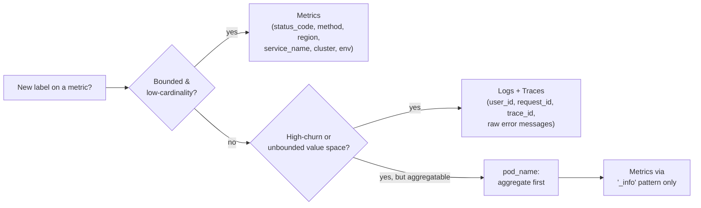

I've seen it happen three times now at different organisations. The team rolls out Prometheus.
Everyone loves it. Then, six months in, someone adds a `request_id` label to an HTTP duration
histogram, and ingestion costs triple overnight.

Cardinality isn't just a performance problem. It's a cost problem, a reliability problem, and — if
left unchecked — a reason the platform gets defunded.

## What cardinality actually means

Every unique combination of label values creates a new time series. A metric like:

```
http_request_duration_seconds{method="GET", status="200", path="/api/v1/users"}
```

...is one time series. Add a `user_id` label with a million distinct users, and you now have a
million time series from a single metric.

**Active series** are what Prometheus and Mimir actually store in memory and on disk. The ingestion
cost of Grafana Cloud (or any hosted Prometheus service) scales directly with active series count.
At the time of writing, most providers charge in the range of $0.50–$1.00 per million active series
per month. That sounds cheap until you have 50 million series from a careless label.

## The patterns that cause cardinality explosions

**High-churn labels.** Anything that's unique per request or session:

- `request_id`, `trace_id`, `session_id`
- `user_id`, `customer_id` (unless cardinality is genuinely bounded)
- Raw timestamps in any form
- Kubernetes pod names without aggregation (pods restart and generate new unique values)

**Unbounded enumerations.** Labels where the value space grows with data:

- URL paths without normalisation (`/user/12345` vs `/user/67890` are two different series)
- Free-text error messages
- Version strings without a cardinality cap

**Metric explosion from instrumentation libraries.** Some framework-level auto-instrumentation
(looking at you, some JDBC integrations) emits per-query metrics with the raw SQL as a label. This
is catastrophic.

## How to detect it before it kills you

Mimir and Prometheus both expose cardinality APIs:

```bash
# Top series contributors — run this before any new label ships
curl -s 'http://prometheus:9090/api/v1/label/__name__/values' | jq '.data | length'

# Per-metric cardinality (Mimir)
curl -s 'https://mimir.your-tenant.grafana.net/api/v1/cardinality/active_series?selector={job="my-service"}' \
  -H "Authorization: Bearer $MIMIR_TOKEN" | jq '.cardinality_sum'
```

Internally, we added a cardinality gate as part of every Alloy pipeline review. Before any new label
ships to Grafana Cloud, we run:

```bash
promtool check rules rules.yml
alloy fmt config.alloy
```

...and estimate the series count manually using this formula:

```
active_series ≈ unique_values(label_A) × unique_values(label_B) × ... × scrape_interval_multiplier
```

If the estimate exceeds our cardinality budget for that team (typically 50k series per service), the
label gets pushed to logs or traces as an attribute instead.

## The label schema discipline that scales

The rule we enforce across our fleet:

> **High-churn labels belong in logs and traces, not metrics.**

Metrics are aggregates. They answer "how many requests failed with a 500 in the last 5 minutes?" —
not "which user saw this specific error?" That question belongs in Loki or Tempo with an exemplar
linking the metric to the trace.

Our label policy in practice:

| Label type                          | Destination                             |
| ----------------------------------- | --------------------------------------- |
| `status_code`, `method`, `region`   | Metrics (bounded, low cardinality)      |
| `service_name`, `cluster`, `env`    | Metrics (bounded by design)             |
| `user_id`, `request_id`, `trace_id` | Logs + Traces only                      |
| `pod_name`                          | Metrics only via `_info` metric pattern |
| Raw error messages                  | Logs only                               |

The decision boils down to one gate applied to every label before it ships:



The OpenTelemetry Collector (and Grafana Alloy) both support label transforms that let you drop,
hash, or aggregate before data reaches the TSDB. We use `transform/drop_high_churn` processors
heavily:

```yaml
# Alloy pipeline: drop high-churn labels before Mimir write
prometheus.relabel "cardinality_guard" {
  rule {
    source_labels = ["request_id"]
    action = "labeldrop"
  }
  rule {
    source_labels = ["user_id"]
    action = "labeldrop"
  }
}
```

## The FinOps lens

At the scale we operate (hundreds of services, multiple AKS clusters), a cardinality discipline is a
direct budget control. We run a monthly ingestion report against our Grafana Cloud usage API and
attribute costs back to teams by `job` label. When a team's ingestion spikes, the first question is
always: _what new label did you add?_

This accountability loop — cost visibility to team level — is what actually changes behaviour. Rules
and docs don't. Seeing your team's line item double on the monthly dashboard does.

## Closing thought

Cardinality governance isn't glamorous, but it's one of the highest-leverage practices in platform
observability. Every label you add is a commitment to carrying that cardinality for the life of the
service. Treat label additions the way you treat adding a new column to a high-traffic database
table: plan it, estimate it, gate it.

The platforms that scale well are the ones where engineers understand that **metrics are
contracts**, not free annotations.
