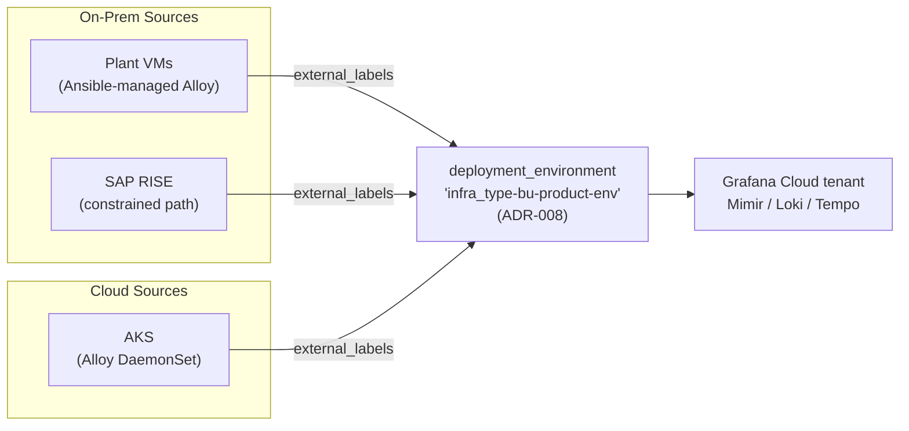

Every hybrid observability project starts by solving the visible problem: get a collector running in
AKS, on the plant-floor VMs, and in the SAP RISE landscape, all shipping to one backend. That part
is mechanical. The part that decides whether the platform actually scales is invisible until someone
writes a query that has to span all three — "error rate for this product across every environment" —
and discovers that `prod`, `production`, `PROD`, and `aks-prod` are all in use, that `service.name`
means the service in one environment and the business unit in another, and that the cost dashboard's
`prod` bucket contains AKS, VMs, and three business units with no way to separate them.

---

## TL;DR

Hybrid and multi-cloud observability is a naming problem wearing an infrastructure costume. The
collectors are easy; the label schema is the load-bearing decision. Enforce one compound environment
label, set at the collector layer as a constant external label, with every segment mandatory — if a
dimension is unknown at deploy time the pipeline isn't ready to onboard. Keep service identity on
the OpenTelemetry-standard mapping even when a vendor proposes their own, and validate the schema
against the live tenant rather than anyone's preference. Then one query resolves the same way across
AKS, on-prem, and RISE, and cost attribution has real dimensions.

---

## The Problem

When each environment's team owns its own collector config, each one picks its own label values.
Nothing forces agreement, so you get drift: `env=prod` here, `environment=production` there,
`deployment_environment=aks-prod` in a third place. Cross-environment queries now need an `OR` per
spelling, and any new environment silently falls out of existing dashboards until someone notices.

Service identity drifts the same way. The OpenTelemetry semantic convention is `service.name` = the
service and `service.namespace` = the owning team. A vendor's professional-services team may propose
repurposing `service.name` as the business unit and `service.namespace` as the product, because it
makes their out-of-the-box cost view look tidy. Accept that in one environment and not another and
the same series means two different things depending on where it originated.

The bill is where this hurts most. Grafana Cloud's cost-attribution view groups ingest spend by the
value of `deployment_environment` on every write. If that label is a flat `prod`, the most expensive
question you can answer is "how much does prod cost" — not which business unit, product, or
infrastructure type is driving it. At 200+ workloads across Azure, on-prem plants, and RISE, that's
the difference between a FinOps conversation and a shrug.

---

## Correct Design

**Principle: one schema, enforced at the collector layer, no segment optional. The application never
sets these labels; the pipeline does.**

The platform I lead standardizes this (internally, ADR-008), making `deployment_environment` a
compound value:

```
<infra_type>-<bu>-<product>-<env>      e.g.  aks-dgeg-mdixai-prod
```

`infra_type` ∈ `{aks, vm, aca, ot}`; `bu` and `product` from an approved list; `env` ∈
`{dev, qa, prod}`. All lowercase, single-hyphen joined, set as a constant external label at Alloy —
never in application code. No segment may be omitted; an unknown segment means the workload isn't
ready to onboard. Service identity stays on the OTel-standard mapping (`service.name` = service,
`service.namespace` = team), a decision validated against our live production Grafana Cloud tenant
with `gcx` rather than adopted on a vendor's say-so.

However heterogeneous the sources, they converge on one schema before they ever reach the backend:



| Decision                          | Rule                                                 | Failure it prevents                                |
| --------------------------------- | ---------------------------------------------------- | -------------------------------------------------- |
| Compound `deployment_environment` | `<infra_type>-<bu>-<product>-<env>`, set at Alloy    | Unattributable `prod` blob in the cost dashboard   |
| No optional segments              | Missing dimension → not ready to onboard             | Silent drift; environments falling out of queries  |
| Service identity = OTel semconv   | `service.name` = service, `service.namespace` = team | Same series meaning two things across environments |
| Set at collector, not app         | Constant `external_labels` rendered per environment  | 200 services each free to invent their own values  |
| Validate against the live tenant  | Check with `gcx`, not preference                     | Adopting a schema that the backend doesn't honor   |

```river
// Context: Alloy config maintained separately per environment

// [WRONG] each environment's config invents its own env label. Cross-environment
// queries need an OR per spelling; the cost view can't attribute spend.
prometheus.remote_write "grafana_cloud" {
  external_labels = {
    env = "production",          // on-prem VMs use "prod"; ACA uses "aks-prod"
    team = "checkout",           // elsewhere this key is "squad" or "owner"
  }
  endpoint { url = "https://prometheus-prod-.../api/prom/push" }
}
```

```river
// Context: one templated Alloy block, rendered per environment from Helm/Terraform

// [CORRECT] identical keys everywhere; only the values are substituted. A query
// filtering deployment_environment=~"aks-dgeg-.*" works across every environment.
prometheus.remote_write "grafana_cloud" {
  external_labels = {
    deployment_environment = env.INFRA_TYPE + "-" + env.BU + "-" + env.PRODUCT + "-" + env.ENV,
    // e.g. "vm-supply-chain-hwa-prod" / "ot-daia-plc-prod" / "aks-dgeg-mdixai-prod"
  }
  endpoint { url = env.GC_PROM_URL }   // glc_ access-policy token, not glsa_
}
```

The collection plane can be as heterogeneous as the infrastructure demands — an Alloy DaemonSet in
AKS, Ansible-managed Alloy on plant VMs, a constrained path for RISE — as long as every one of them
stamps the same label keys. Scale comes from the schema being identical, not from the collectors
being identical.

### At hyperscale

Past a few thousand workloads the schema needs a registry, not a wiki page: an enforced allowlist of
`bu` and `product` segment values, validated in CI, with a request workflow for new ones. OTel's
`schema_url` is the primitive most large pipelines under-use for exactly this. And because every
promoted label is a cardinality decision priced across every environment-and-product combination,
schema governance and FinOps governance stop being separate reviews — the person approving a new
segment value is also approving its series-count bill.

---

## Conclusion

Write the label schema before you deploy the second collector. Make every environment label compound
and mandatory, set it at the collector layer, keep service identity on the OpenTelemetry convention,
and enforce it in the Alloy config template rather than trusting 200 teams to comply. Then test it:
run one query across every environment and confirm it needs no per-source `OR`. If it does, you have
a collection fleet, not a platform.

---

_Amit Singh is an Observability Architect and SRE leading a global observability transformation
across 200+ workloads spanning Azure, on-premises, and SAP RISE environments using Grafana Cloud and
OpenTelemetry. He holds a patent in the observability space._

---

**Tags:** #Observability #Alloy #Grafana #PlatformEngineering #FinOps
