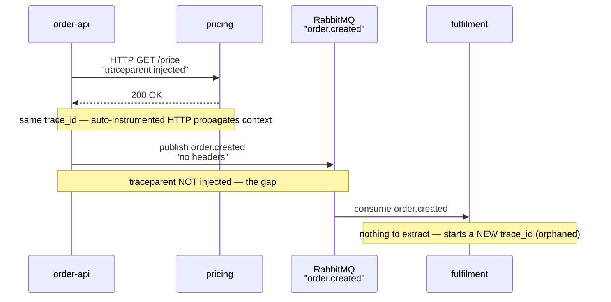

The demo of distributed tracing always looks the same: a request hits the gateway, fans out to four
services, and the waterfall shows exactly which downstream call ate the latency. Then you deploy it
against a real system and the waterfall stops at the edge of a message queue. The producer's span
ends; the consumer starts a brand-new trace. Tempo now holds two fragments with no link between
them, and the request you're trying to debug — the one that took nine seconds — is split across two
`trace_id`s you can't join. Tracing didn't fail loudly. It just quietly stopped covering the part of
the path where the time actually went.

---

## TL;DR

A trace is only as complete as its least-instrumented hop. Context propagation — carrying the W3C
`traceparent` from one unit of work to the next — is what makes spans part of the same trace.
Auto-instrumentation handles synchronous HTTP and gRPC well and handles almost nothing else: message
queues, cron and batch jobs, webhooks, third-party callbacks, and legacy proxies all drop the
context unless you carry it explicitly. The fix is to treat every asynchronous or external boundary
as a propagation point: inject `traceparent` into message headers on the way out, extract it on the
way in, and wrap any hop you can't instrument in a manual span so the gap is visible instead of
silent.

---

## The Problem

Context propagation works by convention. On a synchronous HTTP call, the OpenTelemetry
instrumentation injects a `traceparent` header on the client and extracts it on the server, so the
server's spans attach to the caller's trace. That convention only holds where instrumentation is
actually running on both sides and the transport carries headers the way HTTP does.

Every other boundary is a place the chain can snap. A message published to a queue carries the
producer's context only if the producer explicitly writes it into the message headers and the
consumer explicitly reads it back. A batch job triggered by cron has no inbound request to extract
from, so it starts fresh. A call through an old reverse proxy that strips unknown headers arrives
context-free. A third-party webhook comes back with no trace at all. In each case the tooling does
not error — it does the correct thing for a request with no parent context, which is to begin a new
trace.

The operational cost shows up during incidents. Tail-based sampling at the collector is configured
to always keep errors and high-latency outliers, so the slow request _is_ retained — but it's
retained as two disconnected fragments. The responder sees a producer trace that ends at "published
to queue" and, if they're lucky enough to find it, a consumer trace that begins at "received from
queue," with no shared identifier and a nine-second gap that no single view explains. MTTR absorbs
the time it takes to reconstruct the join by hand.

---

## Correct Design

**Principle: every boundary that isn't a plain synchronous HTTP/gRPC call is a propagation point you
own. Carry the context across it, or wrap it in a span so the gap is explicit.**

```text
  [order-api] --HTTP--> [pricing]        auto-instrumented: traceparent flows, spans join
       │
       └── publish(order.created) ──▶ [ RabbitMQ ]  ──▶ consume ──▶ [fulfilment]
                    ▲                                      ▲
            inject traceparent                    extract traceparent
            into message headers                  from message headers
            (WITHOUT this: fulfilment starts a new trace; the chain snaps here)
```

The sequence view makes the same break explicit in time order — the `trace_id` carries across the
instrumented HTTP hop and dies at the queue:



```python
# Context: publishing to a queue — the common silent break

# [WRONG] the message body carries domain data but no trace context. The
# consumer has nothing to extract, so it starts a new trace. Producer and
# consumer spans end up in two unrelated Tempo traces.
def publish_order_created(channel, order):
    channel.basic_publish(
        exchange="orders",
        routing_key="order.created",
        body=json.dumps(order),
        # no headers -> no traceparent -> broken trace
    )
```

```python
# Context: same publish, context propagated across the async boundary

# [CORRECT] inject the current context into message headers on send; the
# consumer extracts it and continues the SAME trace. The queue hop becomes
# one visible span instead of a gap.
from opentelemetry import propagate, trace

def publish_order_created(channel, order):
    headers = {}
    propagate.inject(headers)  # writes W3C traceparent (+ tracestate) into headers
    with trace.get_tracer(__name__).start_as_current_span(
        "order.created publish", kind=trace.SpanKind.PRODUCER
    ):
        channel.basic_publish(
            exchange="orders",
            routing_key="order.created",
            body=json.dumps(order),
            properties=pika.BasicProperties(headers=headers),
        )

# consumer side: ctx = propagate.extract(msg.headers); start CONSUMER span with ctx
```

| Boundary                         | Does auto-instr propagate? | What you must do                                   |
| -------------------------------- | -------------------------- | -------------------------------------------------- |
| Sync HTTP / gRPC                 | Yes                        | Nothing — verify `OTEL_PROPAGATORS=tracecontext`   |
| Message queue / event bus        | No                         | Inject on publish, extract on consume              |
| Cron / scheduled batch job       | No (no inbound context)    | Start a root span per run; link to a triggering ID |
| Third-party webhook / callback   | No                         | Carry an ID you control; stitch with span links    |
| Legacy proxy that strips headers | No                         | Allowlist `traceparent`; add a boundary span       |

Keep `deployment.environment` and the other resource attributes identical across the producer and
consumer services so that once the trace is joined, a single filter in Grafana still resolves the
whole path.

### At hyperscale

At millions of spans per second the un-instrumented hop is also a sampling-consistency problem. If
the producer samples a trace in and the consumer independently samples it out, you keep half a trace
— which looks exactly like a broken propagation chain. Carry the sampling decision in `tracestate`,
not just the trace identifiers in `traceparent`, and prefer tail-based sampling at the collector,
where the whole joined trace is visible before the keep-or-drop call is made.

---

## Conclusion

Audit your traces for the hops that don't show up. List every asynchronous and external boundary in
a critical path — queues, schedulers, webhooks, old proxies — and confirm each one either propagates
`traceparent` or is wrapped in an explicit span. A trace that looks complete in the demo and snaps
at the queue in production is worse than no trace, because it tells you the time went somewhere it
didn't.

---

_Amit Singh is an Observability Architect and SRE leading a global observability transformation
across 200+ workloads spanning Azure, on-premises, and SAP RISE environments using Grafana Cloud and
OpenTelemetry. He holds a patent in the observability space._

---

**Tags:** #Observability #OpenTelemetry #Tempo #Alloy #IncidentResponse
