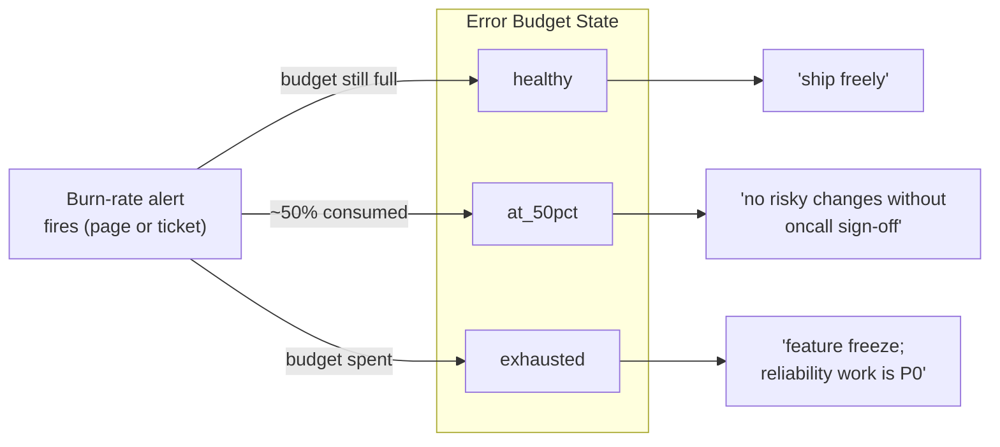

Reliability is a feature with a target, not a value to maximize. That sentence is easy to nod along
to and hard to operationalize, and the place it usually breaks is the gap between an SLO and an
error-budget policy. A team writes "99.9% availability, 30-day window" into a doc, wires a Grafana
SLO panel, and considers reliability handled. Then the service burns through three weeks of budget
in two days and nothing happens — no freeze, no reprioritization, no conversation — because nobody
ever wrote down what _should_ happen. The SLO was a chart. The policy is what would have made it a
decision.

---

## TL;DR

An SLO is a target on a service-level indicator. An error budget is `1 − SLO` over the window. An
error-budget _policy_ is the written rule that changes team behavior when the budget state changes:
ship freely while healthy, freeze features and reprioritize reliability work when exhausted. The
business outcome — predictable reliability that teams can plan around — comes from the policy loop,
not the number. Multi-window burn-rate alerts tell you the budget is draining; the policy is what
makes that alert mean something.

---

## The Problem

The chart-without-policy failure has a few reliable symptoms. The SLO target is picked by
aspiration, not by what the business needs — 99.99% because it sounds serious, with no analysis of
what a tighter target costs in engineering effort or what a looser one would actually harm.
Attainment is displayed but not owned; the panel is green or red and no role is accountable for
acting on red. And burn-rate alerts, if they exist, page someone who acknowledges them and moves on,
because "budget burning fast" has no defined response.

Underneath all three is the same missing artifact: a policy that ties budget state to team action.
Without it, the SLO cannot do the one job that makes it worth the instrumentation effort — arbitrate
the tension between shipping features and protecting reliability. That arbitration is the business
value. A number that doesn't arbitrate anything is overhead.

There's also a measurement trap. If the SLI is computed off an infrastructure proxy — CPU, pod
restarts, host up/down — rather than a user-facing signal like checkout success rate, then even a
perfectly enforced policy is defending the wrong thing. The budget can be full while customers are
failing.

---

## Correct Design

**Principle: the SLO measures a user-facing outcome, and a written policy converts budget state into
a required action. The alert detects; the policy decides.**

| Element         | "Just a chart"                     | Business instrument                                     |
| --------------- | ---------------------------------- | ------------------------------------------------------- |
| SLI             | CPU, restarts, host up             | User-facing: request success ratio, checkout completion |
| Target          | Aspirational (99.99% "to be safe") | Chosen against cost of tighter vs harm of looser        |
| Budget state    | Displayed on a panel               | Owned by a named role; drives the sprint plan           |
| Burn-rate alert | Paged, acknowledged, ignored       | Triggers a defined response from the policy             |
| Exhaustion      | Nothing changes                    | Feature freeze; reliability work takes priority         |

```yaml
# Context: "we do SLOs" — the number exists, the consequence doesn't

# [WRONG] a target with no policy. The panel shows burn; nothing in the
# team's process references budget state, so a fast burn changes nothing.
slo:
  service: checkout-api
  objective: 99.9
  window: 30d
  # no owner, no freeze trigger, no alerting tied to a response
```

```yaml
# Context: SLO + multi-window burn-rate alerts + a policy that acts

# [CORRECT] user-facing SLI, fast and slow burn alerts, and an explicit
# budget policy that names the action at each state.
slo:
  service: checkout-api
  sli: "sum(rate(checkout_completed_total[5m])) / sum(rate(checkout_attempted_total[5m]))"
  objective: 99.9
  window: 30d
  owner: checkout-oncall
burn_rate_alerts:
  - severity: page   # ~2% budget in 1h
    condition: "burn_rate_1h > 14.4 and burn_rate_5m > 14.4"
  - severity: ticket # ~10% budget in 3d
    condition: "burn_rate_6h > 6 and burn_rate_30m > 6"
budget_policy:
  healthy:   "ship freely"
  at_50pct:  "no risky changes without oncall sign-off"
  exhausted: "feature freeze; reliability work is P0 until budget recovers"
```

The same policy reads as a flow: a burn-rate alert lands the budget in a state, and the state names
the action the team is obligated to take.



The multi-window condition (a long window for significance, a short window for currency) is what
keeps a fast-burn page from firing on a transient blip and a slow-burn ticket from missing a
sustained degradation.

### At hyperscale

Across a thousand teams the error-budget policy is enforced by tooling, not culture. The deploy
pipeline reads budget state and blocks releases automatically when it's exhausted, and the SLO spec
is code that generates the recording rules and burn-rate alerts rather than a doc someone maintains
by hand. "We agreed to freeze" does not survive that many teams; the freeze has to be a gate the CD
system checks, with an explicit, logged override for the cases that genuinely warrant one.

---

## Conclusion

If your SLO doesn't change what the team does when the budget runs low, you have a chart, not an
SLO. Write the policy: name an owner for budget state, define the action at healthy / halfway /
exhausted, and wire multi-window burn-rate alerts to those actions. Anchor the SLI to something a
customer would notice. The number is the easy part; the agreed-upon consequence is the instrument.

---

_Amit Singh is an Observability Architect and SRE leading a global observability transformation
across 200+ workloads spanning Azure, on-premises, and SAP RISE environments using Grafana Cloud and
OpenTelemetry. He holds a patent in the observability space._

---

**Tags:** #SRE #Observability #IncidentResponse #SystemDesign #Grafana
