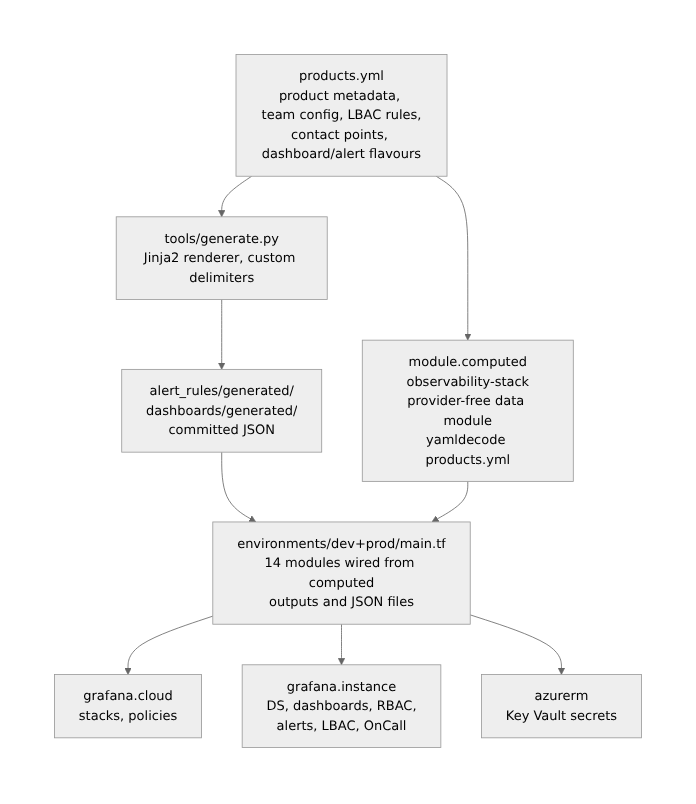

The last product I onboarded to our Grafana Cloud platform was Signal Forge, an internal SRE tooling
service. Adding it required a YAML block in `products.yml`, a generator run, and a plan review. No
`.tf` files touched. No module wiring. A Grafana folder, four dashboards, alert rules with routing,
a team with LBAC scope, a contact point — all provisioned from a product registry entry.

We have seven products running across two Grafana Cloud stacks. If you looked at the Terraform
codebase, the `.tf` files for `environments/dev/` and `environments/prod/` haven't changed in
months. The product catalog has.

This post is about how that separation works, the architectural decision that makes it possible, and
what I got wrong along the way.

## Why I built it

I ran a shared Grafana Cloud instance for two years before codifying anything as code. New products
got onboarded the usual way: a platform engineer spent half a day clicking through the Grafana UI —
folders, data source permissions, dashboard imports, alert rules, contact points, team membership.
The other half was MS Teams channel messages explaining what broke.

Three problems forced the rewrite:

**No audit trail.** Config drift was invisible. A developer changed a dashboard variable, an alert
threshold got edited directly in the UI, a contact point webhook URL was updated after an MS Teams
channel migration. None of it was tracked. Runbooks said one thing; the instance was doing another.

**Onboarding didn't scale.** I had four teams waiting to be onboarded when I started. Every
onboarding was a manual coordination exercise — collect the team's cluster names, deployment
environments, contact point URLs, preferred alert routing — and then replicate the decisions I'd
made for every prior team.

**No consistency across environments.** I run both a dev stack (`dev`) and a production stack
(`prod`). Getting the same product into both required doing the work twice, manually, with no
validation that they matched.

The requirement was a platform where adding a product meant a peer-reviewed PR, and where the dev
stack and production stack were provably identical except for their credentials.

## Architecture

The platform uses three layers. Understanding the separation between them is the load-bearing
insight.



### Layer 1: `products.yml` — the policy plane

Every product entry in `products.yml` declares what it needs, not how to provision it:

```yaml
signal_forge:
  platform: aks
  team:
    name: "Signal Forge"
    email: "sre-tools@org.com"
    dashboardRole: Editor
    members: [member@org.com]
  terraform_envs: [dev]          # gates which stacks see this product
  oncall:
    enabled: true
    schedule:
      timezone: "Asia/Kolkata"
  contact_points:
    teams:
      teams_signal_forge_dev:
        name: "teams-signal-forge-dev"
        section_title: "Signal Forge Alert"
        url: "https://prod.westeurope.logic.azure.com/..."
  grafana:
    folder_key: golden-signal-forge
    folder_title: "Golden-Signal-Forge"
  environments:
    dev:
      status: active
      deployment_environment: signal-forge-dev
      dashboard_flavours: [aks/standard]
      alert_flavours: [aks/standard]
      use_contact_points: [teams_signal_forge_dev]
```

What that entry drives, automatically:

- A Grafana folder (`Golden-Signal-Forge`)
- Four dashboards from the `aks/standard` template set (global, namespace, nodes, pods)
- Alert rule groups from the `aks/standard` template
- A Grafana team with `member@org.com` as a member
- Folder permissions: SRE gets Admin, Signal Forge team gets Editor
- An LBAC label selector scoped to `{deployment_environment="signal-forge-dev"}`
- A Teams webhook contact point
- An OnCall schedule in IST timezone
- An Alloy writer token restricted to `signal-forge-dev` writes only (written to Azure Key Vault
  after apply)

That is the complete onboarding. No `.tf` file edits required.

### Layer 2: The pure data module

The `observability-stack` module is the architectural center of this design. It is a Terraform
module with no provider configuration, no resources, and no data sources. It reads `products.yml`
and produces derived locals consumed by every other module.

```hcl
# modules/observability-stack/main.tf (excerpt)
locals {
  _raw = yamldecode(file("${path.module}/../../products.yml"))

  # Filter products to this stack's environment
  products = {
    for k, v in local._raw.products : k => v
    if contains(v.terraform_envs, var.terraform_env)
  }

  # Derive LBAC scopes from active environments
  lbac_teams = {
    for prod_key, prod in local.products : prod_key => {
      deployment_environments = [
        for env_key, env in prod.environments : env.deployment_environment
        if env.status == "active"
      ]
    }
  }

  # Auto-scan generated dashboard and alert files
  product_dashboards = {
    for f in fileset("${path.module}/../../dashboards/generated/${var.terraform_env}", "*.json") :
    trimsuffix(f, ".json") => {
      path = "${path.module}/../../dashboards/generated/${var.terraform_env}/${f}"
    }
  }
}
```

Because this module has no provider block, it can be evaluated without any Grafana credentials.
`terraform plan -target=module.computed` runs in 400ms locally and surfaces structural errors in
`products.yml` — a missing required field, a product listed in `terraform_envs` without an active
environment, an LBAC scope derived from no active environments — before touching any real
infrastructure.

In a shared platform context, this property matters: platform team members can validate registry
changes without access to the production Grafana SA token. The data module acts as a schema
validator and dependency resolver that is completely decoupled from the infrastructure it ultimately
drives.

### Layer 3: Jinja2 generation with committed output

Dashboards and alert rules are not written in HCL. They are Jinja2 templates rendered to JSON,
committed to git, and loaded by Terraform's `grafana_dashboard` and `grafana_rule_group` resources.

The template set covers four platform archetypes:

| Template          | Renders                                                    | File count per product      |
| ----------------- | ---------------------------------------------------------- | --------------------------- |
| `aks/standard`    | Kubernetes cluster, namespace, node, pod dashboards        | 4 dashboards, 1 alert group |
| `aca/standard`    | Azure Container App landing, developer, SRE, product views | 4 dashboards, 1 alert group |
| `onprem/standard` | Per-plant overview, Windows host dashboards                | 1 per plant + 4 shared      |
| `sap/hwa`         | HWA agent probes, OS metrics                               | 1 alert group               |

Templates use `[[ ]]` delimiters instead of Jinja2's default `{{ }}`. Grafana alert annotations use
`{{ $labels.foo }}` syntax throughout. Escaping every annotation variable in every template would be
mechanical error-prone work. Changing the delimiter eliminates the conflict:

```python
env = jinja2.Environment(
    loader=jinja2.FileSystemLoader(str(templates_dir)),
    variable_start_string="[[",
    variable_end_string="]]",
)
```

This means templates can embed Grafana annotation variables verbatim:

```json
{
  "annotations": {
    "summary": "Pod {{ $labels.pod }} in {{ $labels.namespace }} is restarting",
    "grafana_folder": "[[ prod_key ]]-[[ env_short ]]"
  }
}
```

`[[ prod_key ]]` is resolved by the generator. `{{ $labels.pod }}` is passed through unchanged to
Grafana's runtime evaluation.

Generated files are committed to git under `alert_rules/generated/<stack>/` and
`dashboards/generated/<stack>/`. A CI gate on every PR verifies they are in sync:

```bash
python tools/generate.py
git diff --exit-code alert_rules/generated/ dashboards/generated/ \
  || (echo "Run: python tools/generate.py" && exit 1)
```

This guarantee — that what is committed is exactly what the generator would produce — means that a
PR review includes reviewing the generated JSON diffs directly. You can see precisely which alert
threshold changed, which datasource UID shifted, which dashboard panel was added, without inferring
it from a template change. The generated artifact is the reviewable unit, not the template.

## What worked

**Plannable without production credentials**

The pure data module means that anyone can evaluate the product registry locally.
`terraform plan -target=module.computed` catches broken entries — missing LBAC UIDs, malformed
environment blocks, contact point keys using hyphens instead of underscores — without touching
Grafana. I run this as a pre-apply check in CI with a read-only service account that has no Grafana
access at all.

**Generated artifact diffs as review surface**

When a dashboard template changes, the PR diff shows the rendered JSON delta across every product
and environment that uses that template. A template edit might affect 24 generated files. Seeing the
full diff — not just the template change — means reviewers can verify that a threshold change in
`aks/standard.json.j2` actually propagates to `product1-dev.json`, `product2-dev.json`, and
`signal_forge-dev.json` with the correct environment labels. Template-only review is an abstraction;
generated-artifact review is evidence.

**OT plant expansion**

On-premises OT covers six plants: Plant1, Plant2, Plant3, Plant4, Plant5, Plant6. Each is a
first-class environment in `products.yml` with its own `deployment_environment` label. The generator
expands per-plant templates once per active plant. Adding Plant7 — which is currently
`status: planned` — will require only a status change in `products.yml` and a generator run. No
template edits. No new JSON files manually created.

**`terraform_envs` as a hard promotion gate**

Products explicitly list which stacks they deploy to. `signal_forge` has `terraform_envs: [dev]`.
The `module.computed` data module filters it out entirely when `var.terraform_env = ""`. There is no
conditional resource creation in the Terraform modules — the product simply does not exist in the
production stack's module inputs. This means a developer cannot accidentally provision a test-only
workload to production by missing a `count` condition.

## What didn't work

**OT plant-as-environment caused merge conflicts on generator output**

When two engineers add different OT plants in concurrent branches, each regenerates the full
`dashboards/generated/dev/` directory. Because the generator is deterministic, the conflict is on
the JSON filenames themselves, not the content — adding `ot-Plant1.json` in one branch and
`ot-Plant2.json` in another produces a conflict that git cannot auto-resolve because both branches
modified the same directory. I don't have a clean solution. The current mitigation is sequencing OT
plant additions rather than parallelizing them, which is a coordination cost.

**Notification policy state management on destroy**

The Grafana provider cannot cleanly delete a notification policy. Its destroy lifecycle action
executes a PUT that writes Terraform state values back to Grafana — which re-pins the root receiver.
Subsequent contact point deletion returns 409 Conflict because the policy still holds a reference to
the contact point being deleted.

Working around this requires API pre-cleanup outside Terraform's lifecycle — a sequence of
`PUT /api/v1/provisioning/policies` to reset the root receiver,
`DELETE /api/v1/provisioning/alert-rules/<uid>` for any rule with `notification_settings.receiver`
set, and a second policy reset immediately before `apply -destroy`. This is embedded in
`tf.sh destroy` but it is brittle: if Grafana restores the policy during the plan's refresh phase
(which it sometimes does), the destroy fails and requires manual API intervention. There is no clean
automated path for this.

**Missing UID validation is a silent failure**

LBAC rules are gated on UID presence: `count = var.mimir_lbac_datasource_uid != "" ? 1 : 0`. When a
product is `status: active` but the corresponding LBAC datasource UIDs are empty in `products.yml`,
the LBAC module silently skips. No error. No warning. The product is onboarded without data
isolation enforcement.

I discovered this after onboarding two products before completing the LBAC bootstrap sequence for
the production stack. Both products were live in Grafana with no query-layer access control. A
`terraform validate` precondition block that fails loudly when active products have empty LBAC UIDs
would have caught this. I have this planned but not yet shipped.

## The non-obvious insight

A Terraform module with no provider configuration is more powerful than one that does.

The conventional framing is: Terraform modules are execution units. They provision resources. A
module without resources is just a library file with extra syntax.

The `observability-stack` module inverts that. It is a **policy derivation layer** — a place where
the authoritative product registry is translated into the inputs that execution modules need.
Because it has no provider, it operates at the planning layer independently of infrastructure
access. The execution modules (RBAC, LBAC, alerting, dashboards) are downstream consumers of its
outputs. They contain no business logic. They are thin wrappers around Grafana API calls,
parameterized by what the data module computed.

This separation turns out to be the right abstraction for a shared platform. The product registry
(`products.yml`) is the interface between the platform team and the product teams. Product teams
declare what they need. The data module interprets it. The execution modules fulfill it. None of the
execution modules read `products.yml` directly — they receive pre-computed inputs. If the data model
of `products.yml` changes, the data module absorbs the change; the execution modules are unchanged.

The pattern scales because product additions are pure data changes. The execution modules are
infrastructure code that needs to be reviewed and tested once. The product registry is configuration
that needs to be reviewed once per product. Conflating the two — embedding product-specific config
directly in HCL modules — means every new product is an infrastructure code change, with all the
review friction and expertise barrier that implies.

## What I'd do differently

**Treat the pure data module as the schema contract from day one**

I added `module.computed` after the initial implementation, once I recognized that `products.yml`
was becoming the real driver. Starting with the data module as the explicit schema boundary would
have forced earlier discipline on what the registry expresses versus what the execution modules
decide. Several edge cases — the OT plant structure, the SAP/HWA alert schema — are encoded as
execution-module logic that should have been registry-expressible from the start.

**Generate Alloy configs from the same registry**

`products.yml` already contains the information needed to generate per-product Alloy pipeline
configs: `deployment_environment` labels, cluster names, subscription IDs, Mimir/Loki/Tempo
endpoints. Currently, I maintain Alloy configs separately, which means the registry and the agent
configs can drift. The same generator pattern — Jinja2 templates, committed output, CI sync check —
would unify the lifecycle.

**Ship UID validation before calling a product onboarded**

Any `status: active` entry with empty LBAC UIDs should be a `terraform validate` failure, not a
silent skip. The `count = … != "" ? 1 : 0` pattern is the right gate for the first bootstrap apply,
but it should transition to a hard error once a product is marked active. The cost of adding that
validation block is one afternoon; the cost of discovering missing LBAC enforcement after a product
goes live is much higher.

## Takeaway

If you are building a shared observability platform for multiple product teams on Grafana Cloud: put
the product registry in YAML, not HCL. Separate the policy plane (what products need) from the
execution plane (how Terraform provisions it) using a provider-free data module. Generate dashboards
and alert rules from templates with committed output — the artifact diff is more reviewable than the
template diff. Ship negative tests for any security control (LBAC, RBAC, contact point routing)
before declaring a product onboarded; a clean apply is not evidence that the control is working.
