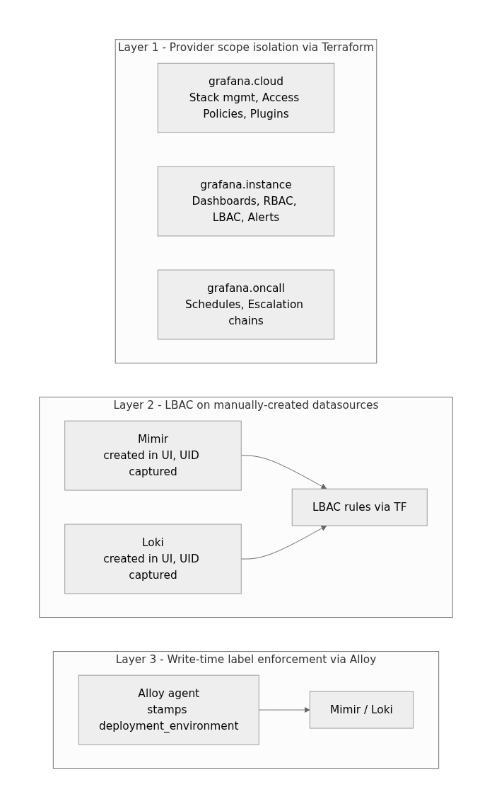

The apply succeeded. The plan was clean. Terraform state showed
`grafana_data_source_config_lbac_rules` as applied with the correct label selectors. And a user on
team B could still execute a PromQL query against team A's Mimir metrics.

This is the story of that gap, what it took to diagnose, and the architecture we shipped to actually
enforce multi-tenant access control on a shared Grafana Cloud instance.

## Why we built it

We run a shared Grafana Cloud instance serving multiple product teams under a single organizational
account. The shared model makes sense operationally: one platform team owns the Grafana stack, alert
routing, and the SLO catalog. Product teams are onboarded via Terraform — folders, datasources,
dashboards, alert rules, on-call schedules — without touching the platform layer.

The problem with shared Grafana instances is scope creep at the query layer. RBAC in Grafana
controls what a user sees in the UI: which folders, which dashboards, which menu items. It does not
restrict what a user can query. A user with Explore access to any Mimir datasource can run arbitrary
PromQL. If teams share a Mimir remote-write endpoint and there is no query-layer filtering, team B
can craft selectors for team A's application metrics.

Label-based access control (LBAC) is Grafana's answer. LBAC attaches label matchers to datasource
permissions — a user or team can only return series where `deployment_environment` matches the
values they're authorized for. It operates between the query execution layer and the storage layer,
not at the folder-permissions level.

For a platform serving products across AKS workloads, on-premises OT plants, and container apps —
each with distinct `deployment_environment` values — LBAC was the right control. The goal was to
automate its setup entirely in Terraform: define authorized environments per team in a central
registry, generate LBAC rules at plan time, apply deterministically.

That goal turned out to be partially achievable. The Terraform path to LBAC enforcement has a hole
in it that the provider documentation doesn't surface.

## Architecture

The architecture we shipped has three independent layers. Each addresses a different attack surface
and operates at a different point in the data lifecycle.



### Layer 1: Provider alias isolation

Most Grafana Cloud Terraform setups use a single provider block. We split ours into three aliases
pointing at distinct endpoints with distinct authentication tokens:

```hcl
provider "grafana" {
  alias         = "cloud"
  cloud_api_key = var.grafana_cloud_api_key
}

provider "grafana" {
  alias = "instance"
  url   = var.grafana_instance_url
  auth  = data.grafana_cloud_stack.main.service_account_token
}

provider "grafana" {
  alias               = "oncall"
  url                 = data.grafana_cloud_stack.main.oncall_url
  auth                = var.grafana_oncall_access_token
  oncall_access_token = var.grafana_oncall_access_token
}
```

The split enforces scope boundaries at the API level: a compromised `grafana.instance` token cannot
touch Cloud-level policies. A module that imports `grafana.cloud` is visibly managing
organizational-level resources — the alias makes the blast radius explicit before you read the
resource definitions.

### Layer 2: LBAC on manually-created datasources

This is the layer that required the most rethinking. The Grafana provider's
`grafana_data_source_config_lbac_rules` resource does not take effect when the datasource it
references was created by `grafana_data_source`. The provider provisions the datasource correctly,
the LBAC rule is written to state — but the rule is not evaluated at query time. Confirmed by
Grafana support after a debugging cycle.

The workaround: create Mimir and Loki datasources manually in the Grafana UI, capture their UIDs in
the product registry, and bind LBAC rules to those UIDs via Terraform.

```yaml
# products.yml — manual UID capture after UI creation
meta:
  sre:
    dev:
      lbac_datasources:
        mimir:
          name: grafana-cloud-mimir-dev
          uid: "<captured from UI>"
          type: prometheus
          default: true
        loki:
          name: grafana-cloud-loki-dev
          uid: "<captured from UI>"
          type: loki
          default: false
```

The LBAC module gates on UID presence so that a missing entry doesn't break the rest of the apply:

```hcl
resource "grafana_data_source_config_lbac_rules" "mimir" {
  count = local.mimir_uid != "" ? 1 : 0

  datasource_uid = local.mimir_uid
  rules = jsonencode([
    for team_key, env_list in var.team_env_map : {
      selector = length(env_list) == 1
        ? "{ deployment_environment=\"${env_list[0]}\" }"
        : "{ deployment_environment=~\"${join("|", env_list)}\" }"
      teams = [var.team_ids[team_key]]
    }
  ])
}
```

The selector format is intentional: single-environment teams get an equality matcher (`=`),
multi-environment teams get a regex union (`=~`). Grafana evaluates these as label selectors on
every query, not as post-query filters.

### Layer 3: Write-time label enforcement via Alloy

LBAC controls reads. It cannot control what labels data arrives with. Without write-time
enforcement, a misconfigured agent could inject metrics without `deployment_environment` — or with
the wrong value — and those series would either satisfy every team's LBAC matcher or none of them.

Alloy pipelines stamp the label unconditionally at collection time before remote-write. Each agent
deployment is scoped to a single environment, and `deployment_environment` is applied as a constant
label before the Mimir remote-write stage. The label cannot be overridden by the application being
scraped.

Cloud Access Policies on the Grafana Cloud side grant write access scoped to the stack. The
`label_policy` attribute on access policies — which would let you restrict writes to specific label
values — only applies to read scopes, not write scopes. This is a second provider gap, separate from
the LBAC one. Write-side label isolation is Alloy's responsibility until Grafana extends label
policy enforcement to write tokens.

The combination: LBAC stops unauthorized reads. Alloy-enforced labels guarantee that data at rest
carries the attributes LBAC depends on. Neither control works without the other.

## What worked

**The pure data module**

The `observability-stack` module is entirely provider-free. It reads `products.yml` at plan time via
`yamldecode(file(...))` and derives team memberships, LBAC label rules, dashboard file lists, alert
group configurations, and OnCall escalation maps. Because it uses no provider resources, you can
evaluate all derivations locally without a TFC token.

This matters more than it seems. Being able to run `terraform plan -target=module.computed` on a
branch without credentials — or inside a CI step before real infrastructure access is granted —
means you catch structural errors in the product registry before they touch running resources.

**VCS-driven apply enforcement**

HCP Terraform with a VCS-driven workspace intentionally breaks local `terraform apply`. The
workspace packages only `environments/<stack>/` on push, which means the runner cannot resolve
`../../modules`. Every infrastructure change must flow through a peer-reviewed PR and a speculative
plan posted as a PR check.

This is not a limitation we worked around. It is a policy we designed for. The constraint forces the
behavior you want: no direct applies, no hotfixes that bypass review.

**Jinja2 generation with `[[ ]]` delimiters**

Alert rules and dashboards are generated from Jinja2 templates. Grafana alert annotations use
`{{ $labels.foo }}` notation — the same as Jinja2's default delimiters. Rather than escaping every
annotation variable in every template, we reconfigured the generator:

```python
env = jinja2.Environment(
    variable_start_string="[[",
    variable_end_string="]]",
)
```

Generated files are committed to version control. A CI gate fails the PR if generated files are
stale (`git diff --exit-code` on `alert_rules/generated/` and `dashboards/generated/`). What is in
the repo is exactly what gets deployed — no template rendering at apply time, no substitution
surprises during a 2 AM rollback.

## What didn't work

**LBAC on Terraform-provisioned datasources**

Already detailed above, but worth naming the failure mode precisely: the plan reports success, the
state file contains the resource, and `terraform show` returns the correct rule definitions. The
enforcement is not there. There is no error, no warning, no diff on subsequent plans. Without active
query-level testing against the datasource as a non-privileged user, this failure is invisible.

The lesson is that infrastructure correctness tests must include negative cases. A clean apply is
not evidence that a security control is working. We now maintain a validation job that executes a
PromQL query as a service account that should be denied, and fails the pipeline if the query returns
data. That job should have been part of the original definition of done.

**CAP label_policy on write scopes**

Cloud Access Policies support a `label_policy` attribute that restricts which label values a token
can write. It appeared to be the right tool for write-time isolation. It is not — at least for
write-scoped tokens. The `label_policy` attribute is only evaluated on read scopes. Write tokens
with label policy rules attached are treated as unrestricted. The Terraform provider does not
surface this as an error or warning.

We have no precise data on when Grafana plans to extend label policy enforcement to write tokens.
Until then, write-side isolation is an Alloy pipeline responsibility.

**Notification policy destroy**

The Grafana provider cannot truly delete a notification policy. Its destroy lifecycle action
executes a PUT that writes Terraform state values back to Grafana — which re-pins the root receiver
and causes 409 Conflict errors on subsequent contact point deletion. A working destroy sequence
requires API pre-cleanup outside Terraform's lifecycle: reset the notification policy via the
Grafana API before running `terraform destroy`, then reset it again after as a safety guard. There
is no clean automated path for this; it requires manual steps every time.

## The non-obvious insight

The trust boundary in a shared Grafana Cloud deployment is not at the Terraform configuration layer.
It is at the data injection layer.

Most platform teams treat Terraform as the policy enforcement plane. If a resource is in state, it
is enforced. Grafana Cloud multi-tenancy breaks that assumption in two distinct places:
Terraform-provisioned datasources bypass LBAC evaluation, and write-scoped access policies bypass
label policy evaluation. Both failures are silent. Neither surfaces in plan output.

The architecture that actually works inverts the usual framing. You cannot declare a read-access
restriction in Terraform and trust it to hold — not unless you have also guaranteed that the data at
rest carries the labels the restriction relies on, and that those labels were stamped by an agent
outside the control of the tenant being restricted.

Multi-tenant access control in Grafana Cloud requires defense in depth across the full data
lifecycle: enforce what is written (Alloy pipeline labels), enforce what is configured (Terraform
LBAC on manually-created UIDs), and test what is actually queryable (negative integration tests as a
required gate). Any one of the three alone is insufficient.

## What we'd do differently

**Design the manual/automated split from the start**

We spent time trying to make Terraform provision everything before hitting the provider gap. The
right starting point — given current provider capabilities — is to treat Mimir and Loki datasource
UIDs as external inputs that Terraform consumes but does not create. A clear contract between what
Grafana UI manages and what Terraform manages would have bypassed the debugging cycle entirely.

**Ship negative query tests before calling LBAC done**

The LBAC gap is invisible without active testing. A CI job that executes a denied query and
validates the 403 response would have surfaced this in the first apply. Shipping LBAC without a
negative test is shipping a control without a test that the control works. We have this now; it
should have been the acceptance criterion, not the remediation.

**Explicit UID validation in the product registry**

The `count = … != "" ? 1 : 0` gate prevents broken bootstraps when UIDs are missing, but it also
silently skips LBAC rule creation for incomplete entries. A Terraform validation block or a pre-plan
script that fails if a product is marked `status: active` but has empty `lbac_datasources` UIDs
would make missing UIDs a loud error rather than a quiet no-op.

## Takeaway

If you are codifying Grafana Cloud multi-tenancy in Terraform: assume the provider will not enforce
label-based access control on any datasource it also creates. Validate LBAC enforcement with a
negative test — a service account that should be denied executing a query that should return nothing
— before marking a tenant as onboarded. Wire write-time label enforcement in your Alloy pipelines as
a hard requirement, not a best-effort optimization. Trust the plan output for resource creation;
test the policy outcome independently.
