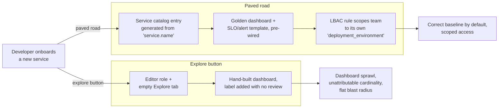

"We made observability self-service" usually means someone flipped every developer to Editor and
pointed them at Grafana Explore. Six months later there are four hundred dashboards, no two of them
laid out the same way, half pointing at metrics that no longer exist; a `customer_id` label somebody
added during an incident is quietly costing more than the service it monitors; and any engineer can
open any other team's logs, including the ones with tokens in them. That's not self-service. It's
the platform team declining to make decisions and calling the result empowerment.

---

## TL;DR

Self-service observability is a paved road, not a blank canvas. The paving is three things: golden
dashboards generated from a service's identity so every team starts with the same correct baseline;
self-serve SLO and alert templates so reliability config is filled-in, not authored from zero; and
label-based access control that scopes each team to the telemetry it owns. Skip the paving and
self-service degrades into dashboard sprawl, unattributable cardinality, and a flat blast radius
where everyone can read everything. The platform team's job is to make the correct path the default
one.

---

## The Problem

An open Explore tab is a powerful tool and a terrible starting point. A developer who wants to know
if their service is healthy has to know which metric carries request rate, what the latency
histogram is called, how to write the PromQL for a p99, and which label holds the status class —
before they can answer a question the platform could have answered for them. Most don't; they build
something approximate, save it, and move on. Multiply by every service and you get sprawl: hundreds
of inconsistent dashboards that are themselves now an operational liability.

The cardinality problem is worse because it's invisible until the bill. Give everyone Editor and
nobody owns the label schema. Someone adds a high-cardinality label to "make debugging easier," it
ships, and it inflates active series across every environment. There's no PR, no review, no
cardinality estimate — the platform never had a chance to catch it because adding a label wasn't
gated by anything.

And access is usually all-or-nothing. Without label-based scoping, one Grafana Cloud tenant means
every onboarded team can query every other team's metrics and logs. That's a compliance problem the
first time a security team's logs or a payments service's traces are readable by an unrelated
product squad.

---

## Correct Design

**Principle: the platform ships the correct default for every observability task a developer would
otherwise do by hand. Self-service means filling in a template, not starting from an empty query.**

| Capability        | Blank-canvas version              | Paved-road version                                          |
| ----------------- | --------------------------------- | ----------------------------------------------------------- |
| Service dashboard | Developer builds one in Explore   | Generated from `service.name`; golden signals, consistent   |
| SLO + alerts      | Authored from scratch per service | Template with objective + burn-rate alerts pre-wired        |
| Adding a label    | Anyone with Editor, no review     | PR against the label schema with a cardinality estimate     |
| Data access       | Everyone sees the whole tenant    | LBAC rule scopes a team to its own `deployment_environment` |
| Finding a service | Ask around / search dashboards    | Service catalog / Entity Catalog as the entry point         |

```hcl
# Context: Grafana provisioning — "self-service" as open access

# [WRONG] every developer is an Editor on the whole org; no label scoping.
# Result: dashboard sprawl, ungated label additions, flat blast radius.
resource "grafana_team" "product_squads" {
  name = "all-product-squads"
}
resource "grafana_organization_preferences" "org" {
  # default role: Editor for everyone in the org
  # no LBAC rules defined
}
```

```hcl
# Context: Grafana provisioning — paved road with scoped access + templated assets

# [CORRECT] each team gets a Viewer/Editor split and an LBAC rule that limits
# its queries to its own slice of the label schema. Dashboards and SLOs come
# from modules, not hand-building.
resource "grafana_data_source_config_lbac_rules" "mimir" {
  datasource_uid = grafana_data_source.mimir.uid
  rules {
    team_id = grafana_team.checkout.id
    rules   = ["{ deployment_environment=~\"aks-dgeg-checkout-.*\" }"]
  }
}

module "checkout_observability" {
  source        = "./modules/service-observability"   # golden dashboard + SLO + alerts
  service_name  = "checkout-api"
  team          = "checkout"
  slo_objective = "99.9"
}
```

The paved road is not a restriction on power users — Explore is still there. It's a guarantee that
the 80% case is handled correctly by default, so the platform team's review effort goes to the
exceptions instead of to cleaning up sprawl.

Both paths start at the same onboarding moment — here's where each one actually leads:



### At hyperscale

At hundreds of teams the paved road has to be generated, not maintained. Dashboards and SLOs are
emitted from the service catalog on every change, not hand-forked per team, and the catalog becomes
the control plane: onboarding, LBAC scope, ownership, and golden-asset generation all key off one
entry. A service that isn't in the catalog then has no observability by construction — which is the
correct default, because it makes the catalog impossible to skip.

---

## Conclusion

Before you announce self-service, build the paving: a module that generates a golden dashboard and
SLO from a service name, a label-schema PR gate with a cardinality check, and LBAC rules that scope
every team to its own data. Measure it by how far a new developer gets without writing PromQL. If
the answer is "not past the login screen," you shipped an Explore button, not a platform.

---

_Amit Singh is an Observability Architect and SRE leading a global observability transformation
across 200+ workloads spanning Azure, on-premises, and SAP RISE environments using Grafana Cloud and
OpenTelemetry. He holds a patent in the observability space._

---

**Tags:** #Observability #PlatformEngineering #Grafana #SRE #GitOps
