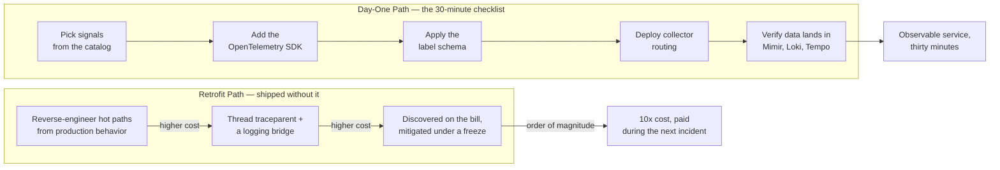

The onboarding number people quote back to me is "three days to thirty minutes." The part that
matters is the qualifier: thirty minutes _if the service picks up the platform template before it
ships_. The three days didn't disappear — it moved. It's now the cost of retrofitting observability
into a service that launched without it, and that cost lands during an incident, under pressure,
paid by whoever is on call. Day one is cheap because the expensive work has already been done once,
in the template, instead of once per service, in production.

---

## TL;DR

Adding observability after a service is in production is roughly an order of magnitude more
expensive than building it in, and the bill arrives at the worst time. "Day one" is not a mindset;
it is a specific set of artifacts that ship with the service skeleton: the OpenTelemetry SDK wired
to the local collector, resource attributes rendered from deploy-time values, a golden-signal
dashboard generated from the service name, an SLO stub, and a production-readiness gate that fails
the merge if any of those are missing. Do that and onboarding is a thirty-minute checklist. Skip it
and the first hard incident is debugged blind while someone retrofits instrumentation live.

---

## The Problem

Retrofitting observability is expensive because almost every step is harder after the fact. Deciding
what to instrument means reverse-engineering the service's real hot paths from memory instead of
adding three golden-signal instruments to a fresh handler. Adding trace context means threading
`traceparent` and a logging bridge through a codebase that currently logs with bare `printf` and
string concatenation. Backfilling resource attributes means every historical series already exists
without them, so dashboards and SLOs have a discontinuity. And you find your cardinality problems in
production — a route label that's actually an unbounded path parameter, a customer ID that should
never have been a label — after they've already inflated the bill.

The organizational failure mode that produces retrofit is predictable. "We'll add observability
before launch" becomes "launch slipped, we'll add it right after," becomes a service in production
with no signal. The first real incident is triaged from application logs and intuition. Someone adds
instrumentation during the incident. The postmortem action item is "add proper observability," which
competes with feature work and slips again. The three days is real; it's just distributed across a
quarter and paid in stress.

---

## Correct Design

**Principle: observability is part of the service skeleton, and the production-readiness review gate
enforces it. The template pays the cost once; every service inherits it.**

On the platform I lead, the thirty-minute path is five steps, and every step is something the
template already did: pick signals from the catalog, add the OpenTelemetry SDK, apply the label
schema, deploy the collector routing, verify data lands in Mimir, Loki, and Tempo. The PRR gate then
checks that SLOs are defined, a golden-signal dashboard exists, paging alerts have runbooks, a
rollback procedure is written, and the cardinality budget has been reviewed — before the service
reaches prod.

Laid out across the service lifecycle, the two paths diverge immediately, and the retrofit side gets
more expensive at every later stage:



| Task                            | Cost on day one                              | Cost retrofitted                                             |
| ------------------------------- | -------------------------------------------- | ------------------------------------------------------------ |
| Choose what to instrument       | 3 golden-signal instruments on a new handler | Reverse-engineer hot paths from production behavior          |
| Trace context + log correlation | SDK bridge on by default                     | Thread `traceparent` + a logging bridge through the codebase |
| Resource attributes             | Rendered from Helm values at deploy          | Backfill; historical series have a discontinuity             |
| Golden-signal dashboard         | Generated from `service.name`                | Hand-built after an incident exposes the gaps                |
| First SLO                       | Stub in the template, tuned later            | Written from scratch with no baseline data                   |
| Cardinality review              | Caught in PR against the label schema        | Discovered on the bill, mitigated under a freeze             |

```dockerfile
# Context: a service image + Helm shipped without observability in the skeleton

# [WRONG] no SDK, no collector target, logs are unstructured stdout. Every row
# in the table above is now a future retrofit ticket.
FROM mcr.microsoft.com/dotnet/aspnet:8.0
COPY --from=build /app/out .
ENTRYPOINT ["dotnet", "Checkout.dll"]
# Helm values: no OTEL_* env, no scrape annotations, no dashboard, no SLO
```

```yaml
# Context: Helm values.yaml stanza our service template ships with

# [CORRECT] the OTLP endpoint, resource attributes, and scrape annotations are
# in the skeleton. A new service fills in three values and is observable.
observability:
  otlpEndpointFromNodeIP: true          # OTEL_EXPORTER_OTLP_ENDPOINT = http://$(NODE_IP):4317
  resourceAttributes:
    service.name: checkout-api           # -> golden-signal dashboard is generated from this
    service.version: "{{ .Chart.AppVersion }}"
    deployment.environment: aks-dgeg-checkout-prod   # compound schema, set at Alloy
  podAnnotations:
    k8s.grafana.com/scrape: "true"
    k8s.grafana.com/metrics.path: "/metrics"
  slo:
    availabilityObjective: "99.9"        # stub; PRR gate requires it to be present
```

### At hyperscale

Once hundreds of services inherit from one skeleton, the template itself is the product. Version it,
test it in CI against a reference service, and track template adoption as a platform metric — a
change to it ripples to every consumer, so it needs a migration path like any shared library
release. The economics are why this matters: retrofit debt compounds, and 500 services each two days
behind on instrumentation is a thousand engineer-days of latent work that only becomes visible one
incident at a time.

---

## Conclusion

Put observability in the service template, not in a checklist people are trusted to remember: SDK
wired to the collector, resource attributes from deploy-time values, a dashboard generated from the
service name, an SLO stub, and a PRR gate that blocks the merge without them. Measure onboarding
time as a platform SLI. If a new service takes more than an hour to become observable, the cost
didn't go away — it moved into your next incident.

---

_Amit Singh is an Observability Architect and SRE leading a global observability transformation
across 200+ workloads spanning Azure, on-premises, and SAP RISE environments using Grafana Cloud and
OpenTelemetry. He holds a patent in the observability space._

---

**Tags:** #Observability #OpenTelemetry #SRE #PlatformEngineering #Helm
