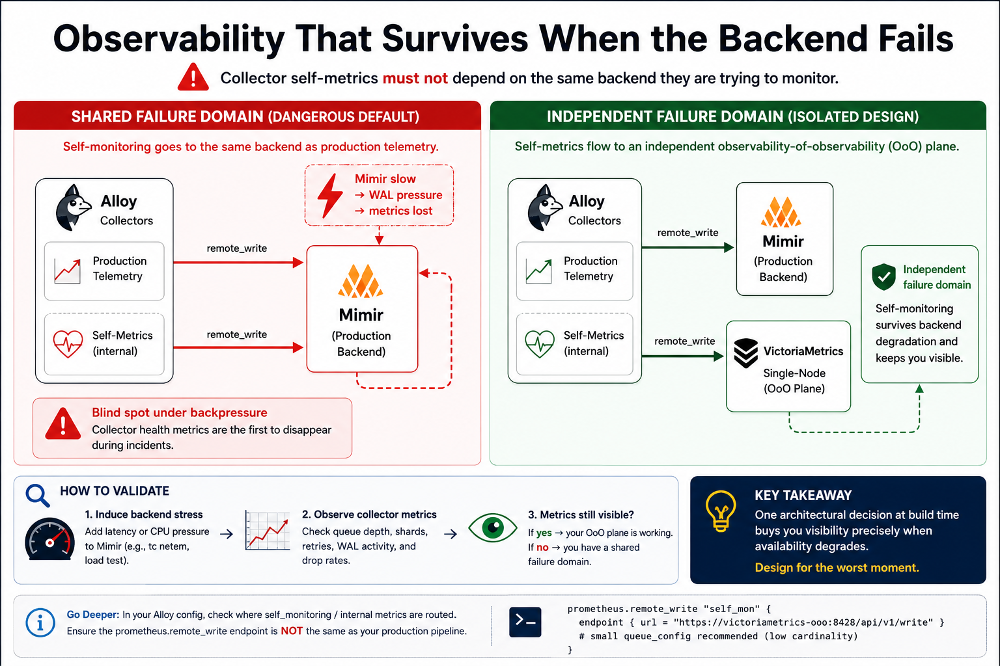
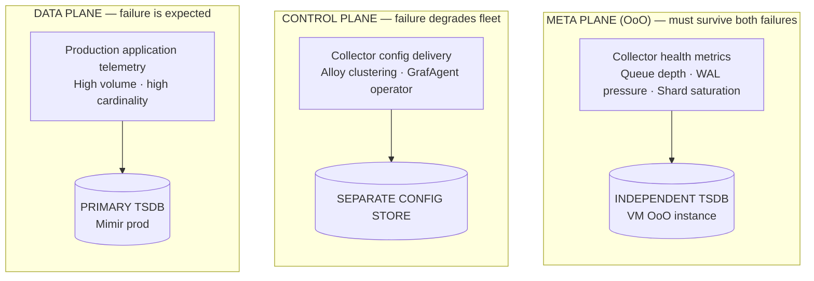

## TL;DR

Routing collector self-metrics through the same telemetry pipeline they monitor is one of the most
dangerous anti-patterns in large-scale observability. It looks harmless in steady state. It becomes
catastrophic under backend pressure. The fix is failure-domain isolation — a structurally
independent **Observability-of-Observability (OoO)** plane that survives primary pipeline
instability.

---

## The Hidden Failure Mode in Production Observability

Most engineers who have operated observability infrastructure at scale have experienced a variation
of this scenario:

A backend TSDB — Mimir, Cortex, Thanos Receive, VictoriaMetrics — starts exhibiting latency spikes.
On-call gets paged. The team opens the Grafana dashboards to diagnose the collector fleet.

The dashboards are blank.

Not because the collectors are healthy. Because the metrics explaining _why_ the collectors are
failing are routed through the same degraded backend the team is trying to diagnose. The
observability system ate itself.

This isn't an edge case. It is a structural failure mode in the majority of production observability
stacks, and it deserves the same treatment as any other single point of failure in distributed
systems design.

---

## Anatomy of the Failure Propagation Chain

Understanding why this happens requires tracing the exact sequence of events during backend
degradation.

### Phase 1: Backend Pressure Begins

A TSDB under load — high cardinality ingestion, compaction pressure, memory saturation, or network
partition — begins exhibiting increased write latency. Remote write endpoints slow down. HTTP 429s
or 503s start appearing.

### Phase 2: Collector Queue Growth

Prometheus remote_write and Grafana Alloy maintain in-memory shards and a Write-Ahead Log (WAL) to
buffer samples destined for the backend. As the backend slows:

- **Shards saturate**: Each shard has a bounded capacity. When the backend acknowledgment rate
  drops, shards fill up.
- **WAL pressure increases**: Unacknowledged segments accumulate. The WAL grows. Eventually, the
  oldest segments are truncated, and samples are dropped.
- **Retry storms emerge**: Collectors begin retrying failed sends. This multiplies the outbound
  request rate at exactly the moment the backend is least able to absorb it.

This is a classic **positive feedback loop**: backend pressure → slower acks → queue growth →
increased retries → more backend pressure.

### Phase 3: Self-Metrics Disappear

The critical insight is that **collector self-metrics — queue depth, WAL size, shard utilization,
sample drop counters — are themselves routed through the same degraded remote_write pipeline**. When
the pipeline degrades, these metrics are among the first to be dropped. They are lower priority than
production workload metrics in most configurations, and they share the same queue that is now
overflowing.

The metrics that would explain the failure are destroyed by the failure.


### Phase 4: Operational Blindness

The on-call engineer now faces the worst possible scenario: a degrading system with no visibility
into the degradation. The dashboards that would normally show:

- `prometheus_remote_storage_queue_highest_sent_timestamp_seconds`
- `prometheus_remote_storage_samples_dropped_total`
- `prometheus_tsdb_wal_storage_size_bytes`
- `alloy_component_controller_running_components`

…are all blank or stale. Incident response time increases. MTTR spikes. And the root cause is an
architectural decision made silently, months earlier, when someone configured `self_mon` to point at
the same endpoint as `prod`.

---

## Why This Anti-Pattern Is So Common

The self-silencing pattern persists for understandable reasons:

**1. Simplicity bias during initial setup.** When you're building an observability stack, adding a
second backend for collector health feels like over-engineering. One Mimir cluster, one remote_write
endpoint, done.

**2. It works perfectly in steady state.** There is no signal that anything is wrong until the
failure mode is triggered. Most environments never run a controlled chaos experiment that would
surface this.

**3. Cost perception.** Running a second TSDB instance feels expensive. The actual cost of
operational blindness during a production incident — measured in MTTR and engineer-hours — is orders
of magnitude higher.

**4. Tooling defaults.** Most documentation examples and quickstart configurations for Prometheus,
Alloy, and similar collectors show a single remote_write destination. Failure-domain isolation is an
advanced operational concern rarely surfaced in getting-started guides.

---

## The Anti-Pattern in Code

Here is the configuration that creates the self-silencing failure mode in Grafana Alloy (River
syntax):

```hcl
// ANTI-PATTERN: Self-silencing configuration
// Both production telemetry and collector self-metrics
// share the same failure domain.

prometheus.remote_write "prod" {
  endpoint {
    url = "https://mimir-prod/api/v1/push"
  }
}

prometheus.remote_write "self_mon" {
  // ⚠️ Same destination as prod.
  // When mimir-prod degrades, self_mon degrades with it.
  // Collector health metrics disappear at the worst possible time.
  endpoint {
    url = "https://mimir-prod/api/v1/push"
  }
}
```

The label `"self_mon"` creates a false sense of separation. At the infrastructure level, there is no
separation. Both write paths terminate at the same Mimir instance. Both are subject to the same
queue pressure, the same shard saturation, the same WAL buildup.

---

## The Correct Design: Failure-Domain Isolation

The solution is not more alerting thresholds or tighter queue configs. It is **structural
isolation** — routing collector self-metrics to a backend that is architecturally independent from
the primary telemetry pipeline.

### Principle

> Collector health metrics must terminate in a backend whose availability is not a function of the
> primary telemetry backend's health.

This is the same principle underlying **control plane / data plane separation** in network design,
**out-of-band management** in datacenter operations, and **heartbeat channels** in distributed
consensus protocols. The mechanism that monitors the system must not share failure modes with the
system it monitors.

### Implementation Options

The OoO (Observability-of-Observability) plane does not need to be heavyweight. It needs to be
**independent**:

| Option                                                     | Use Case                              |
| ---------------------------------------------------------- | ------------------------------------- |
| Separate Mimir tenant with isolated ingesters              | Large-scale Grafana Cloud deployments |
| Lightweight VictoriaMetrics instance                       | On-premises or hybrid environments    |
| Isolated Prometheus with local storage                     | Small clusters, lab environments      |
| Alloy's in-process `prometheus.exporter.self` → local file | Airgapped or minimal setups           |

### Isolated Configuration (Alloy / River)

```hcl
// CORRECT: Failure-domain isolated self-monitoring

// Primary telemetry pipeline — production workloads
prometheus.remote_write "prod" {
  endpoint {
    url = "https://mimir-prod/api/v1/push"

    http_client_config {
      bearer_token_file = "/var/run/secrets/mimir-prod-token"
    }
  }

  queue_config {
    max_shards            = 200
    capacity              = 10000
    max_samples_per_send  = 2000
    batch_send_deadline   = "5s"
    min_shards            = 1
    max_retries           = 3
  }
}

// OoO plane — structurally independent backend
// Survives primary pipeline instability by design.
prometheus.remote_write "self_mon" {
  endpoint {
    // Independent destination: VictoriaMetrics instance
    // with no shared infrastructure with mimir-prod
    url = "https://victoriametrics-ooo:8428/api/v1/write"
  }

  // Conservative queue config: self-metrics volume is low.
  // Large queue config here would be wasteful and obscures signal.
  queue_config {
    max_shards            = 2
    capacity              = 500
    max_samples_per_send  = 100
    batch_send_deadline   = "5s"
    min_shards            = 1
    max_retries           = 5
  }
}

// Collector self-metrics scrape — routed ONLY to self_mon
prometheus.scrape "alloy_self" {
  targets = prometheus.exporter.self.default.targets

  forward_to = [prometheus.remote_write.self_mon.receiver]
  //             ↑ explicitly NOT routed to prod
}
```

### Key Design Decisions in This Configuration

**Separate authentication.** The OoO backend should have its own credentials, not shared with the
production pipeline. A credential rotation or revocation event should not simultaneously affect both
planes.

**Conservative queue config on self_mon.** Collector self-metrics are low cardinality and low
volume. Oversized queue configs here mask problems rather than expose them. Two shards, 500 capacity
is appropriate for most deployments.

**Explicit forward_to targeting.** In Alloy's component model, every scrape target explicitly
declares its destination receivers. This makes routing intent visible in code review and prevents
accidental cross-contamination between planes.

---

## Validating the Isolation

Architectural intent is not the same as operational reality. A configuration that _looks_ isolated
can still share failure modes through shared infrastructure — a common load balancer, a shared
network path, a shared Kubernetes namespace with resource contention.

### The Chaos Validation Test

```bash
# Step 1: Establish baseline — confirm self-metrics are flowing
# Query VictoriaMetrics OoO plane directly:
curl -s "http://victoriametrics-ooo:8428/api/v1/query" \
  --data-urlencode 'query=prometheus_remote_storage_queue_highest_sent_timestamp_seconds' \
  | jq '.data.result[].value[1]'

# Step 2: Introduce backend pressure on the PRIMARY pipeline
# Option A: Inject latency at the network layer
tc qdisc add dev eth0 root netem delay 5000ms 500ms

# Option B: Throttle Mimir ingester CPU
systemctl set-property mimir-ingester.service CPUQuota=20%

# Option C: Use toxiproxy for HTTP-layer fault injection
toxiproxy-cli toxic add mimir-prod --type latency --attribute latency=5000

# Step 3: Observe collector queue metrics — should remain visible
watch -n5 'curl -s "http://victoriametrics-ooo:8428/api/v1/query" \
  --data-urlencode "query=prometheus_remote_storage_samples_dropped_total" \
  | jq ".data.result[].value[1]"'

# Step 4: Check if primary pipeline dashboards are degrading
# while OoO dashboards remain available — this is the target state.
```

**Pass criteria:** Collector queue depth, WAL size, and sample drop counters remain queryable from
the OoO plane during induced primary backend degradation.

**Fail criteria:** These metrics disappear or become stale during the fault injection window. The
OoO plane shares the failure domain.

---

## Metrics You Must Route to the OoO Plane

Not all metrics need to go to the OoO backend — only those required for operational diagnosis of the
collector fleet itself. The key signal set:

```promql
# Queue health — are samples backing up?
prometheus_remote_storage_queue_highest_sent_timestamp_seconds
prometheus_remote_storage_samples_in_total
prometheus_remote_storage_samples_dropped_total
prometheus_remote_storage_samples_failed_total

# Shard saturation — is the collector hitting capacity limits?
prometheus_remote_storage_shards
prometheus_remote_storage_shards_max
prometheus_remote_storage_shards_desired

# WAL health — is the write-ahead log growing uncontrollably?
prometheus_tsdb_wal_storage_size_bytes
prometheus_tsdb_wal_corruptions_total
prometheus_tsdb_wal_truncations_failed_total

# Alloy component health
alloy_component_controller_running_components
alloy_component_dependencies_wait_seconds_bucket

# Target scrape health
up
scrape_duration_seconds
scrape_samples_scraped
```

These are your **canary series**. They must survive when the primary pipeline is failing. If they
share its failure domain, you have no canary.

---

## Generalizing the Pattern: The Three-Plane Model

The failure-domain isolation principle generalizes beyond collector self-metrics. At scale, a mature
observability architecture operates three distinct planes:



Each plane should be able to fail independently without destroying the operational visibility of the
others.

This mirrors the design of reliable distributed systems more broadly:

- Kubernetes separates the control plane from the data plane.
- BGP uses out-of-band management networks for router configuration.
- Consensus protocols (Raft, Paxos) use heartbeat channels independent of the state machine they
  drive.

The observability stack is not exempt from these principles. It is subject to them.

---

## A Real Production Incident: Alloy Co-location

During a production Alloy co-location incident — where collector processes and instrumented
workloads shared node resources — the primary Mimir backend began exhibiting write amplification
under compaction pressure.

Remote write queue depth grew from nominal (~50 samples) to the queue ceiling (10,000 samples)
within four minutes. Shards maxed out. WAL truncation events began dropping samples.

**Without OoO isolation:** The queue depth metrics, which would have shown the trajectory from
"queue growing" to "samples dropping" as a continuous time series, would have been routed through
the same congested pipeline. By the time the pipeline cleared, the critical diagnostic window — the
four minutes showing queue growth rate, shard saturation progression, and first-drop timestamp —
would have been lost.

**With OoO isolation:** The entire event was visible as it happened. The VictoriaMetrics OoO
instance — a single-node deployment with 2 shards and 500-capacity queue — continued accepting
collector self-metrics throughout the incident. The post-incident review had complete queue depth
telemetry from the moment of first pressure to full recovery.

The structural isolation cost: one additional small VM and approximately 200 additional time series.

The operational value: complete situational awareness during a production failure, directly reducing
MTTR.

---

## System Design Implications for MAANG-Scale Observability

If you're designing observability infrastructure for a system at Google, Netflix, or Meta scale,
this pattern has additional implications.

**Hierarchical OoO planes.** At sufficient scale, the OoO plane itself needs monitoring. This is not
a paradox — it is a hierarchy. The OoO plane is a small, low-cardinality, low-volume system. It can
be monitored by a lightweight Prometheus with local storage that reports to nothing but a PagerDuty
webhook. The chain terminates.

**SLO definition for the meta plane.** Your production telemetry may have a 99.9% ingestion SLO.
Your OoO plane should have a higher SLO — 99.99% or better — because it is the system that tells you
when your 99.9% SLO system is failing. SLO hierarchy must match operational dependency hierarchy.

**Cardinality budgets.** Collector self-metrics are inherently low cardinality. The OoO plane can be
sized at 1-2% of the primary pipeline's capacity in typical deployments. This is not a significant
infrastructure cost.

**Blast radius containment.** In a multi-tenant Mimir deployment, the OoO plane should be in a
different tenant with isolated ingesters — not just a different label namespace within the same
ingester pool. Tenant isolation in Mimir is logical, not always physical. Verify your deployment's
actual isolation boundaries.

---

## Summary

|                               | Anti-Pattern                     | Isolated Design            |
| ----------------------------- | -------------------------------- | -------------------------- |
| Self-metrics destination      | Same backend as production       | Independent OoO backend    |
| Failure correlation           | Correlated with primary pipeline | Independent                |
| Visibility during degradation | Lost at worst possible time      | Preserved                  |
| Operational complexity        | Low                              | Slightly higher            |
| Incident diagnosis capability | Severely compromised             | Full situational awareness |
| Infrastructure cost           | Baseline                         | Small additional instance  |

---

## Conclusion

The self-silencing observability anti-pattern is a structural failure in system design, not a
configuration mistake. It emerges from the reasonable instinct to keep things simple, but it
violates a fundamental principle of reliable system design: **the mechanism that monitors a system
must not share the failure modes of the system it monitors**.

Failure-domain isolation — routing collector self-metrics to a structurally independent OoO plane —
is not an optimization. It is a correctness requirement for any observability stack expected to
provide situational awareness during backend degradation.

Audit your remote_write configurations. If `self_mon` and `prod` resolve to the same infrastructure,
you are not running self-monitoring. You are running deferred blindness.
