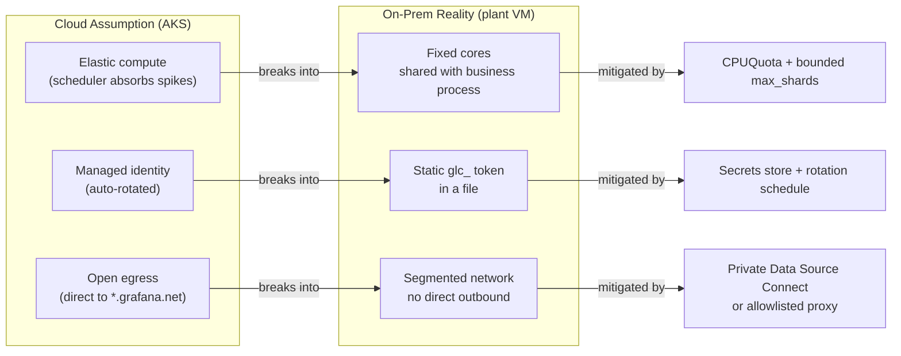

The first on-prem rollout usually starts by copying the AKS Alloy configuration onto a VM, because
it works and it's right there. It runs. Then the backend has a slow afternoon, Alloy's default retry
behavior spins up two hundred parallel shard workers, and on a two-core plant VM with no elastic
headroom that CPU flood starves the business process sharing the host. An engineer kills the
collector to save the workload, and monitoring goes dark during the one window it was needed. The
config wasn't wrong. It was written for a place where compute is elastic, identity is managed, and
egress is open — and a plant VM is none of those.

---

## TL;DR

Cloud collector configs bake in three assumptions that don't hold on-prem: elastic compute (so a
retry storm is absorbed), managed identity (so credentials rotate themselves), and open egress (so
the backend is directly reachable). On a shared on-prem or plant VM you must add what the cloud gave
you for free: an explicit CPU and memory budget enforced by the OS, bounded retry so backend
pressure can't saturate the host, a static `glc_` token managed and rotated deliberately, and a
defined network path — Private Data Source Connect or an allowlisted proxy — to Grafana Cloud.
Deploy it with Ansible per host, not Helm per cluster.

---

## The Problem

**No elastic compute.** In AKS, a collector pod has resource limits and the cluster has headroom; a
spike is scheduled around. On a plant VM the collector shares a fixed core count with a workload
that has no resource guarantee, and Alloy's throughput-optimized defaults — a high `max_shards`,
aggressive retry — turn a backend blip into host CPU saturation. The correct on-call action becomes
"kill the collector," which is a monitoring blackout by another name.

**No managed identity.** AKS workloads authenticate to Grafana Cloud with a workload identity that
rotates behind the scenes. A VM has a static `glc_` access-policy token sitting in a file. Nobody
rotates it, it doesn't expire on its own, and if it leaks there's no automatic revocation. It also
gets confused with a `glsa_` service-account token, which surfaces later as 401s at the Mimir, Loki,
and Tempo write endpoints.

**No open egress.** Cloud subnets reach `*.grafana.net` directly. Plant networks are segmented,
often with no direct outbound internet, sometimes air-gapped from IT entirely. Assuming the OTLP
endpoint is reachable is how a rollout stalls at "data isn't arriving" with no error that points at
the firewall.

**No DaemonSet.** There's no scheduler placing one collector per node. Each host is provisioned
individually, and on AIX the collector can't run natively at all — telemetry has to route through an
intermediary that re-exposes it in a scrapeable format.

---

## Correct Design

**Principle: give the on-prem collector, by hand, everything the cloud gave it automatically —
resource limits, bounded retry, credential management, and a network path — and deploy it per
host.**

| Assumption from cloud | On-prem reality                            | What you add                                                |
| --------------------- | ------------------------------------------ | ----------------------------------------------------------- |
| Elastic compute       | Fixed cores shared with a workload         | `CPUQuota` / `MemoryMax` in systemd; `max_shards` bounded   |
| Managed identity      | Static token in a file                     | `glc_` token in a secrets store; scheduled rotation         |
| Open egress           | Segmented / air-gapped network             | Private Data Source Connect or an allowlisted forward proxy |
| DaemonSet placement   | Per-host provisioning; AIX can't run Alloy | Ansible role per host; njmon → exporter → Alloy for AIX     |
| Cluster dashboards    | Kubernetes Monitoring app                  | Host + process dashboards built on node/process exporters   |

Laid out as a pipeline, each cloud assumption breaks into a specific on-prem reality, and each
reality gets its own explicit mitigation:



```ini
# Context: systemd unit copied from the cloud mental model onto a plant VM

# [WRONG] no resource ceiling; Alloy competes freely for all cores. A backend
# blip -> retry storm -> the co-located business process is starved -> someone
# kills Alloy mid-incident.
[Service]
ExecStart=/usr/bin/alloy run /etc/alloy/config.alloy
# CPUQuota:  not set
# MemoryMax: not set
```

```ini
# Context: systemd unit for a co-located on-prem collector

# [CORRECT] hard OS-enforced ceiling; the collector cannot saturate the host
# no matter how hard it retries. Pair with bounded max_shards in Alloy config.
[Service]
ExecStart=/usr/bin/alloy run /etc/alloy/config.alloy
CPUQuota=30%
MemoryMax=512M
OOMScoreAdjust=500          # OS sheds Alloy before the business process
```

```river
// Context: Alloy remote_write on the plant VM — bounded, not throughput-greedy
prometheus.remote_write "grafana_cloud" {
  endpoint {
    url = env.GC_PROM_URL          // reached via PDC / allowlisted proxy, not direct
    queue_config {
      max_shards  = 10             // default 200 is a CPU bomb on 2 cores
      min_backoff = "2s"
      max_backoff = "60s"
    }
  }
  external_labels = { deployment_environment = "vm-supply-chain-hwa-prod" }  // compound schema
}
```

The co-location retry-storm failure is worth understanding in full detail — it's the same mechanism
whether the host is a plant VM or a shared cloud instance without limits.

### At hyperscale

Across thousands of on-prem hosts the fleet needs central config management — Alloy Fleet Management
or an Ansible control repo — so a `max_shards` cut or a token rotation ships once rather than
host-by-host. Fleet-wide collector upgrades then need deliberate staggering: thousands of agents
restarting and reconnecting in lockstep is its own thundering-herd event against the backend, and
the fix (jittered `min_backoff`, phased rollout) is a rollout-policy decision, not a per-agent
config.

---

## Conclusion

Don't reuse the cluster Alloy config on a VM. Write an Ansible role that installs the collector with
a systemd CPU and memory ceiling, bounds `max_shards`, reads a `glc_` token from a secrets store on
a rotation schedule, and routes to Grafana Cloud over Private Data Source Connect or an approved
proxy. Treat AIX and other non-native hosts as an explicit intermediary pattern. On-prem is a
different set of constraints, and the config has to name each one.

---

_Amit Singh is an Observability Architect and SRE leading a global observability transformation
across 200+ workloads spanning Azure, on-premises, and SAP RISE environments using Grafana Cloud and
OpenTelemetry. He holds a patent in the observability space._

---

**Tags:** #Observability #Alloy #SRE #PlatformEngineering #Kubernetes
