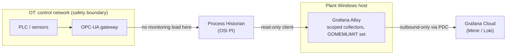

The instinct when you're asked to "get observability into the plants" is to go straight at the
source: put an agent next to the PLCs, pull the sensor tags, scrape the Windows hosts running the
HMI. It doesn't survive contact with a real manufacturing environment. The control network is a
safety boundary you don't get to add load to. The plant is often air-gapped from IT. And the one
place you _can_ safely collect — the Windows hosts — will bury you: an unscoped process collector
across a fleet mid-rollout was already producing between 1,600 and 3,900 distinct process time
series per plant, growing every time a transient process ran. OT and IT observability meet at the
historian, and the thing that breaks is rarely the telemetry pipeline — it's a renamed service
account.

---

## TL;DR

Don't instrument the control layer. Bridge OT and IT at the process historian (OSI PI, or an OPC-UA
gateway), which already aggregates plant-floor signal and sits at a boundary where adding a read
client is safe. Get the data out through a secure, outbound-only path — Private Data Source Connect
or an equivalent — never by opening the plant network. Scope every collector explicitly; an
allow-all Windows `process` collector is a cardinality bomb that detonates as you scale from 7
plants to 40. And treat the historian integration's dependencies — service accounts, certificates,
connectivity — as tier-one, because that's where the real outages come from.

---

## The Problem

**The control layer is off-limits.** PLCs and the OPC-UA servers in front of them run on
deterministic cycle times. Adding a polling client that scrapes aggressively is a safety and
reliability risk to the process itself, not just a monitoring inconvenience. You need a collection
point that already exists for this purpose.

**The plant is segmented or air-gapped.** Cloud observability assumes the backend is reachable.
Plant networks frequently have no direct outbound path to the internet, and the ones that do route
through tightly controlled boundaries. Any design that assumes `*.grafana.net` is reachable from the
shop floor stalls at "data isn't arriving."

**The Windows hosts will flood you.** The hosts running FactoryTalk, HMI sessions, and SQL Server
are the safe place to run a collector — but their defaults are wrong for the environment. An
unscoped `process` collector matches every running process, and across a fleet scaling from 7 to 40
plants that was already 1,600–3,900 series per plant, climbing as one-off processes accumulated,
with no `GOMEMLIMIT` ceiling on the agent to cap the growth. The pipeline wasn't the bottleneck; the
collection scope was.

**The integration is the fragile part.** The historian bridge depends on a service account, a
certificate, and a network path. When a change request renamed service accounts on the OSI PI
servers without testing the restart, every Centerlines screen in the plant went dark — a logon
failure, not a telemetry failure. The observability of the plant floor was only as reliable as an
untested account rename.

---

## Correct Design

**Principle: read from the historian, exfiltrate over a secure outbound path, scope every collector,
and treat the bridge's dependencies as production-critical.**

```text
  PLC / sensors ──▶ OPC-UA gateway ──▶  PROCESS HISTORIAN (OSI PI)  ◀── read-only client
  (safety boundary — no monitoring load here)          │
                                                        │  outbound-only (PDC / approved boundary)
                                                        ▼
                                         Grafana Alloy (plant Windows host,
                                         SCOPED collectors, GOMEMLIMIT set)
                                                        │
                                                        ▼
                                          Grafana Cloud (Mimir / Loki)
                                          deployment_environment = ot-<plant>-...
```

The historian is the only box in this path that both sides of the boundary can touch:



| Decision                | Instrument-the-floor (wrong)                 | Meet-at-the-historian (right)                     |
| ----------------------- | -------------------------------------------- | ------------------------------------------------- |
| Collection point        | Poll PLCs / OPC-UA servers directly          | Read from OSI PI / an OPC-UA gateway              |
| Network                 | Open a path into the plant                   | Outbound-only via PDC or an approved boundary     |
| Windows `process` scope | `include` matches everything (3,900+ series) | Allowlist named plant processes only              |
| Agent resource ceiling  | None — memory climbs with series count       | `GOMEMLIMIT` / `GOMAXPROCS` set in the service    |
| Multi-plant rollout     | Hand-built per plant                         | Jinja2 alert + dashboard templates, one per plant |
| Access                  | Everyone sees every plant                    | OT RBAC / LBAC scoped by `deployment_environment` |

```river
// Context: Alloy on a plant Windows host — the default that doesn't scale

// [WRONG] the process collector matches every process on the host. Across a
// 40-plant rollout this is thousands of series per plant, growing with every
// transient process, and nothing caps the agent's memory as it tracks them.
prometheus.exporter.windows "plant" {
  enabled_collectors = ["cpu", "memory", "process", "service"]
  process { }   // no include filter -> collect them all
}
```

```river
// Context: Alloy on a plant Windows host — scoped, bounded, plant-aware

// [CORRECT] only the processes that represent plant health are collected;
// the agent has an explicit memory ceiling; the environment label carries
// the plant so OT RBAC and cost attribution work per site.
prometheus.exporter.windows "plant" {
  enabled_collectors = ["cpu", "memory", "process", "service"]
  process {
    include = "(FactoryTalk.*|Studio5000.*|pinet.*|sqlservr|hmi.*)"
  }
}
prometheus.remote_write "grafana_cloud" {
  endpoint { url = env.GC_PROM_URL }   // reached via PDC, not an inbound rule
  external_labels = { deployment_environment = "ot-lelystad-plc-prod" }
}
// service unit: Environment=GOMEMLIMIT=400MiB  GOMAXPROCS=2
```

The historian bridge's service account, its certificate expiry, and its connectivity check belong on
a dashboard with paging alerts — the INC that took the plant's screens offline was a dependency
failure, and dependency failures are the ones you can see coming.

### At 35+ plants

At full rollout the per-plant work has to be near zero: Jinja2-templated alerts and replicated
dashboards generated from a plant registry, with label and naming enforcement in CI so one plant's
drift doesn't silently drop it out of the multi-plant rollup. The historian integrations also need
per-plant blast-radius isolation — a bad OPC-UA exporter config at one site must not be able to
saturate the shared Grafana Cloud ingest path for the other thirty-four.

---

## Conclusion

Integrate OT and IT at the historian, not the control layer. Pull the data out over an outbound-only
path, scope every collector to named plant processes, set a hard memory ceiling on the agent, and
template the per-plant rollout. Then monitor the bridge itself — the service account, the cert, the
link — because in manufacturing the outage is almost never the pipeline; it's the credential nobody
tested.

---

_Amit Singh is an Observability Architect and SRE leading a global observability transformation
across 200+ workloads spanning Azure, on-premises, and SAP RISE environments using Grafana Cloud and
OpenTelemetry. He holds a patent in the observability space._

---

**Tags:** #Observability #Alloy #PlatformEngineering #IncidentResponse #SRE
