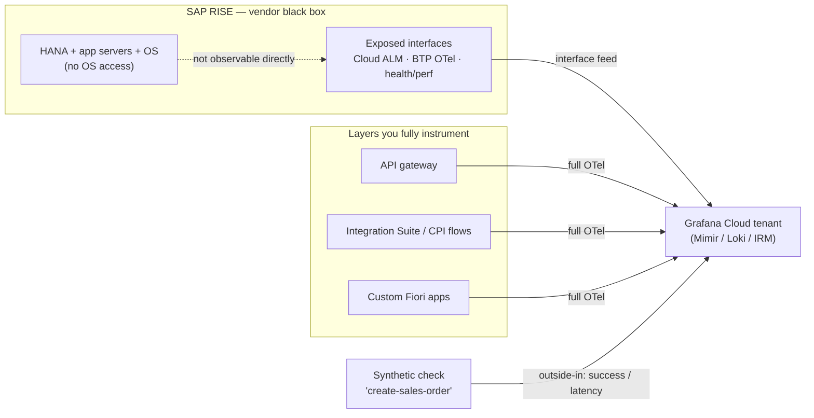

Every observability runbook starts the same way: get an agent onto the host. RISE with SAP removes
that option on day one. The SAP application servers, the HANA database, the OS underneath — all of
it is SAP-managed infrastructure you have a contract with, not a shell on. The workloads running
there are frequently the most business-critical in the company, and the instinct is to treat them
like any other production system and instrument them the same way. You can't. The observability
model for RISE is not "instrument the system" — it's "monitor the contract and own the edges."

> The specifics of which telemetry a given RISE contract exposes vary by service level and change
> over time — treat the interface list below as the shape of the approach, and confirm the exact
> feeds against your own agreement.

---

## TL;DR

RISE with SAP is a managed black box: no OS access, no agent on the app servers or HANA. Build
observability in three layers instead. Outside-in: synthetic monitoring of the business transactions
that matter, so you measure what a user experiences regardless of what you can see inside.
Interface-level: consume the telemetry SAP does expose — health and performance endpoints, SAP Cloud
ALM signals, OpenTelemetry export from BTP where available — into the same Grafana Cloud tenant as
everything else. And own the edges: the integration layer, custom Fiori apps, and the API gateway in
front of RISE are yours to instrument fully. The SLO lives on the business transaction, not on a CPU
number you'll never get.

---

## The Problem

The black box removes the bottom two-thirds of a normal observability stack. There's no node
exporter, no way to run Alloy as a DaemonSet, no OS metrics, no direct HANA instrumentation, no
container runtime to hook. Anything that assumes you can deploy a collector next to the workload is
off the table.

That has a knock-on effect on reliability practice. An SLI built from infrastructure signals — host
up, CPU saturation, pod restarts — is impossible here, which is actually clarifying: it forces the
SLO onto a user-facing measure. But teams that don't adjust end up with a RISE landscape that is
"monitored" only by SAP's own tooling, visible to the SAP basis team and nobody else, and
disconnected from the incident response, dashboards, and on-call the rest of the estate uses. The
first cross-system incident — a slow order because an integration to RISE is timing out — has no
shared timeline because the RISE half was never in the platform.

There's also a false sense of coverage from SAP's built-in monitoring. It's real and useful, but it
answers SAP's questions in SAP's console. It doesn't put a burn-rate alert in your IRM or a latency
panel next to the calling service's panel.

---

## Correct Design

**Principle: measure the contract from outside, ingest the interfaces SAP exposes, and fully
instrument the layers you still control. The SLO is on the business transaction.**

```text
        [ user / calling service ]
                 │
     ┌───────────┴───────────┐
     ▼                       ▼
  YOU OWN                 SYNTHETIC (outside-in)
  API gateway             scripted business txn:
  Integration Suite /     create order, run report,
  CPI flows               post goods movement
  custom Fiori apps       measured on a schedule
     │  full OTel                 │  success / latency
     └───────────┬────────────────┘
                 ▼
          Grafana Cloud tenant  ◀── interface feeds: SAP-exposed health/perf
          (Mimir / Loki / IRM)      endpoints, Cloud ALM signals, BTP OTel export
                 │
            SLO on: "order posts successfully in < N s"   (never on host CPU)
```

| Layer                                       | Access you have    | What you collect                                       |
| ------------------------------------------- | ------------------ | ------------------------------------------------------ |
| HANA / app servers / OS                     | None (SAP-managed) | Nothing directly — rely on the layers below            |
| SAP-exposed interfaces                      | Read via contract  | Health/perf endpoints, Cloud ALM, BTP OTel export      |
| Synthetic (outside-in)                      | Full               | Scripted business transactions: success + latency      |
| Integration layer (CPI / Integration Suite) | Full               | OTel traces/metrics/logs — this is where timeouts show |
| API gateway + custom Fiori                  | Full               | RED metrics, traces, RUM                               |

Drawn as a boundary instead of a table, the same split looks like this — telemetry only crosses out
of the black box through the interfaces SAP chose to expose:



```yaml
# Context: trying to onboard RISE the way you'd onboard an AKS service

# [WRONG] assumes a host to put a collector on. There is no host you can reach.
# This plan blocks on an access request that will never be granted.
observability:
  approach: "deploy Alloy DaemonSet on the SAP app servers"
  sli: "avg(node_cpu_seconds) / host up"      # signals you will never get
```

```yaml
# Context: RISE onboarding that fits the black box

# [CORRECT] SLO on a user-facing transaction; synthetic check as the primary
# signal; SAP-exposed feeds and the integration layer fill in the why.
observability:
  synthetic:
    check: "create-sales-order"          # Grafana Synthetic Monitoring, scripted
    interval: 60s
    assert: "http 200 and order_id present"
  ingest_interfaces:
    - sap_cloud_alm_metrics               # into Mimir
    - icm_status_endpoint                 # scraped via a reachable jump path
    - btp_integration_suite_otlp          # OTLP from the parts SAP runs on BTP
  slo:
    sli: "successful create-sales-order synthetic / total"
    objective: "99.5"
    window: 30d
  owns_fully: [api-gateway, cpi-flows, fiori-custom-apps]
```

### At hyperscale

With many RISE landscapes across regions, the synthetic checks are themselves a fleet. Run them from
probe locations that match each landscape's user geography, and generate the check definitions as
code per landscape from the same catalog entry that drives everything else. Because the exposed
interface feeds vary by contract and service level, the ingestion layer needs a per-landscape
capability map rather than one assumed feed set — otherwise a landscape silently ships with less
coverage than the dashboard implies.

---

## Conclusion

Onboard RISE by measuring what it does, not what it's made of. Put a synthetic check on every
business transaction that matters and make that the SLI. Pull SAP's exposed interface telemetry and
the BTP integration layer into the same tenant, dashboards, and on-call as the rest of the estate.
Instrument the gateway and custom apps in front of RISE completely. Don't file the access request
for the app servers — it isn't coming, and the model doesn't need it.

---

_Amit Singh is an Observability Architect and SRE leading a global observability transformation
across 200+ workloads spanning Azure, on-premises, and SAP RISE environments using Grafana Cloud and
OpenTelemetry. He holds a patent in the observability space._

---

**Tags:** #Observability #OpenTelemetry #SRE #SystemDesign #Grafana
