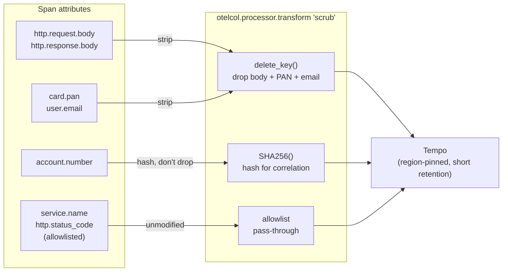

A payments engineer debugging a failed settlement wants everything: the full request, the full
response, the account identifiers, the amounts, the downstream error verbatim. That instinct is
correct for debugging and radioactive for compliance. The moment an account number lands in a span
attribute or a card PAN shows up in an error log, your traces and logs become a second, uncontrolled
store of regulated data — one that's replicated to a vendor, retained on a different schedule,
searchable by a wider audience, and outside the residency and access controls you built around the
system of record. In fintech, "we have great observability" and "we have a data-governance incident"
are often the same sentence.

> This piece is principle-first rather than tied to one incident — the pattern generalizes across
> regulated, transaction-critical systems.

---

## TL;DR

Fintech observability is bounded by regulation, and the binding constraint is what your telemetry is
allowed to contain. Treat every span attribute and log field as data that must clear the same bar as
your database columns: redact or tokenize personally identifiable and account data at the collector,
allowlist attributes rather than blocklisting the ones you remembered, pin retention and region for
any signal that could carry regulated data, and scope access so a support engineer can't read raw
payment traces. "Trust" is then something you can demonstrate: published SLO attainment, evidenced
recovery objectives, and a telemetry pipeline that provably strips what it must.

---

## The Problem

Telemetry backends are built for scale and query speed, not for the controls a financial system of
record lives under. They typically don't enforce field-level encryption, per-record access policy,
jurisdictional pinning, or the retention limits that regulation imposes on customer data. So
anything sensitive that flows into them inherits weaker protection by default.

The leaks are mundane. Auto-instrumentation captures `http.request.body` and `http.response.body` on
error. A developer adds `user.email` and `account.id` as span attributes because it makes a trace
easy to find. An exception message interpolates the card number. A SQL span records the full
statement with literal values. None of these are malicious; all of them put regulated data into a
store that will replicate it to a vendor region, keep it for the backend's default retention rather
than the 30 or 90 days policy allows, and expose it to everyone with Grafana access.

The second problem is that "trust," in fintech, is a claim you have to substantiate. Customers,
auditors, and partners want evidence of reliability — not a green status page but SLO attainment
over time, incident timelines, and demonstrated recovery-time and recovery-point objectives. That
evidence has to come from telemetry that is itself clean, because you can't hand an auditor a
dashboard that's backed by data you're not allowed to keep.

---

## Correct Design

**Principle: telemetry is subject to the same data-governance rules as any other datastore. Strip
regulated data at the collector, allowlist what's permitted, and constrain retention, region, and
access for anything that could carry it.**

| Risk in telemetry            | Default behavior                 | Control                                                |
| ---------------------------- | -------------------------------- | ------------------------------------------------------ |
| PII / account IDs on spans   | Added freely as attributes       | Attribute allowlist; hash or tokenize at the collector |
| Request/response bodies      | Captured on error by auto-instr  | Disabled; capture size + content-type only             |
| Card data in error messages  | Interpolated into exception text | Redact patterns in the log pipeline before export      |
| SQL statements with literals | Full statement on the db span    | Parameterized statement only; strip literal values     |
| Retention / residency        | Backend default, vendor region   | Dedicated tenant: region-pinned, short retention       |
| Access                       | Anyone with Grafana can read     | RBAC + LBAC; raw payment signals to a restricted scope |

```yaml
# Context: OpenTelemetry SDK + auto-instrumentation in a payments service

# [WRONG] every one of these lines writes regulated data into traces/logs that
# will be replicated to a vendor, over-retained, and broadly readable.
OTEL_INSTRUMENTATION_HTTP_CAPTURE_HEADERS_SERVER_REQUEST: "authorization,cookie"
OTEL_PYTHON_LOG_CORRELATION: "true"
# span attributes set in code:
#   span.set_attribute("user.email", user.email)
#   span.set_attribute("account.number", acct.number)
#   span.set_attribute("card.pan", card.pan)
# logger.error(f"settlement failed for {acct.number} card {card.pan}: {resp.text}")
```

```river
// Context: Alloy — scrub regulated data before anything leaves the boundary

// [CORRECT] allowlist span attributes; hash the identifiers you must keep for
// correlation; drop bodies; redact PAN-shaped strings in logs. Route to a
// region-pinned, short-retention tenant with restricted access.
otelcol.processor.transform "scrub" {
  error_mode = "ignore"
  trace_statements {
    context = "span"
    statements = [
      `delete_key(attributes, "http.request.body")`,
      `delete_key(attributes, "http.response.body")`,
      `set(attributes["account.number"], SHA256(attributes["account.number"])) where attributes["account.number"] != nil`,
      `delete_key(attributes, "card.pan")`,
      `delete_key(attributes, "user.email")`,
    ]
  }
}

loki.process "redact_pan" {
  stage.replace {
    expression = "(\\d[ -]?){13,19}"     // PAN-shaped sequences
    replace    = "[REDACTED-PAN]"
  }
}
```

The `scrub` processor above is really a per-attribute gate: every span attribute is dropped, hashed,
or allowed through before it ever reaches trace storage.



With the pipeline provably clean, the trust-facing metrics — rolling SLO attainment, MTTR
distribution, RPO/RTO evidence — are safe to publish, because they're derived from aggregates that
never contained a customer's data in the first place.

### At hyperscale

At scale the redaction pipeline needs its own assurance. Run a continuous canary that injects known
PAN- and PII-shaped test values upstream and alerts if any of them reaches the backend unredacted —
because a single un-scrubbed new attribute on one service is a reportable event, not a bug to triage
next sprint. Enforce the attribute allowlist in CI against the instrumentation code too, not only at
the collector, so a leak is caught in review rather than discovered in the store.

---

## Conclusion

Put your telemetry through data-governance review the same way you would a new database. Turn off
body capture, allowlist span attributes, hash the identifiers you need for correlation and drop the
rest, and send anything that could carry regulated data to a region-pinned tenant with short
retention and restricted access. Then build the trust story on those clean aggregates: attainment,
recovery objectives, incident timelines. Reliability you can prove — without a governance liability
attached — is the product.

---

_Amit Singh is an Observability Architect and SRE leading a global observability transformation
across 200+ workloads spanning Azure, on-premises, and SAP RISE environments using Grafana Cloud and
OpenTelemetry. He holds a patent in the observability space._

---

**Tags:** #Observability #OpenTelemetry #SRE #SystemDesign #FinOps
