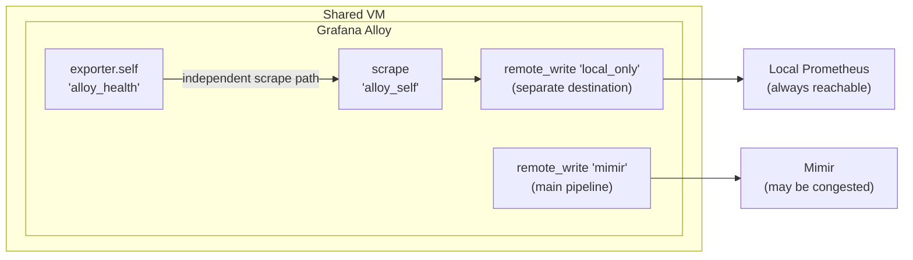

The production VM was running fine. Then Mimir had a hiccup. What happened next is the kind of
failure that earns its own standing rule in the team runbook: Grafana Alloy — the observability
agent deployed specifically to provide visibility — consumed so much CPU that the critical business
process sharing the same VM was starved of resources. An engineer killed Alloy to rescue the
business process. Monitoring went dark. The team operated blind during an active incident. MTTR
grew.

The root cause was not a bug. It was a default: `max_shards = 200`.

---

## TL;DR

Grafana Alloy's `prometheus.remote_write` component defaults to 200 parallel shard workers when
retrying against a degraded backend. On a shared VM, this CPU flood stalls co-located workloads.

The fix is three layers deep: OS-level CPU quota (`CPUQuota=30%` in systemd, Windows Job Object
equivalent via Ansible), explicit `max_shards = 10` in the Alloy River config, and an independent
self-monitoring path so Alloy's health metrics don't travel through the same congested pipeline
they're reporting on.

Without all three layers, any backend degradation event can cascade into a monitoring blackout at
the worst possible time.

---

## The Problem

The VM in question ran two workloads: Grafana Alloy forwarding metrics to a shared Mimir cluster,
and a business-critical application. Neither workload had explicit CPU limits. This is typical in
the early phases of an observability rollout — agents get installed and "it just works," so resource
governance doesn't come up until something breaks.

When the Mimir backend became temporarily slow, Alloy did not idle and wait. Its default behavior is
to treat backend pressure as a signal to retry _harder_. The `remote_write` subsystem responds by
spawning more parallel shard workers — up to the configured ceiling — all simultaneously attempting
to flush the internal WAL-backed queue to the backend.

With `max_shards` at the default of 200, Alloy can spawn two hundred goroutines in parallel, each
churning through serialize → compress → HTTP POST → retry cycles. On a dual-core VM this ceiling is
effectively unbounded relative to available compute. The business process — which has no special
priority claim and no resource guarantee — was starved. CPU utilization hit the ceiling. The
application became unresponsive.

The engineer on call had one option: kill Alloy. This is the correct call — it protected the
business process — but it introduced a monitoring blackout at exactly the moment when the team
needed to understand the state of that same application.

The business impact: extended MTTR, no diagnostic signal during incident response, and an engineer
now operating on memory and intuition rather than dashboards and traces.

---

## Failure Chain

### Phase 1: Backend Degradation

Mimir becomes slow or returns 5xx. This can be a transient overload, a network blip, or a downstream
dependency failure. Alloy's internal queue starts filling as samples accumulate faster than they
drain.

### Phase 2: Shard Escalation

Alloy's `remote_write` queue manager interprets the growing queue depth as a throughput deficit. Its
response is to spawn additional shard workers — parallel goroutines that each independently attempt
to flush a batch to the backend. The default ceiling is `max_shards = 200`. Each worker is in a
tight retry loop: serialize, compress, HTTP POST, receive 5xx or timeout, wait `min_backoff`, retry.

### Phase 3: CPU Saturation

Two hundred goroutines on a shared VM is not a load spike — it is sustained saturation. The Go
runtime schedules across available CPUs, but the net effect is that a large fraction of the host's
compute is occupied by serialization, compression, and TCP retransmissions. The business process,
running at normal priority with no CPU reservation, cannot get scheduled.

### Phase 4: Manual Intervention

Application latency climbs. An engineer notices. The diagnostic path — checking metrics — is
compromised because the metrics pipeline is the thing under stress. Alloy health metrics are routed
through the same congested `remote_write` pipeline, so they are dark. The engineer kills Alloy. CPU
drops. The application recovers.

### Phase 5: Monitoring Blackout

With Alloy dead, no metrics flow to Mimir. Dashboards go stale. Alert rules fire on missing data.
The team is now triaging a combined event: the original Mimir degradation, the starved business
process, and the absence of all observability signal. A problem that started as a backend blip has
become a full diagnostic blackout.

---

## Why It Persists

The `max_shards = 200` default is not wrong in isolation. It exists because in the canonical
deployment model — a dedicated VM or Kubernetes pod running only the collector — you _want_ Alloy to
aggressively drain its queue when the backend recovers. Falling behind on metrics is bad. Losing
data is bad. The default is optimized for throughput over politeness.

What the default does not account for is co-location. The Prometheus ecosystem largely assumes
collectors run in isolation: Node exporters on dedicated pods, Alloy DaemonSets with proper
Kubernetes resource limits, centralized collector pools with their own CPU budgets. When Alloy is
installed on a shared host — which happens constantly during observability rollouts, migrations, and
hybrid environments — the default config becomes a loaded weapon with no safety.

There is also a subtler organizational dynamic: observability agents are infrastructure, not
application code. They don't go through the same production-readiness checklist. Resource limits,
alert coverage, and graceful degradation behavior are afterthoughts. By the time anyone asks "what
does Alloy do when Mimir is down?", they're usually asking from an incident timeline.

---

## Anti-Pattern: The Default Config on a Shared Host

```hcl
# Context: default Alloy remote_write config — dangerous on shared VMs

# [WRONG] No queue_config means max_shards defaults to 200
# [WRONG] 200 parallel workers on a dual-core VM is uncontrolled CPU saturation
# [WRONG] min_backoff/max_backoff not set — workers retry as fast as Go allows
prometheus.remote_write "mimir" {
  endpoint {
    url = "http://mimir:9009/api/v1/push"
    // no queue_config block
    // result: 200 goroutines, unbounded retry rate, no memory ceiling on the queue
  }
}
```

```ini
# Context: default systemd unit — no resource constraints
# [WRONG] Alloy competes for all available CPU on the host
# [WRONG] No OOM priority — OS may kill the business process before Alloy
# [WRONG] No memory ceiling — queue grows until the host OOMs

[Unit]
Description=Grafana Alloy
After=network.target

[Service]
ExecStart=/usr/bin/alloy run /etc/alloy/config.alloy
# CPUQuota:        not set
# MemoryMax:       not set
# OOMScoreAdjust:  not set — defaults to 0, same priority as everything else
```

The danger is invisible under normal conditions. This config works perfectly until Mimir has a bad
day — exactly the moment when the monitoring system is most needed.

---

## Correct Design

The fix operates at three independent layers. Each layer addresses a distinct failure mode, and each
is independently valuable. Together they make Alloy safe to co-locate.

**Principle:** an observability agent on a shared host must have an explicit resource budget, a
bounded retry strategy, and a self-monitoring path that does not depend on the pipeline it is
monitoring.

### Options Table

| Approach                         | CPU Protection                  | Queue Bounding             | Health Visibility           | Gaps                                   |
| -------------------------------- | ------------------------------- | -------------------------- | --------------------------- | -------------------------------------- |
| systemd CPUQuota only            | Yes — hard cap                  | No — workers still max out | No — dark during congestion | Two of three failure modes unaddressed |
| max_shards only                  | No — workers can still saturate | Yes — bounded              | No — dark during congestion | CPU and health gaps remain             |
| Independent self-monitoring only | No                              | No                         | Yes — always visible        | No resource protection                 |
| **All three layers**             | **Yes**                         | **Yes**                    | **Yes**                     | **None**                               |

Each layer without the others leaves a gap. The three-layer approach closes all of them.

### Layer 1: OS-Level CPU Quota

```ini
# Context: /etc/systemd/system/alloy.service [Service] section — Linux

# [CORRECT] Hard CPU ceiling enforced by the kernel scheduler
# Even with 200 goroutines active, total wall-clock CPU share is capped
CPUQuota=30%          # 30% of total CPU — conservative starting point on a dual-core VM
MemoryMax=512M        # prevents WAL queue-driven memory bloat from OOM-ing the host
OOMScoreAdjust=500    # OS terminates Alloy before the business process under memory pressure
# Tune CPUQuota based on VM size and co-tenant resource requirements
# On a 4-core VM with a CPU-intensive co-tenant, 20% may be more appropriate
```

```bash
# Apply and verify
systemctl daemon-reload
systemctl restart alloy

# Confirm limits are active (not just configured)
systemctl show alloy | grep -E 'CPUQuota|MemoryMax|OOMScoreAdjust'
# Expected:
# CPUQuotaPerSecUSec=300000   (30% of 1s = 300ms per second)
# MemoryMax=536870912         (512 MiB in bytes)
# OOMScoreAdjust=500
```

For Windows hosts managed via Ansible, the equivalent is a Windows Job Object with a hard CPU rate
cap. The `grafana-cloud-deployments` playbook handles this automatically — a PowerShell script runs
as a persistent Scheduled Task under SYSTEM, attaches to the Alloy process on startup, and enforces
kernel-level limits:

| systemd directive    | Windows equivalent                     | Mechanism                            |
| -------------------- | -------------------------------------- | ------------------------------------ |
| `CPUQuota=30%`       | `JOB_OBJECT_CPU_RATE_CONTROL_HARD_CAP` | Kernel-enforced; available Win8+     |
| `MemoryMax=512M`     | `JOB_OBJECT_LIMIT_JOB_MEMORY`          | Commit-limit; OOMs the job on breach |
| `OOMScoreAdjust=500` | Process priority class `BelowNormal`   | OS trims/kills lower-priority first  |

```yaml
# Context: inventories/group_vars/all.yml — Ansible-managed Windows hosts
alloy_cpu_quota_pct: 30   # maps to JOB_OBJECT_CPU_RATE_CONTROL_HARD_CAP
alloy_memory_max_mb: 512  # maps to JOB_OBJECT_LIMIT_JOB_MEMORY
```

```powershell
# Context: verify Windows Job Object enforcement after Ansible deploy

# [CORRECT] Confirm Alloy process is inside the Job Object — must return True
Add-Type -TypeDefinition @'
using System; using System.Runtime.InteropServices;
public class ProcJob {
    [DllImport("kernel32.dll")] public static extern bool IsProcessInJob(IntPtr proc, IntPtr job, out bool result);
}
'@
$inJob = $false
[ProcJob]::IsProcessInJob((Get-Process alloy).Handle, [IntPtr]::Zero, [ref]$inJob)
$inJob                             # expected: True
(Get-Process alloy).PriorityClass  # expected: BelowNormal
```

### Layer 2: Bounded Remote Write Queue

```hcl
# Context: /etc/alloy/config.alloy

# [CORRECT] Explicit queue_config with bounded shard count
# 10 workers is sufficient for single-VM throughput requirements
# With 10 shards instead of 200, retry-storm CPU impact is bounded and predictable
prometheus.remote_write "mimir" {
  endpoint {
    url = "http://mimir:9009/api/v1/push"

    queue_config {
      capacity             = 5000   // max samples held in memory — size to available RAM
      max_samples_per_send = 500    // batch size; larger batches reduce HTTP round-trips
      max_shards           = 10     // KEY FIX: default is 200 — this single line is the CPU driver
      min_backoff          = "2s"   // initial retry delay — gives the backend time to recover
      max_backoff          = "60s"  // back off hard when Mimir is under sustained pressure
    }

    retry_on_http_429 = true        // respect Mimir's backpressure signals explicitly
  }
}
```

The `max_shards` parameter is the load-bearing line. At 10 shards instead of 200, Alloy can still
drain a full queue quickly when the backend recovers, but it cannot saturate a shared host's CPU
during a retry storm.

### Layer 3: Independent Self-Monitoring Path



```hcl
# Context: Alloy River config — independent self-monitoring path

# [CORRECT] Alloy's health metrics routed to a SEPARATE destination
# If routed through the same mimir endpoint, health data goes dark precisely
# when Mimir is the problem — exactly when you need to see what's happening
prometheus.exporter.self "alloy_health" { }

prometheus.scrape "alloy_self_monitoring" {
  targets         = prometheus.exporter.self.alloy_health.targets
  forward_to      = [prometheus.remote_write.local_only.receiver]
  scrape_interval = "15s"
}

// Separate destination — local Prometheus, secondary Mimir tenant, or any
// independent write endpoint that does NOT share the main pipeline's fate
prometheus.remote_write "local_only" {
  endpoint {
    url = "http://local-prometheus:9090/api/v1/write"
    // This endpoint must be reachable independently of the primary Mimir cluster
  }
}
```

---

## Validation Test

```bash
# Context: Linux — confirm all three layers are active

# Layer 1: OS limits applied
systemctl show alloy | grep -E 'CPUQuota|MemoryMax|OOMScoreAdjust'
# Expected:
# CPUQuotaPerSecUSec=300000
# MemoryMax=536870912
# OOMScoreAdjust=500

# Layer 2: max_shards is in effect (check rendered config and live metric)
grep max_shards /etc/alloy/config.alloy
# Expected: max_shards = 10

curl -s http://localhost:12345/metrics | grep prometheus_remote_storage_shards_max
# Expected: prometheus_remote_storage_shards_max{...} 10

# Layer 3: self-monitoring is live and routing independently
curl -s http://local-prometheus:9090/api/v1/query \
  --data-urlencode 'query=up{job="alloy"}' | jq '.data.result[].value[1]'
# Expected: "1"

# Chaos injection — simulate Mimir unavailability and verify CPU stays bounded
sudo tc qdisc add dev eth0 root netem delay 10000ms  # 10s artificial latency to Mimir
sleep 60
# While degraded: health metrics should remain visible via local Prometheus
curl -s http://local-prometheus:9090/api/v1/query \
  --data-urlencode 'query=prometheus_remote_storage_pending_samples' | jq .
# Queue will grow, but CPU should stay within the 30% quota
# Restore
sudo tc qdisc del dev eth0 root
```

```powershell
# Context: Windows — confirm all three layers after Ansible deploy

# Layer 1: Job Object active
$inJob = $false
[ProcJob]::IsProcessInJob((Get-Process alloy).Handle, [IntPtr]::Zero, [ref]$inJob)
$inJob  # expected: True

# Layer 2: max_shards in config
Select-String max_shards "C:\Program Files\GrafanaLabs\Alloy\config.alloy"
# Expected: max_shards = 10

# Limits re-apply automatically after service restart
Restart-Service Alloy
Start-Sleep 75
(Get-ScheduledTask -TaskName AlloyResourceLimits).State  # expected: Running
$inJob = $false
[ProcJob]::IsProcessInJob((Get-Process alloy).Handle, [IntPtr]::Zero, [ref]$inJob)
$inJob  # expected: True
```

---

## Key Metrics

Instrument these on the **independent self-monitoring Prometheus instance**. Placing them on the
same congested pipeline they describe defeats the purpose — they go dark at exactly the wrong
moment.

| Signal                     | PromQL                                                                    | Alert Threshold     | What It Tells You                                         |
| -------------------------- | ------------------------------------------------------------------------- | ------------------- | --------------------------------------------------------- |
| Samples being dropped      | `rate(prometheus_remote_storage_dropped_samples_total[5m])`               | `> 0`               | Data loss in progress — fire P1                           |
| Queue filling              | `prometheus_remote_storage_pending_samples`                               | `> 3000`            | Backend pressure building; investigate before drops begin |
| Active shards near ceiling | `prometheus_remote_storage_shards`                                        | `> 8` (with max=10) | Workers near ceiling; backend may be degraded             |
| Alloy CPU consumption      | `rate(process_cpu_seconds_total{job="alloy"}[2m])`                        | `> 0.3`             | Climbing toward contention; check co-tenant health        |
| WAL fsync latency          | `rate(prometheus_tsdb_wal_fsync_duration_seconds_count[5m])`              | spike               | WAL under I/O pressure — common cascade trigger           |
| Send timestamp staleness   | `time() - prometheus_remote_storage_queue_highest_sent_timestamp_seconds` | `> 120s`            | Samples not reaching Mimir; queue accumulating            |

```promql
# Composite alert: catch backend pressure before it reaches the CPU ceiling
(
  prometheus_remote_storage_pending_samples > 3000
  and
  prometheus_remote_storage_shards > 7
)
# Fires when queue is deep AND near the shard ceiling simultaneously
# Both conditions together mean max_shards is the next wall to hit
```

---

## Pattern Generalization

The underlying failure is uncontrolled retry escalation by a co-located non-primary workload. The
same pattern surfaces across the collector ecosystem.

**Fluent Bit / Fluentd on shared nodes:** buffer overflow during log backend degradation drives I/O
and CPU in the same way. The equivalent of `max_shards` is `flush_thread_count` in Fluent Bit. The
fix is the same: explicit ceilings and OS-level quotas.

**OpenTelemetry Collector:** the `otlphttp` exporter has a `num_consumers` parameter that governs
parallel export goroutines. The `retry_on_failure` config block's `max_elapsed_time` is the
equivalent of `max_backoff`. Default configs are similarly optimized for dedicated deployments.

**Prometheus `remote_write` (pre-Alloy):** Alloy inherited this subsystem directly. The `max_shards`
parameter and its default of 200 exist in `prometheus.yml` with identical semantics and the same
failure mode on shared hosts.

The underlying principle is constant across all of them: **any agent that implements "retry harder
when the backend is slow" becomes a CPU bomb on a shared host during backend degradation.** The
retry strategy that maximizes throughput in isolation becomes resource contention in co-location.
This is not a bug — it is a design tradeoff that is only visible when the deployment constraint
changes from isolated to shared.

The broader engineering rule: an observability agent must have an explicit resource budget when
co-located, and its health metrics must be routed independently of the pipeline it monitors.

---

## Production Incident

This is a representative account based on the incident described in this post-mortem. The specific
VM hosted a business-critical application and Grafana Alloy, both installed during an observability
expansion to hybrid on-premises workloads.

**T+0:00** — The Mimir cluster experiences elevated write latency. Alloy's `remote_write` component
begins seeing timeouts on POST requests to the Mimir push endpoint. The WAL queue starts filling.

**T+0:02** — Alloy's queue manager detects the growing backlog. Shard count begins climbing. With no
`max_shards` constraint and no CPU quota, escalation is immediate and uncapped.

**T+0:05** — VM CPU utilization reaches 95%. The business-critical application begins queuing
internal requests. User-facing latency spikes. This triggers a separate application alert.

**T+0:12** — On-call engineer responds to the application latency alert. Opens the dashboard to
investigate. The dashboard is stale — Alloy has been unable to push metrics for 12 minutes, and
Alloy's health metrics are routed through the same congested pipeline. The engineer cannot see
recent CPU utilization, memory, or application-level signals. They are diagnosing a live performance
problem with 12-minute-old data.

**T+0:18** — Engineer identifies the anomaly via the process table rather than a dashboard: Alloy
consuming 60%+ CPU. No runbook entry for this failure mode. Single available action: kill Alloy.

**T+0:19** — `systemctl stop alloy`. CPU drops. Application recovers within 30 seconds.

**T+0:45** — Mimir recovers. Engineer manually restarts Alloy. Queue partially drains from WAL;
samples older than WAL retention window are lost.

**Total impact:** approximately 14 minutes of application degradation, 45 minutes of monitoring
blackout, partial metric data loss for the incident window, and materially extended MTTR because the
engineer was operating without observability signal during the most critical phase of triage. The
Mimir event was a 45-minute brownout that should have been invisible. Instead, Alloy's default retry
behavior amplified it into an application incident.

---

## MAANG-Scale Considerations

At Google, Netflix, or Meta scale, this specific failure mode is less likely in the steady state —
Alloy almost always runs as a DaemonSet pod with Kubernetes resource limits. But the underlying
pattern is more dangerous, not less.

**Templated resource limits are not reasoned resource limits.** At fleet scale,
`resources.limits.cpu: "500m"` in a shared Helm values file is the Kubernetes equivalent of
`CPUQuota` — and most teams that set it via copy-paste have never stress-tested what happens when
10,000 Alloy instances simultaneously encounter a degraded Mimir ruler. The value was chosen once
and never revisited.

**Fleet-wide retry storms as a correlated failure.** At 10,000 nodes with default
`max_shards = 200`, a 30-second Mimir unavailability eventcan trigger 2,000,000 parallel goroutines
all retrying in near-lockstep. The thundering herd problem at this scale can extend a 30-second blip
into a multi-minute recovery event: Mimir recovers, but cannot absorb the burst of simultaneous
reconnects. The fix at MAANG scale is not just `max_shards = 10` but also jitter in `min_backoff` —
staggered reconnects rather than synchronized ones.

**Multi-tenant Mimir isolation for self-monitoring.** At Netflix or Google scale, the correct
architecture routes Alloy self-monitoring metrics to a separate Mimir tenant with its own ingest
quota and independent ruler. This ensures that a quota exhaustion event in the primary tenant (which
causes Alloy to retry, filling the queue, triggering shard escalation) does not also suppress the
health signals that would tell you the quota was exhausted in the first place. Circular
observability is the MAANG-scale version of the same routing mistake that burned this VM.

**WAL replay bursts on rolling restarts.** At 10,000 nodes × 200 shards × 500 samples per flush, the
burst on a fleet-wide rolling restart can saturate Mimir's ingestion path regardless of per-instance
`max_shards`. The combination of explicit per-instance shard limits and staggered rollout timing
(max surge + max unavailable in the DaemonSet rollout policy) is how MAANG-scale teams control the
blast radius of a routine deploy. Neither constraint alone is sufficient.

---

## Summary Table

| Dimension          | Anti-Pattern                                                                | Correct Design                                                                        |
| ------------------ | --------------------------------------------------------------------------- | ------------------------------------------------------------------------------------- |
| Retry behavior     | Default `max_shards=200`; unbounded goroutine escalation on backend failure | `max_shards=10`, `min_backoff=2s`, `max_backoff=60s` — bounded and progressive        |
| CPU governance     | No systemd limits; Alloy competes freely with all co-located processes      | `CPUQuota=30%` in systemd unit; Windows Job Object via Ansible                        |
| Memory governance  | No ceiling; WAL queue can bloat the host into OOM                           | `MemoryMax=512M`; Windows Job Object commit limit                                     |
| OOM priority       | Default score of 0 — OS may kill the business process before Alloy          | `OOMScoreAdjust=500`; Windows `BelowNormal` priority class                            |
| Health signal path | Self-monitoring routed through the same congested pipeline                  | Independent `prometheus.remote_write` destination — local or secondary Prometheus     |
| Failure detection  | Engineer notices application degradation manually; dashboard is stale       | Alert on queue depth (`>3000`) and shard ceiling (`>8/10`) from independent path      |
| Failure cascade    | Backend blip → CPU storm → business process starved → monitoring blackout   | Backend blip → bounded retry → CPU stays within quota → health metrics always visible |
| Blast radius       | Single Mimir event cascades to application incident and monitoring gap      | Backend event isolated to queue accumulation; no co-lateral process impact            |

---

## Conclusion

When Alloy co-locates with any workload that must be protected, apply the three-layer fix before
deployment — not after the first incident. Set `CPUQuota` in the systemd unit, drop `max_shards` to
10, and route self-monitoring metrics to an independent destination. The default config is not
wrong; it is optimized for isolated deployments. Shared hosts are not isolated deployments, and the
gap between those two assumptions is where incidents are born.
