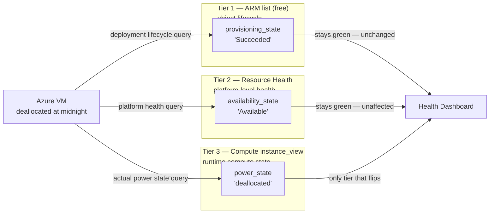

An alert fired at 2:07am: `azure_monitor_metric` was missing CPU data for three VMs in the dev
resource group. The on-call engineer opened Grafana. `provisioning_state` showed `Succeeded` for all
three VMs — green. The exporter's self-metrics showed zero errors. The remote_write client was
posting successfully. Everything looked operational.

The VMs had been deallocated by a cost-optimization runbook at midnight. Azure Monitor does not emit
metrics for deallocated resources. `provisioning_state` had not changed. It never would change. A VM
that is successfully created, then stopped, then deallocated still carries
`provisioning_state: Succeeded` in every ARM list response until the resource is deleted. The field
describes the ARM object's deployment lifecycle, not the VM's operational state.

The 48 minutes spent debugging the exporter before checking VM power state directly in the Azure
portal is the cost of building a health model on the wrong signal. This post documents the
three-tier status model that maps each Azure health signal to its API, its call cost per collection
cycle, and the specific failure class it catches — and explains why the obvious shortcut
(`expand="instanceView"`) breaks on any subscription that runs AKS.

---

## TL;DR

Azure ARM's `provisioning_state` tells you whether the resource object was successfully deployed. It
is always `Succeeded` for a VM that has been deallocated, for a storage account that Azure has
marked `Degraded`, and for a Key Vault in a region with an active outage. Azure exposes three
independently queryable status dimensions: ARM provisioning state (object lifecycle), Resource
Health availability state (platform-level operational health), and VM-specific power state (compute
instance state). Using only Tier 1 means your health dashboard is blind to stopped compute, regional
degradation, and platform health events. The correct model is opt-in tiering: always collect
`provisioning_state` because it is free, enable `resource_health` for operational health alerting,
enable `vm_power_state` only for workloads with VMs. Do not use
`resources.list(expand="instanceView")` to get VM power state — it returns HTTP 400 on subscriptions
with VMSS-managed nodes (AKS).

---

## The Problem

Most Azure monitoring implementations start with the ARM resource list API because it is the natural
entry point for building an inventory. One paginated call per resource group returns all resources
with their metadata, and `provisioning_state` is in the response with no extra API cost. It looks
like a health signal because it uses the same vocabulary as health signals everywhere else:
`Succeeded`, `Failed`, `Updating`, `Deleting`. The miss is that these words describe the ARM
object's position in its deployment lifecycle, not whether the resource is doing anything useful.

The ARM object lifecycle and operational health are independent dimensions. A VM can simultaneously
hold:

- `provisioning_state: Succeeded` and `power_state: deallocated` — stopped, no metrics emitted
- `provisioning_state: Succeeded` and `availability_state: Degraded` — platform-level issue visible
  to Azure but not reflected in ARM state
- `provisioning_state: Succeeded` and `availability_state: Unavailable` — regional or service outage

In all cases, `provisioning_state: Succeeded` is identical. The field transitions away from
`Succeeded` only during active ARM operations — creating, updating, or deleting the resource. Once
the deployment lifecycle operation completes, it stays `Succeeded` until the resource is deleted,
regardless of what happens to the workload running on it. Teams that alert on
`provisioning_state!="Succeeded"` are alerting on ARM control plane failures — stuck deployments,
failed template applications, active deletions. They are not alerting on operational health.

The scope of the blind spot scales with the environment. An Azure estate with VMs that are
periodically stopped for cost management, with services that occasionally hit platform-level
degradation, or with resources in regions with elevated failure rates will generate persistent
false-negative health signals. The Grafana dashboard shows green; the application team is getting
timeouts.

---

## Failure Chain

**Phase 1 — Health dashboard built on ARM list data.** A resource health dashboard is built using
`provisioning_state` as the primary health label. The data is free, always present, and
straightforward to query. `azure_resource_info{provisioning_state!="Succeeded"}` becomes the
operational health alert. It fires correctly during one botched Terraform apply, which reinforces
the belief that `provisioning_state` is the right signal.

**Phase 2 — Cost runbook runs at midnight.** A scheduled automation script deallocates three dev VMs
at midnight to reduce weekend compute costs. This is correct, intentional behavior. The VMs
transition from `power_state: running` to `power_state: deallocated`. Azure sends no notification to
ARM. `provisioning_state` for all three VMs remains `Succeeded`. The runbook completes, logs
success, and exits.

**Phase 3 — Azure Monitor metrics stop emitting.** Azure Monitor does not collect CPU, disk, or
network metrics for deallocated VMs. This is correct behavior: there is no compute activity to
measure. The exporter's next collection cycle calls `monitor.metrics.list()` for the now-deallocated
VMs. Azure Monitor returns no data points. The exporter emits no `azure_monitor_metric` samples for
these VMs. No error is raised; the absence is correct from the exporter's perspective.

**Phase 4 — Alert fires on missing data.** The alerting rule
`absent(azure_monitor_metric{resource_group="...", metric_name="Percentage CPU"})` fires at 2:07am
after two hours of no CPU data from the dev VMs. PagerDuty pages on-call.

**Phase 5 — Engineer debugs the wrong component.** On-call opens Grafana. The health dashboard shows
`provisioning_state: Succeeded` for all three VMs. `azure_exporter_errors_total` is 0.
`azure_exporter_last_scrape_timestamp_seconds` is 90 seconds old — well within the 600-second
staleness threshold. The engineer assumes the exporter is failing silently, a network issue is
blocking Azure Monitor API calls, or the metric configuration changed. Checks Azure Monitor API
credentials (valid). Verifies Monitoring Reader RBAC assignment (present). Reviews recent git
history for configuration changes (none in 72 hours). Calls `az monitor metrics list` directly
against the subscription — returns empty, consistent with a deallocated VM but not yet recognized as
such.

**Phase 6 — Root cause found in the Azure portal.** At 02:55, the engineer opens the Azure portal
directly for the three VMs. All show `Status: Stopped (deallocated)`. The cost runbook is confirmed
as the cause. The exporter was correct throughout. Time to diagnosis: 48 minutes.

---

## Why It Persists

The Resource Health API is not well-documented in the context of Prometheus-based monitoring.
Microsoft's documentation for third-party integrations leads with ARM list data because it requires
no additional SDK packages or API calls. The Resource Health API requires separate client
initialization (`azure-mgmt-resourcehealth`) and a separate ARM call pattern
(`availability_statuses.list_by_resource_group()`). Teams building their first Azure exporter do not
know this API exists until they hit the production failure mode. By then, they have often shipped a
health dashboard that has been trusted for months.

The VM power state situation is made worse by a documented API inconsistency that turns the obvious
remediation into a trap. When engineers discover that `provisioning_state` misses compute state, the
natural fix is the ARM list API's `expand` parameter:

```text
resources.list(expand="instanceView")
```

This works on subscriptions with only standalone VMs. It fails with `HTTP 400 Bad Request` on
subscriptions containing VM Scale Sets — specifically, the error message indicates that
`instanceView` expand is not supported at subscription scope for VMSS-managed instances. Any Azure
subscription running AKS has VMSS, because AKS node pools are backed by VMSS. This means the
"obvious" fix breaks in the most common production environment. Engineers who try it against an AKS
subscription get a 400, find no actionable documentation, and move on without solving the power
state monitoring gap. The pattern stays broken.

The correct approach — per-VM `instance_view()` calls through the Compute Management client — is
universally supported but requires understanding that ARM generic resource metadata and
Compute-specific instance state live in separate API namespaces.

---

## Anti-Pattern Code

```python
# Context: Azure VM health status via ARM list response
# [WRONG] Using provisioning_state as an operational health or running-state signal

def get_vm_health_wrong(resource_client, subscription_id: str):
    resources = resource_client.resources.list(
        filter="resourceType eq 'Microsoft.Compute/virtualMachines'"
    )
    for r in resources:
        # provisioning_state describes the ARM object's deployment lifecycle
        # It is NOT the VM's running state, health state, or reachability
        # A deallocated VM always returns Succeeded here — forever
        state = r.properties.get("provisioningState", "Unknown")
        yield {
            "name": r.name,
            "health": state,  # WRONG — this is deployment state, not operational health
        }
```

```python
# Context: Attempt to retrieve VM power state via ARM list expand parameter
# [WRONG] expand="instanceView" returns HTTP 400 on subscriptions with VMSS/AKS node pools

def get_vm_power_state_wrong(resource_client, subscription_id: str):
    resources = resource_client.resources.list(
        filter="resourceType eq 'Microsoft.Compute/virtualMachines'",
        expand="instanceView",   # [WRONG] Not supported at subscription scope with VMSS
                                 # Error: "The expand option 'instanceView' is not supported
                                 # for resources managed by a virtual machine scale set"
                                 # AKS uses VMSS for all node pools → this always fails in AKS envs
    )
    for r in resources:
        # Even where this works (no VMSS), the response structure is inconsistent
        statuses = r.instance_view.statuses if r.instance_view else []
        power = next((s.code for s in statuses if s.code.startswith("PowerState/")), "Unknown")
        yield r.name, power
```

---

## Correct Design

The principle: map each Azure status dimension to its API, its per-cycle call cost, and the
operational question it answers. Collect in tiers — always collect the free tier, opt into the
higher tiers based on the monitoring use case.

```text
ARM Resource List Response (Tier 1 — always, zero extra calls)
  ├── provisioning_state: Succeeded | Failed | Deleting | Updating
  └── catches: stuck ARM deployments, failed templates, active deletions
         ↑ does NOT catch: stopped VMs, deallocated VMs, platform degradation

Resource Health API (Tier 2 — opt-in, 1 call per RG per cycle)
  ├── availability_state: Available | Unavailable | Degraded | Unknown
  └── catches: Azure platform health events, regional outages, service degradation
         ↑ does NOT catch: VM power state (a running VM can be Available at the platform level)

Compute Instance View (Tier 3 — opt-in, 1 call per VM per cycle, parallelized)
  ├── power_state: running | stopped | deallocated | starting | stopping
  └── catches: VMs stopped by cost scripts, VMs suspended, VMs stopped via Azure portal
         ↑ required: azure-mgmt-compute; per-VM calls — not subscription-scope expand
```

| Tier | Metric emitted                              | API                   | Extra calls/cycle | Failure class caught                    |
| ---- | ------------------------------------------- | --------------------- | ----------------- | --------------------------------------- |
| 1    | `azure_resource_info{provisioning_state}`   | ARM list (free)       | 0                 | Deployment failures, stuck operations   |
| 2    | `azure_resource_health{availability_state}` | Resource Health       | 1/RG              | Platform degradation, regional outages  |
| 3    | `azure_vm_power_state`                      | Compute instance_view | 1/VM              | Deallocated, stopped, suspended compute |

The same deallocated VM, queried through all three tiers at once, shows exactly why `Succeeded`
alone is not a health signal — two tiers stay green while only the third one flips:



```python
# Context: Three-tier Azure status collection — Tier 2 Resource Health
# [CORRECT] One API call per resource group covers all resource types uniformly

from azure.mgmt.resourcehealth import ResourceHealthMgmtClient

def get_resource_health(
    health_client: ResourceHealthMgmtClient,
    subscription_id: str,
    resource_group: str,
) -> dict:
    """
    Returns: {resource_id_lower -> {availability_state, reason_type}}

    One paginated call per RG covers VMs, Storage, Key Vault, App Service, SQL uniformly.
    Not all resource types have Resource Health records — the returned dict is a subset
    of total resources (expected, not an error).
    """
    result = {}
    for status in health_client.availability_statuses.list_by_resource_group(
        resource_group_name=resource_group,
        subscription_id=subscription_id,
    ):
        result[status.id.lower()] = {
            "availability_state": status.properties.availability_state,
            "reason_type": status.properties.reason_type or "",
        }
    return result
```

```python
# Context: Three-tier Azure status collection — Tier 3 VM power state
# [CORRECT] Per-VM instance_view() calls — NOT expand="instanceView" on list()

from azure.mgmt.compute import ComputeManagementClient
from concurrent.futures import ThreadPoolExecutor, as_completed

def get_vm_power_states(
    compute_client: ComputeManagementClient,
    resource_group: str,
    vm_names: list,
    max_concurrent: int = 10,
) -> dict:
    """
    Returns: {vm_name -> power_state_string}

    Uses per-VM instance_view() instead of resources.list(expand="instanceView").
    The expand approach causes HTTP 400 on subscriptions with VMSS-managed nodes (AKS).
    Per-VM calls are universally supported regardless of how the VM was created.
    ThreadPoolExecutor parallelizes the calls — 10 concurrent is well within ARM rate limits.
    """
    result = {}

    def _get_one(vm_name: str):
        iv = compute_client.virtual_machines.instance_view(resource_group, vm_name)
        power = next(
            (s.code.replace("PowerState/", "")
             for s in (iv.statuses or [])
             if s.code and s.code.startswith("PowerState/")),
            "unknown",
        )
        return vm_name, power

    with ThreadPoolExecutor(max_workers=max_concurrent) as pool:
        futures = {pool.submit(_get_one, name): name for name in vm_names}
        for future in as_completed(futures):
            try:
                name, state = future.result()
                result[name] = state
            except Exception:
                result[futures[future]] = "error"  # log separately; don't fail the whole batch

    return result
```

---

## Validation Test

Validate each tier independently before relying on it in a production alert:

```bash
# Context: Verify all three status tiers return data for a resource group

RESOURCE_GROUP="MF_DM_CC_DEV_CORE-RG"
SUBSCRIPTION_ID="<your-subscription-id>"

# Tier 1 — ARM provisioning_state (always in list response)
az resource list \
  --resource-group "$RESOURCE_GROUP" \
  --query "[].{name:name, type:type, state:properties.provisioningState}" \
  --output table
# Expect: all created resources show provisioningState=Succeeded

# Tier 2 — Resource Health API (separate endpoint, subset of resources)
az rest \
  --method GET \
  --url "https://management.azure.com/subscriptions/${SUBSCRIPTION_ID}/resourceGroups/${RESOURCE_GROUP}/providers/Microsoft.ResourceHealth/availabilityStatuses?api-version=2015-01-01" \
  --query "value[].{resource:id, state:properties.availabilityState}" \
  --output table
# Expect: Available for healthy resources, fewer rows than total (not all types have records)

# Tier 3 — VM power state via per-VM instance_view (NOT expand parameter)
VM_NAME="dev-vm-01"
az vm get-instance-view \
  --resource-group "$RESOURCE_GROUP" \
  --name "$VM_NAME" \
  --query "instanceView.statuses[?starts_with(code,'PowerState/')].{state:code}" \
  --output table
# Expect: PowerState/running for a running VM, PowerState/deallocated for a stopped VM
```

To confirm that `provisioning_state` lies about a stopped VM — run this and observe the mismatch:

```bash
# Deallocate a dev VM, then query both Tier 1 and Tier 3
az vm deallocate --resource-group "$RESOURCE_GROUP" --name "$VM_NAME" --no-wait

# After deallocation completes (~60-120 seconds), check both tiers
az resource show \
  --resource-group "$RESOURCE_GROUP" \
  --name "$VM_NAME" \
  --resource-type "Microsoft.Compute/virtualMachines" \
  --query "properties.provisioningState"
# Returns: "Succeeded" — still green, even though the VM is stopped

az vm get-instance-view \
  --resource-group "$RESOURCE_GROUP" \
  --name "$VM_NAME" \
  --query "instanceView.statuses[?starts_with(code,'PowerState/')].code"
# Returns: ["PowerState/deallocated"] — the actual state
```

---

## Key Metrics

| Metric                  | Key labels                          | PromQL to detect failure                                 |
| ----------------------- | ----------------------------------- | -------------------------------------------------------- |
| `azure_resource_info`   | `provisioning_state`                | `azure_resource_info{provisioning_state!="Succeeded"}`   |
| `azure_resource_health` | `availability_state`, `reason_type` | `azure_resource_health{availability_state!="Available"}` |
| `azure_vm_power_state`  | `power_state`                       | `azure_vm_power_state == 0`                              |

The silent failure mode — deallocated VM with green provisioning state:

```promql
# VM appears healthy in ARM (Tier 1) but is not running (Tier 3)
# This is the "provisioning_state lies" detection query
azure_resource_info{
  provisioning_state="Succeeded",
  resource_type="microsoft.compute/virtualmachines"
}
and on(name, resource_group)
(azure_vm_power_state{power_state!="running"} == 0)
```

Correlate the missing Azure Monitor metric alert with its actual cause:

```promql
# Missing CPU metric AND deallocated VM present in same resource group
# Alerts on the root cause, not just the symptom
absent(
  azure_monitor_metric{metric_name="Percentage CPU", resource_group="mf_dm_cc_dev_core-rg"}
)
and on(resource_group)
(azure_vm_power_state{power_state="deallocated"} == 0)
```

Alert suppression — silence missing-metric alerts when compute is intentionally stopped:

```promql
# Fires only when Azure Monitor CPU data is absent AND VMs are running
# Suppresses overnight runbook deallocations from paging on-call
absent(azure_monitor_metric{metric_name="Percentage CPU"})
unless on(resource_group)
(azure_vm_power_state{power_state="deallocated"} == 0)
```

---

## Pattern Generalization

The three-tier status model — object lifecycle state, platform health state, and runtime compute
state — recurs in every large-scale distributed system that separates control plane from data plane:

**Kubernetes pod lifecycle vs. container health.** `pod.status.phase` (Pending, Running, Succeeded,
Failed) maps to Tier 1 — it describes the pod object's position in its scheduling lifecycle.
Container readiness probes map to Tier 2 — they describe whether the workload is operationally
reachable from the cluster's perspective. The application's own health endpoint (Tier 3) describes
whether the workload is accepting and processing requests. A pod can be `phase: Running` with a
passing readiness probe and a goroutine deadlock consuming 100% CPU and producing nothing. All three
layers are necessary; using phase as a health proxy is the Azure `provisioning_state` mistake
re-enacted in Kubernetes.

**Managed database health.** In Azure SQL, RDS, or Cloud SQL, the ARM provisioning state tells you
the instance object was created. The platform health API tells you whether the cloud provider
considers the instance operational. A connection pool exhaustion test or a `SELECT 1` liveness check
tells you whether queries succeed. A database can be `Succeeded` and `Available` at the platform
level with a full connection pool and a CPU at 100% from a runaway query. Platform health is not
application health.

**Message broker health.** An Azure Service Bus namespace at `provisioning_state: Succeeded` and
`availability_state: Available` tells you the control plane is happy. Queue depth, consumer lag, and
dead-letter queue growth tell you whether the system is processing messages. A namespace with 50,000
messages in the dead-letter queue is operationally degraded in a way no Azure health API will
surface.

The underlying principle: provisioning state describes whether the control plane successfully
managed the resource object. Platform health describes whether the infrastructure provider considers
the resource operational. Runtime state describes what the workload is actually doing. These three
dimensions require separate APIs, catch separate failure classes, and have different call costs.
Using the cheapest one as a proxy for the other two fails under the failure modes that matter most —
precisely because those failures leave the cheap signal unchanged.

---

## Production Incident

_Representative account. Timings are from the failure class; specific identifiers anonymized._

**00:00** — Scheduled cost-optimization runbook executes. Deallocates three dev VMs in
`MF_DM_CC_DEV_CORE-RG` as configured. ARM returns `200 OK` for each deallocation call.
`provisioning_state` for all three VMs remains `Succeeded` in every subsequent ARM list response.
The runbook logs success and exits. Nothing in the monitoring stack detects a change.

**00:05** — Azure Monitor stops emitting CPU, disk I/O, and network metrics for the three
deallocated VMs. This is expected and correct — Azure does not instrument stopped compute resources.
The exporter's next collection cycle calls `monitor.metrics.list()` for the affected VMs. Azure
Monitor returns no data points. The exporter logs no error; absence of metrics from Azure Monitor is
not an exporter failure, and there is no VM power state metric to cross-reference the absence
against.

**02:07** — Alerting rule fires after two hours without CPU data:
`absent(azure_monitor_metric{resource_group="...", metric_name="Percentage CPU"})`. PagerDuty pages
on-call.

**02:12** — On-call opens Grafana. Health dashboard: `provisioning_state: Succeeded` for all
resources in the group. `azure_exporter_errors_total: 0`.
`azure_exporter_last_scrape_timestamp_seconds`: 87 seconds old, within normal range. No red signals
anywhere.

**02:14–03:00** — Engineer checks Azure Monitor API credentials via `az account get-access-token`
and confirms Monitoring Reader RBAC assignment is present and not expired. Calls
`az monitor metrics list` directly against the subscription for one of the affected VMs — returns no
data, which matches the absent() alert but does not explain why. Reviews git history for
configuration changes in the exporter and conf.yaml. Finds nothing. Checks whether Grafana Cloud's
ingest is dropping data. No ingest errors. Total elapsed: 46 minutes.

**03:02** — Engineer opens the Azure portal directly. All three VMs:
`Status: Stopped (deallocated)`. The cost runbook is confirmed as cause.
`vm_power_state_enabled: true` added to `conf.yaml`. The next collection cycle emits
`azure_vm_power_state{power_state="deallocated"} = 0` for all three VMs. Absent-metric alert rule
updated to suppress when `azure_vm_power_state == 0` is present in the same resource group.

**Post-incident:** The alert now fires on `azure_vm_power_state == 0` (a direct signal) rather than
`absent(azure_monitor_metric)` (a symptom). Next scheduled runbook execution pages nothing. On-call
sleeps through the weekend.

---

## MAANG-Scale Considerations

At Netflix or Google scale, the three-tier model evolves in two ways that are out of scope for a
typical enterprise Azure deployment:

**Event-driven state updates replace polling.** At 100,000+ VMs across multiple regions, polling
every VM for power state every 300 seconds is impractical — the Compute API call volume alone would
approach ARM rate limits, and the collection cycle duration would approach the interval. MAANG-scale
implementations replace the per-VM polling loop with event subscriptions: Azure Event Grid delivers
VM start, stop, and deallocation events to an event processor that maintains a current-state cache.
The exporter consults the cache rather than calling the Compute API per VM per cycle. The slower ARM
list and Resource Health API calls continue as background refreshes for consistency. This inverts
the Tier 3 collection model from push-on-interval to event-driven — fundamentally the same status
model, different collection mechanism.

**Multi-dimensional platform health signals.** Azure Resource Health provides one
`availability_state` per resource. At MAANG scale, the health signal is multi-dimensional: a VM may
be `Available` at the platform level while running on a host with degraded NUMA performance, in a
zone with elevated network p99, or on a hypervisor scheduled for live migration in 30 minutes. These
sub-signals are accessible via Azure's internal health APIs (available to Enterprise Agreement
customers via Azure Monitor Service Health events and Resource Health reasons), not through the
standard `availability_statuses` endpoint. The three-tier model is the floor: what Azure exposes
publicly. Production MAANG-grade monitoring adds synthetic health checks as a Tier 4 that operates
independently of what Azure reports about itself.

**Rapid scaling consistency windows.** When auto-scaling provisions hundreds of VMs in response to a
traffic spike, there is a consistency window where VMs exist in ARM
(`provisioning_state: Creating → Succeeded`) but are not yet indexed by Resource Health and have not
yet had their first successful `instance_view()` call. A monitoring system that alerts on absence of
Tier 2 or Tier 3 data for every known VM will page during legitimate scale-out events. The correct
model gates Tier 2 and Tier 3 absence alerts on Tier 1 age: alert only when
`provisioning_state: Succeeded` has been stable for more than one collection interval without
corresponding health or power state data.

---

## Summary Table

| Dimension                      | provisioning_state only                                       | Three-tier model                                              |
| ------------------------------ | ------------------------------------------------------------- | ------------------------------------------------------------- |
| Signals captured               | ARM object lifecycle only                                     | Lifecycle + platform health + compute state                   |
| Deallocated VM detection       | No — always shows Succeeded                                   | Yes — Tier 3: `azure_vm_power_state == 0`                     |
| Platform degradation detection | No — unaffected by Azure health events                        | Yes — Tier 2: `availability_state!="Available"`               |
| API cost per cycle             | 0 extra calls                                                 | +1 call/RG (health) + 1 call/VM (power state)                 |
| AKS/VMSS compatibility         | N/A                                                           | Yes — per-VM `instance_view()`, not `expand=`                 |
| ARM rate limit impact          | Minimal                                                       | ~2 extra calls/RG/cycle; 3.2% of 15k/hr free quota            |
| Missing metric root cause      | Ambiguous — "exporter broken?"                                | Explicit — correlate power_state with absent()                |
| False negative on stopped VM   | Yes (shows green until deleted)                               | No — Tier 3 catches it within one interval                    |
| Alert quality                  | `provisioning_state!="Succeeded"` catches only ARM operations | Separate alerts per health dimension, no cross-tier ambiguity |
| Overnight runbook safe         | No — triggers absent() alert                                  | Yes — power state metric enables suppress-when-stopped rule   |

---

## Conclusion

Add `resource_health_enabled: true` and `vm_power_state_enabled: true` to your Azure exporter
configuration today. Write three separate alert rules:
`azure_resource_info{provisioning_state!="Succeeded"}` for ARM lifecycle failures,
`azure_resource_health{availability_state!="Available"}` for platform health, and
`azure_vm_power_state == 0` for stopped compute. Suppress absent-metric alerts when VMs are
intentionally deallocated. Do not build a health model on `provisioning_state` — it describes
whether Azure successfully stored the resource object, not whether the workload is running.
