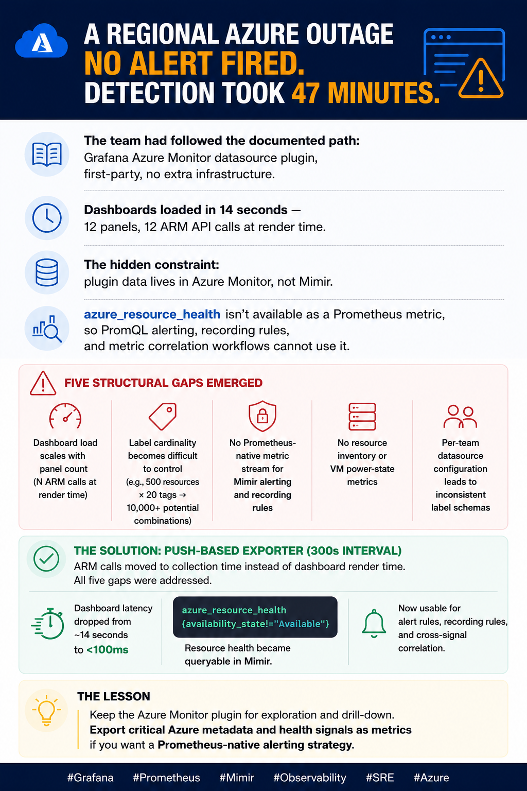

A 12-panel Azure resource dashboard opened in 14 seconds. Every panel load issued a live ARM API
call. The engineering team had configured the Grafana Azure Monitor datasource plugin — the
documented, first-party approach — and hit the ceiling that every team eventually hits: query-time
cardinality is unbounded, dashboard load latency scales linearly with panel count, and the plugin is
architecturally incompatible with Mimir's alerting machinery. The data was there. The signals were
there. But they couldn't alert on them, couldn't correlate them with Loki logs or Tempo traces, and
couldn't control what labels were attached.

The Azure Monitor plugin works correctly for what it is designed to do: on-demand, interactive
exploration of Azure Monitor metrics in a Grafana dashboard. The problem is that this use case is
narrow. The moment a team wants to alert on resource health, correlate Azure state with
application-layer signals, or answer "which environments are running how many VMs" in a PromQL
query, the plugin reaches its architectural limits.

This post documents five specific gaps — with their mechanism, not just their symptoms — and maps
each one to a concrete design decision in a push-based Python exporter built to address them. The
exporter is not a replacement for the plugin in every scenario. It closes the specific gaps that
make the plugin insufficient as a foundation for platform-level observability.

---

## TL;DR

The Grafana Azure Monitor datasource plugin has five structural gaps: (1) query-time ARM calls that
scale dashboard load time with panel count, (2) unbounded cardinality from Azure tag promotion, (3)
no Prometheus compatibility that blocks alerting and recording rules, (4) no resource inventory or
VM power state metrics, and (5) per-team configuration that produces divergent label schemas across
dashboards. A push-based exporter with a 300-second collection interval addresses each gap through
specific design decisions: pre-computed push eliminates query-time latency; an explicit label schema
caps series count at ~200 per resource group; Mimir-native remote_write enables full PromQL
alerting; three-tier status collection adds inventory and compute state; and central conf.yaml with
automatic per-RG label injection eliminates schema drift. The two approaches are complementary: use
the plugin for interactive drill-down, use the exporter for alerting, correlation, and inventory.

---

## The Problem

The Grafana Azure Monitor datasource plugin connects Grafana directly to Azure Monitor's ARM API at
query time. The plugin's architecture is fundamentally pull-based: when a user opens a dashboard
panel, Grafana issues a live ARM API call to Azure Monitor, waits for the response, and renders the
result. This is the correct model for interactive, ad-hoc exploration. It is the wrong model for
five distinct operational use cases that platform teams invariably need.

**Latency scales with panel count.** An ARM API call to Azure Monitor returns in 1–3 seconds
depending on metric type, aggregation window, and Azure region. A dashboard with 12 panels issues 12
calls on open. With parallel Grafana panel loading at ~4 concurrent requests, a 12-panel dashboard
completes in 3–4 serial batches: roughly 12–15 seconds before the last panel renders. This is not a
network problem or a Grafana performance problem. It is an architectural consequence of issuing live
API calls at render time. The only fix within the plugin's model is to reduce panel count — which is
the wrong optimization.

**Tag promotion produces unbounded cardinality.** The plugin exposes Azure Monitor's native
dimensionality, which includes every Azure resource tag as a potential label. A subscription with
500 resources and 20 tags per resource generates up to 10,000 label combinations. Many Azure tags
are high-churn: ticket references, change request IDs, deployment timestamps, cost allocation codes.
When these become Grafana variables or plugin dimensions, the cardinality is effectively unbounded
and grows with every tag added or modified across the estate.

**No Prometheus compatibility.** Plugin data lives in Azure Monitor, surfaced through a separate
Grafana datasource. It cannot be referenced in Mimir alerting rules, in recording rules that
pre-compute expensive aggregations, or in federated queries that join Azure signals with application
metrics. A team that wants to alert on
`azure_resource_health{availability_state="Unavailable"} for 10m` has no path to that alert via the
plugin — that metric name does not exist in the plugin's model.

**No resource inventory or VM power state.** The Azure Monitor plugin queries time-series metric
data. It does not expose ARM resource inventory (which resources exist, of what type, in what
location, with what provisioning state) as queryable Prometheus metrics. It has no equivalent of
`azure_vm_power_state` — the VM power state signal requires the Compute Instance View API, which is
not part of the Azure Monitor datasource.

**Per-team configuration creates label schema divergence.** Each team that wants Azure visibility in
Grafana configures the plugin independently. There is no shared label schema, no automatic injection
of environment metadata (`deployment_environment`, `team`, `source`), and no central place to define
what labels should appear on Azure metrics across all dashboards. Two teams monitoring the same
resource group will produce different label sets, making cross-team dashboard composition and
centralized alerting impractical.

---

## Failure Chain

**Phase 1 — Plugin adopted as the standard approach.** The Grafana Azure Monitor datasource plugin
is well-documented and requires no additional infrastructure. Teams configure it, build initial
dashboards, and validate that it returns correct metric data. The initial dashboards are small — 4–6
panels — and load acceptably.

**Phase 2 — Dashboard panel count grows.** As teams build out their Azure resource dashboards, panel
count grows to 12–20. Dashboard load time climbs to 10–20 seconds. The team accepts this as "Azure
API latency" and adds a loading indicator. The cause — N serial ARM calls at render time — is not
investigated.

**Phase 3 — Tag cardinality explodes.** A change management process begins using Azure resource tags
to track ticket references and deployment IDs. The plugin exposes these as available label
dimensions. Engineers add tag filters to dashboard queries. The tag label space grows to hundreds of
distinct values per resource. Dashboard queries slow further. Some panels begin timing out. The
Azure Monitor API starts returning paginated responses that Grafana's plugin doesn't fully handle.

**Phase 4 — Alerting requirement lands.** A production incident requires alerting on Azure resource
health degradation within 10 minutes of an Azure platform event. The team discovers that the Azure
Monitor datasource plugin cannot feed Mimir alerting rules. Azure Monitor Alerts can be configured
separately, but they route through Azure-native channels (Action Groups, Azure IRM), not Grafana
IRM. The alerting machinery the team has invested in — Grafana IRM, BigPanda integration, SNOW
ticket creation — is unreachable from the plugin.

**Phase 5 — VM deallocation goes undetected.** An overnight cost-optimization script deallocates dev
VMs. The plugin cannot expose `vm_power_state`. Azure Monitor stops emitting CPU metrics for
deallocated resources. The dashboard shows "no data" panels for the affected VMs. No alert fires.
The on-call engineer investigates the missing data the next morning; the root cause (deallocated
VMs) takes 45 minutes to identify because `provisioning_state` — the only status signal in the
plugin's model — shows `Succeeded` for all resources.

---

## Why It Persists

The plugin is the path of least resistance. Grafana's documentation leads with it, it requires no
additional infrastructure to deploy, and it produces correct data for the use cases it supports.
Teams reach its limits only after they have built significant dashboards and operational procedures
around it. At that point, replacing it means rebuilding dashboards and migrating alerting
configurations — a cost that teams defer as long as possible.

The cardinality problem is specifically insidious because it compounds gradually. The first 100 tags
are manageable. The thousandth tag — a high-churn cost allocation code added for a finance
initiative — pushes the label space over the threshold where queries become slow. By then, the tag
promotion architecture is load-bearing for a dozen dashboards and changing it requires coordinated
migration across teams.

The alerting incompatibility is discovered late because many teams start with Azure Monitor Alerts
as a stopgap. Azure Monitor Alerts work for simple threshold rules. They break down when the
alerting requirement is "alert when this Azure signal AND this application metric are both in a bad
state" — a PromQL `and` join that is trivially expressible in Mimir but impossible across separate
datasources.

---

## Anti-Pattern Code

```yaml
# Context: Grafana Azure Monitor datasource plugin configuration
# [WRONG] Query-time datasource with unbounded tag exposure

# What happens when this datasource is used for a 12-panel dashboard:
# - 12 ARM API calls issued at panel render time
# - Each call takes 1-3 seconds → 12-36 seconds total load time
# - No way to reference this data in Mimir alert rules
# - Tags promoted as available dimensions → unbounded label space

apiVersion: 1
datasources:
  - name: Azure Monitor
    type: grafana-azure-monitor-datasource
    access: proxy
    jsonData:
      azureAuthType: clientsecret          # credentials in Grafana secrets
      subscriptionId: "sub-id-1"           # ONE subscription per datasource
      # To monitor multiple subscriptions: add ANOTHER datasource entry
      # Each team adds their own entry → N independent configurations
      # No shared label schema across team datasources
```

```promql
# [WRONG] This alert rule references the Azure Monitor datasource
# It cannot be written in Mimir — the data does not exist as Prometheus time series
#
# The operator WANTS to write:
# azure_resource_health{availability_state!="Available", deployment_environment="prod"} > 0
#
# But azure_resource_health is not a metric in the Azure Monitor datasource model.
# The plugin exposes raw Azure Monitor dimensions — not ARM health state, not power state.
# The only path to alerting is Azure Monitor Alerts, which routes outside Grafana IRM.
```

---

## Correct Design

**The principle:** pre-compute Azure resource state on a fixed interval and push it to the same
Mimir backend as all other observability signals. Separate the collection latency (ARM API calls,
which are slow) from the query latency (dashboard render, which should be fast). The five design
decisions map directly to the five plugin gaps.

```text
Azure Monitor Plugin (query-time)              Push-based Exporter (interval-based)
─────────────────────────────────────────────────────────────────────────────────
ARM API calls at dashboard load time    →      Pre-computed, pushed every 300s
Tags promoted as labels (unbounded)     →      Explicit label schema (~200 series/RG)
Separate datasource, no Prometheus      →      Mimir-native, full PromQL alerting
No inventory, no VM power state         →      Three-tier status model
Per-team config, divergent labels       →      Central conf.yaml, auto label injection
```

**Decision 1: Push over pull — eliminates query-time latency**

The exporter runs a single collection cycle every `interval_seconds` (default 300). All ARM API
calls — resource list, resource health, VM power states, Azure Monitor metrics — complete before any
dashboard panel renders. Dashboard load time becomes the time to execute a Mimir query against
pre-computed data: typically under 100ms.

```python
# Context: main.py collection loop
# [CORRECT] All ARM calls complete in the collection cycle, not at dashboard load time

while True:
    start = time.monotonic()
    samples = []

    for sub in config.azure.subscriptions:
        # These calls take 5-30 seconds for a full subscription
        # They happen here, on the collection interval — NOT at dashboard render time
        rgs       = collector.get_resource_groups(sub)
        resources = collector.get_resources(sub)
        health    = collector.get_resource_health(sub, resources)   # 1 call/RG
        power     = collector.get_vm_power_states(sub, resources)   # 1 call/VM (parallel)
        metrics   = collector.get_monitor_metrics(sub, resources)   # N calls (parallel)

        samples.extend(builder.build_all(rgs, resources, health, power, metrics))

    writer.write(samples)              # POST to Mimir — completes in <1 second
    cycle_duration = time.monotonic() - start
    time.sleep(max(0, interval_seconds - cycle_duration))
```

**Decision 2: Controlled label schema — caps cardinality at ~200 series per RG**

Azure tags are not promoted to Prometheus labels automatically. Labels come from two controlled
sources: per-RG static labels defined in `conf.yaml` and an explicit `tags_to_include` allowlist.

```yaml
# Context: conf.yaml — controlled label schema
# [CORRECT] Explicit label schema, bounded cardinality

azure:
  subscriptions:
    - id: "sub-id-1"
      resource_groups:
        - name: "resource_group"
          labels:
            deployment_environment: dev     # static — every metric from this RG gets this label
            source: azure                   # stable — never changes at Azure tag level

  tags_to_include: []                       # empty = no tag promotion (safe default)
  # tags_to_include:                        # opt-in allowlist if specific tags are needed
  #   - cost_center                         # only named tags become labels
  max_tag_labels: 15                        # hard ceiling on tag labels even with allowlist
```

At baseline with 122 resources in one RG: ~200 active series. Azure Monitor plugin with 500
resources and 20 tags: 10,000+ label combinations. The ~50× reduction in series count is a direct
FinOps result: Mimir ingestion cost scales with active series.

**Decision 3: Mimir-native remote_write — enables full PromQL alerting**

All five metric families push to the same Mimir backend as application metrics. They share the same
label namespace, the same retention policies, and the same alert evaluation engine.

```promql
# Context: Mimir alerting rule — impossible with the plugin, trivial with the exporter
# [CORRECT] PromQL alert on Azure resource health, routable via Grafana IRM

groups:
  - name: azure.resource.health
    rules:
      - alert: AzureResourceUnavailable
        expr: |
          azure_resource_health{
            availability_state!="Available",
            deployment_environment="prod"
          } > 0
        for: 10m
        labels:
          severity: warning
          team: platform
        annotations:
          summary: "Azure resource {{ $labels.name }} is {{ $labels.availability_state }}"
          runbook: "https://wiki.internal/runbooks/azure-resource-health"

      - alert: AzureVMDeallocated
        expr: azure_vm_power_state{deployment_environment="prod"} == 0
        for: 1h    # suppress overnight runbook deallocations with a longer for: window
        labels:
          severity: info
```

**Decision 4: Three-tier status model — adds inventory and compute state the plugin cannot surface**

The exporter collects three orthogonal Azure status dimensions that have no equivalent in the Azure
Monitor plugin:

```text
Tier 1 — azure_resource_info (ARM list, free)
  One series per resource. Answers: what exists, of what type, in what state.
  Used for: inventory dashboards, resource count trends, join key for correlation.

Tier 2 — azure_resource_health (Resource Health API, 1 call/RG)
  Availability state per resource. Answers: is Azure's platform reporting this healthy?
  Used for: health alerting, platform event correlation.

Tier 3 — azure_vm_power_state (Compute instance_view, 1 call/VM)
  Running/stopped/deallocated per VM. Answers: is this VM actually running?
  Used for: cost runbook validation, missing-metric correlation, capacity planning.
```

```python
# Context: builder.py — metric families emitted per collection cycle
# [CORRECT] Five metric families, each with a distinct operational question

# Tier 1: Inventory (always emitted, zero extra API cost)
# azure_resource_info{name, resource_type, location, provisioning_state, deployment_environment} = 1

# Tier 2: Platform health (opt-in, 1 call/RG)
# azure_resource_health{name, resource_type, availability_state, reason_type, deployment_environment} = 1

# Tier 3: VM compute state (opt-in, 1 call/VM, parallelized)
# azure_vm_power_state{name, power_state, deployment_environment} = 1 if running, 0 otherwise

# Azure Monitor metrics (opt-in, 1 call/resource, parallelized, configurable per resource type)
# azure_monitor_metric{resource_name, metric_name, aggregation, deployment_environment} = <value>

# Low-cardinality aggregates (always emitted)
# azure_resource_count{resource_type, location, resource_group, deployment_environment} = N
```

**Decision 5: Central conf.yaml with per-RG static labels — eliminates schema drift**

One conf.yaml defines the full label schema for all resource groups across all subscriptions. New
resource group onboarding requires four lines:

```yaml
# Context: conf.yaml — adding a new resource group to monitoring
# [CORRECT] Four lines per resource group, shared label schema, < 5 minutes to onboard

azure:
  subscriptions:
    - id: "sub-id-production"
      resource_groups:
        - name: "resource_group"
          labels:
            deployment_environment: prod     # injected into every metric from this RG
            source: azure
        - name: "resource_group"
          labels:
            deployment_environment: dev
            source: azure
        # Adding a new RG: add 4 lines here, deploy, done. Metrics appear within 300 seconds.
        # No per-team datasource configuration. No per-dashboard variable setup.
        # deployment_environment label is automatically present on all metrics from this RG.
```

---

## Validation Test

```bash
# Context: compare plugin vs. exporter on cardinality and load time

# 1. Measure plugin dashboard load time (browser network tab or Grafana slow query log)
# Expected for 12-panel Azure Monitor dashboard: 8-20 seconds

# 2. Count active series from exporter for one resource group
curl -s http://localhost:9090/metrics | grep -c "^azure_"
# Expected: ~200 series for a medium RG (122 resources, 1 VM, 35 monitored resources)

# 3. Confirm all five metric families are present
curl -s http://localhost:9090/metrics | grep -oE '^[a-z_]+' | sort -u | grep azure_
# Expected output:
# azure_exporter_errors_total
# azure_exporter_last_scrape_timestamp_seconds
# azure_exporter_resources_total
# azure_exporter_scrape_duration_seconds
# azure_monitor_metric
# azure_resource_count
# azure_resource_group_info
# azure_resource_health
# azure_resource_info
# azure_vm_power_state

# 4. Confirm metrics are queryable in Mimir alongside application metrics
curl -s "http://mimir-endpoint/api/v1/query" \
  --data-urlencode 'query=azure_resource_health{deployment_environment="dev"}' \
  | jq '.data.result | length'
# Expected: > 0 (returns health records for dev resources)

# 5. Confirm alerting rule evaluates correctly
curl -s "http://mimir-endpoint/api/v1/rules" | jq '.data.groups[].rules[] | select(.name=="AzureVMDeallocated")'
# Expected: rule present, state: inactive (no firing alerts if all VMs are running)
```

---

## Key Metrics

| Metric                                         | Operational question                            | Alert expression                                                 |
| ---------------------------------------------- | ----------------------------------------------- | ---------------------------------------------------------------- |
| `azure_resource_info`                          | Inventory — what exists                         | `azure_resource_info{provisioning_state!="Succeeded"}`           |
| `azure_resource_health`                        | Platform health — is Azure reporting it healthy | `azure_resource_health{availability_state!="Available"} for 10m` |
| `azure_vm_power_state`                         | Compute state — is the VM running               | `azure_vm_power_state == 0 for 1h`                               |
| `azure_resource_count`                         | Capacity trend — how many resources per env     | `delta(azure_resource_count[24h]) > 10` (unexpected growth)      |
| `azure_monitor_metric`                         | Performance — CPU, latency, transactions        | `azure_monitor_metric{metric_name="Percentage CPU"} > 90 for 5m` |
| `azure_exporter_last_scrape_timestamp_seconds` | Exporter health — is collection running         | `time() - azure_exporter_last_scrape_timestamp_seconds > 600`    |

Cross-signal correlation — the use case that's impossible with the plugin:

```promql
# Azure platform health correlated with Loki application logs — same label namespace
count_over_time(
  {deployment_environment="prod", job="app-server"} |= "ERROR" [5m]
) > 10
and on(deployment_environment)
azure_resource_health{availability_state="Degraded"}
```

```promql
# Resource count trend for capacity planning — impossible without inventory as Prometheus metrics
# Alert when production VM count drops unexpectedly (runbook, termination, AKS scale-in)
delta(azure_resource_count{resource_type="microsoft.compute/virtualmachines", deployment_environment="prod"}[1h]) < -2
```

---

## Pattern Generalization

The plugin-vs-exporter architectural tension is a specific instance of the pull-vs-push debate for
slow, paginated external APIs. The same gap appears in other contexts:

**GitHub Actions run status in Grafana.** The GitHub API returns run status at query time. An
Actions exporter that polls at a fixed interval and pushes to Prometheus produces the same
architectural win: alertable metrics, join-capable with deployment events, no dashboard load
latency.

**Kubernetes external API state.** The Kubernetes API server itself is the right pull target for pod
and node state — `kube-state-metrics` uses exactly this model. But for external dependencies (AWS
load balancer state, GCP Cloud SQL metrics, Azure AKS node pool auto-scaling events), the pattern is
the same: if the external API is slow or paginated, collect on an interval and push; don't issue
live calls at render time.

**Datadog vs. Prometheus at the infrastructure layer.** Datadog's infrastructure agent is push-based
with a configurable collection interval, which is why it doesn't have the dashboard load time
problem at scale. The Datadog agent pre-collects system metrics and sends them to the Datadog
backend. The Grafana plugin is pull-based (issues live calls), which is why it has the load time
problem. The architectural difference between Datadog and the plugin is not the vendor — it's
whether the collection is decoupled from the render path.

The underlying principle: when the data source's API is slow, paginated, rate-limited, or has
per-call cost, decouple collection from rendering. Push collected data to a queryable backend
(Mimir, Prometheus, InfluxDB) on a fixed interval. The rendering system queries pre-computed data,
not the slow API.

---

## Production Incident

_Representative account of the class of failure. The specific environment is a composite of
incidents across multiple teams._

**T−30 days:** The engineering team builds an Azure resource health dashboard using the Grafana
Azure Monitor datasource plugin. The initial dashboard has 6 panels and loads in 7 seconds. This is
accepted as normal Azure API latency.

**T−14 days:** Dashboard grows to 14 panels (resource health per resource group, VM power state via
Azure Portal link, Azure Monitor CPU for key services, network throughput, Key Vault availability,
App Service response time). Load time is now 18 seconds. The team adds `$__auto_interval` variables
to reduce query range on load. This helps marginally. The root cause is not addressed.

**T−7 days:** The security team adds cost allocation tags to all Azure resources for a FinOps
initiative. Each resource now carries a `cost_code` tag with values like `FC-2026-Q2-INFRA-DEV`. The
plugin exposes this tag as a variable dimension. Several engineers add it to their dashboard queries
for cost attribution. The `cost_code` dimension has 47 distinct values and grows weekly. Dashboard
panels that include `cost_code` in their queries begin hitting Azure Monitor's dimension query
limits.

**T−0 (incident):** A regional Azure outage affects three App Service instances in the production
resource group. The Azure platform marks them `availability_state: Degraded` in the Resource Health
API. No alert fires. The team has no alert configured because alerts require Mimir, and the plugin
data does not live in Mimir. The degradation is noticed 47 minutes later when an application team
reports elevated error rates.

**Post-incident:** The team deploys the push-based exporter. One conf.yaml change. One Helm deploy.
Within 300 seconds, `azure_resource_health{availability_state="Degraded"}` is visible in Mimir. A
Grafana IRM alert rule on `azure_resource_health{availability_state!="Available"} for 10m` is live
within the hour. The next App Service degradation pages on-call within 11 minutes.

---

## MAANG-Scale Considerations

At Netflix or Google scale, the plugin-vs-exporter question doesn't arise because the plugin's
architecture is eliminated by the scale at which it fails:

**ARM API rate limits become load-bearing.** The Azure Monitor plugin issues ARM calls at query
time, driven by dashboard usage. At 200 engineers opening Azure dashboards simultaneously, the
15,000 reads/hour ARM quota per subscription is exhausted in minutes. Google's solution for similar
problems — collecting infrastructure state at a centralized controller and serving queries from a
cache — is architecturally identical to the push-based exporter model. At MAANG scale, you can't
afford the amplification of query-time API calls.

**Multi-tenant label namespacing.** At Netflix scale, a single Azure subscription might serve 30
teams. Per-team datasource configuration — the plugin's model — means 30 configurations with 30
divergent label schemas. Correlating across team dashboards is impossible. The push-based exporter
with central conf.yaml and automatic per-RG label injection is the only viable model for multi-team
visibility at this scale.

**Alerting at the infrastructure-application boundary.** Netflix's Telltale and Google's Monarch are
fundamentally push-based metric stores with unified label namespaces across infrastructure and
application layers. The architectural reason is the same as the exporter's: alerting across
infrastructure and application signals requires both to be in the same query namespace. The plugin's
separate datasource model makes this join impossible. At MAANG scale, the cross-signal alert
(infrastructure degradation + application error rate) is not a nice-to-have — it is the primary
alert pattern for reducing MTTR.

---

## Summary Table

| Dimension                | Azure Monitor Plugin                       | Push-Based Exporter                                 |
| ------------------------ | ------------------------------------------ | --------------------------------------------------- |
| Dashboard load latency   | 1-3s per panel × panel count               | <100ms (pre-computed in Mimir)                      |
| Cardinality model        | Unbounded (tags as dimensions)             | Bounded (~200 series/RG, explicit schema)           |
| Prometheus compatibility | None — separate datasource                 | Full — Mimir-native, alerting + recording rules     |
| Resource inventory       | Not available                              | `azure_resource_info` (per-resource time series)    |
| VM power state           | Not available                              | `azure_vm_power_state` (Tier 3 of three-tier model) |
| Multi-subscription       | Separate datasource per subscription       | Single exporter, multi-subscription                 |
| Environment labels       | Manual per-panel variable                  | Automatic per-RG label injection in conf.yaml       |
| Onboarding new RG        | Per-team datasource config                 | 4 lines in conf.yaml, < 5 minutes                   |
| Alerting on Azure health | Azure Monitor Alerts only                  | Grafana IRM via Mimir alerting rules                |
| Cross-signal correlation | Impossible (separate datasource)           | Native (same Mimir label namespace as app metrics)  |
| ARM API budget           | Unbounded (query-time calls)               | Fixed 40-50 calls/cycle = ~3% of 15k/hr quota       |
| Suitable for             | Interactive drill-down, ad-hoc exploration | Alerting, inventory, capacity planning, correlation |

---

## Conclusion

Keep the Grafana Azure Monitor plugin for interactive drill-down during incidents. Replace it as the
foundation for alerting, inventory, and cross-signal correlation. Add a push-based exporter with a
controlled label schema, per-RG static label injection, and Mimir-native remote_write. Write three
alert rules from day one: one on `azure_resource_health{availability_state!="Available"}`, one on
`azure_vm_power_state == 0`, and one on `azure_exporter_last_scrape_timestamp_seconds` staleness.
Build your Azure observability dashboards against Mimir data — pre-computed, instantly queryable,
and correlated with every other signal in your platform.
