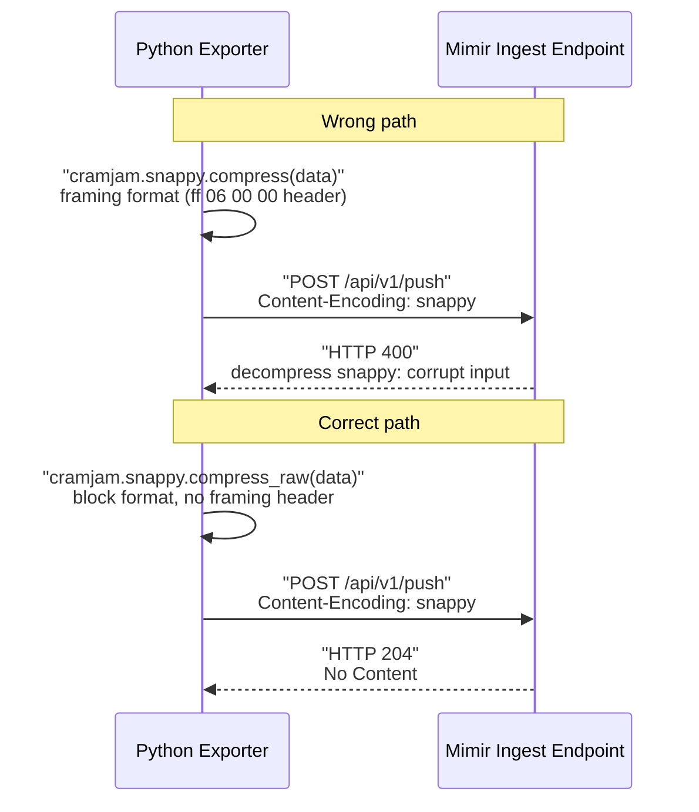

The first payload our Python exporter pushed to Grafana Cloud Mimir came back HTTP 400:
`decompress snappy: corrupt input`. The protobuf encoding was hand-rolled and passing unit tests.
The snappy call returned without error. The HTTP headers matched the remote_write spec exactly —
`Content-Type: application/x-protobuf`, `Content-Encoding: snappy`,
`X-Prometheus-Remote-Write-Version: 0.1.0`. Nothing in the 400 response body explained why Mimir
considered the payload corrupt.

The fix was replacing `cramjam.snappy.compress(data)` with `cramjam.snappy.compress_raw(data)`. One
word. Three hours to find it.

The reason it took three hours is that most Prometheus documentation, including official client
library guides, describes the wire format as "snappy compressed protobuf" without specifying _which_
snappy format. Snappy has two: a raw block format and a framing format with a `ff 06 00 00` magic
header. They produce different bytes on the wire. Prometheus remote write requires block.
`cramjam.snappy.compress()` defaults to framing. Most systems outside the Prometheus ecosystem —
Hadoop, Kafka, many Go packages — use framing, so the assumption that "snappy is snappy" goes
unquestioned until it breaks, once, at the worst possible moment, with an error message that points
nowhere.

This post documents the full implementation: a correct Prometheus remote_write client in Python with
no protoc dependency, no generated code, and a 60-line hand-rolled protobuf encoder. Every line that
matters has a comment explaining why it is there.

---

## TL;DR

Prometheus remote write 0.1.0 requires Snappy **block** format, not the framing format. In Python,
`cramjam.snappy.compress()` produces framing; `cramjam.snappy.compress_raw()` produces block. The
HTTP 400 response from Mimir — `decompress snappy: corrupt input` — will not help you find this.
Separately: the Prometheus remote_write proto schema is narrow enough (four message types, no
`oneof`, no `map`) that a 60-line hand-rolled Python encoder replaces the `protobuf` library
entirely, eliminating a generated-file dependency and a protoc build step with no trade-offs for
this use case.

---

## The Problem

We built a push-based exporter that collects Azure resource metadata — inventory, health state, VM
power state, Azure Monitor metrics — and ships them as Prometheus time series to Grafana Cloud Mimir
via remote_write. The design is intentionally push-only: the exporter wakes on a 300-second
interval, runs one collection cycle across configured Azure subscriptions, and POSTs the resulting
sample batch directly to the Mimir ingest endpoint. No Prometheus server. No Alloy scrape target. No
local storage.

The motivation for push over pull is practical. Azure ARM API calls are paginated and slow, taking
5–30 seconds per subscription for a full resource inventory. A Prometheus scrape has a 10–15 second
timeout and a strict pull cadence. Mapping slow, variable-duration ARM collection onto a
scrape-based model means managing stale markers, extending scrape timeouts, and dealing with the
scrape scheduler's assumption that targets respond promptly. Push decouples collection latency from
the scrape plane entirely and eliminates the need for network reachability from the Alloy or
Prometheus plane to the exporter's port — the exporter can run anywhere that has outbound HTTPS.

Remote write in Python requires two components: protobuf serialization and Snappy compression. The
protobuf side has obvious solution paths — `protobuf`, `betterproto`, hand-rolling it. The snappy
side looks trivial: install cramjam, call compress, done. That assumption is wrong in a way that the
error message will not correct.

---

## Failure Chain

**Phase 1 — Initial implementation.** The first version used the `protobuf` Python package with a
vendored `prompb_pb2.py` generated from the `prometheus/prometheus` proto definitions. This worked
but added a generated-file dependency and a protoc compilation step to the Docker build. Both are
friction points when `pip install -r requirements.txt` should be the entire build.

**Phase 2 — Dependency elimination.** The proto schema for remote_write 0.1.0 uses four message
types: `WriteRequest`, `TimeSeries`, `Label`, `Sample`. No `oneof`. No `map`. No complex nesting
beyond repeated fields. The entire schema fits in a hand-rolled Python encoder using only varint and
length-delimited field encoding — about 60 lines. The `protobuf` library was dropped. Unit tests
covering encoding of known byte sequences passed cleanly.

**Phase 3 — First end-to-end test.** First live push to Grafana Cloud. HTTP 400. Response body:
`decompress snappy: corrupt input`. The response came from Mimir's ingest layer, not the HTTP
routing layer — the payload arrived, the decompressor ran, and it failed.

**Phase 4 — Wrong debugging path.** Three assumptions were checked in sequence: the hand-rolled
protobuf encoder produced invalid bytes; the batch was too large; the label set was malformed. A hex
dump of the compressed payload was inspected. The `WriteRequest` structure was decoded manually
using `protoscope`. All encoding was correct.

**Phase 5 — Root cause.** The cramjam documentation distinguishes two functions:

```text
cramjam.snappy.compress(data)     → framing format  (ff 06 00 00 magic header)
cramjam.snappy.compress_raw(data) → block format    (raw compressed bytes, no header)
```

The initial implementation called `compress()`. Mimir expects `compress_raw()`. The `ff 06 00 00`
framing header is what Mimir's decompressor considers corrupt input.

---

## Why It Persists

The Prometheus remote write specification (0.1.0) says:

> _"The encoding of the data MUST be compressed Snappy."_

It does not say "Snappy block format". The distinction between block and framing is a Snappy
implementation detail, not a Prometheus protocol concept. Most engineers who have used Snappy
elsewhere — Kafka message compression, Parquet column encoding, Hadoop sequence files — have used
the framing format, because the broader ecosystem standardizes on it for streaming data. The block
format is a Prometheus-specific convention rooted in the Go `github.com/golang/snappy` package's
original API, where `Encode()` produced block format before framing support was added to the
library.

The cramjam documentation does label both functions correctly. The problem is that developers
searching for "prometheus remote write snappy python" find examples using `python-snappy`'s
`compress()` function, which happens to produce block format on current versions — but this is
undocumented behavior. cramjam's `compress()` has always produced framing format, which means code
that works with `python-snappy` silently breaks when the dependency is switched to cramjam.

The error message — `decompress snappy: corrupt input` — provides zero diagnostic information about
the specific mismatch. It tells you Mimir couldn't decompress the payload. It does not tell you the
payload is framing-format compressed, which requires a framing-aware decompressor. Without knowing
the format distinction exists, there is no obvious next debugging step. The bytes look like valid
snappy-compressed data because they are. They're just not the format Prometheus expects.

---

## Anti-Pattern Code

```python
# Context: Snappy compression for Prometheus remote_write payload
# [WRONG] cramjam.snappy.compress() produces framing format
# Mimir returns HTTP 400: decompress snappy: corrupt input

import cramjam

def compress_wrong(data: bytes) -> bytes:
    # compress() adds a ff 06 00 00 magic header + per-chunk framing headers
    # This is the Snappy framing/stream format — correct for Kafka and Hadoop,
    # rejected by Prometheus remote_write ingest (Mimir, Cortex, Thanos)
    return bytes(cramjam.snappy.compress(data))

# The first 4 bytes of the output will be: ff 06 00 00
# Mimir's decompressor expects raw block format bytes with no leading magic
# and returns HTTP 400 with no further detail about which bytes failed
```

The same failure is possible when switching from `python-snappy`, which coincidentally works but
doesn't document why:

```python
# Context: python-snappy compress() — produces block format on current versions
# [WRONG-BY-COINCIDENCE] works today, behavior is undocumented and not guaranteed
import snappy

def compress_accidental(data: bytes) -> bytes:
    # python-snappy compress() happens to produce block format (not framing)
    # cramjam compress() does NOT — same function name, different wire output
    # Switching from python-snappy to cramjam breaks this without any error at import time
    return snappy.compress(data)
```

The two requests below travel through the same exporter and the same Mimir ingest endpoint — the
only difference is which cramjam function ran before the POST:



---

## Correct Design

The principle: the Snappy compression call must explicitly select block format, and this selection
must survive a dependency swap. `cramjam.snappy.compress_raw()` is the explicit, stable choice.

```text
Python samples: List[Tuple[labels_dict, float_value, int_timestamp_ms]]
        │
        ▼
  Hand-rolled protobuf encoder (60 lines, no protoc)
        │
        │  WriteRequest
        │    └── repeated TimeSeries
        │          ├── repeated Label  (__name__ sorted first, then alphabetical)
        │          └── repeated Sample (double value + int64 timestamp_ms)
        ▼
  cramjam.snappy.compress_raw()          ← block format, explicit
        │
        ▼
  HTTP POST
    Content-Type: application/x-protobuf
    Content-Encoding: snappy
    X-Prometheus-Remote-Write-Version: 0.1.0
    Authorization: Basic <username:api_key>
        │
        ▼
  Grafana Cloud Mimir ingest → HTTP 204 No Content
```

**Snappy initialization — explicit format selection with documented fallback:**

```python
# Context: module-level snappy compressor, initialized once at import time
# [CORRECT] Explicit format selection survives dependency changes

def _init_compressor():
    try:
        import cramjam
        # compress_raw() → block format (no framing header) — required for remote_write
        # compress()     → framing format (ff 06 00 00 prefix) — returns HTTP 400 from Mimir
        def _compress(data: bytes) -> bytes:
            return bytes(cramjam.snappy.compress_raw(data))
        return _compress
    except ImportError:
        pass

    try:
        import snappy as _snappy
        # python-snappy compress() produces block format on versions in active use (2023+)
        # This is undocumented but consistent. cramjam is preferred for its explicit API.
        def _compress(data: bytes) -> bytes:
            return _snappy.compress(data)
        return _compress
    except ImportError:
        pass

    raise ImportError(
        "Snappy compression library not found.\n"
        "  pip install cramjam           # recommended — no native deps, explicit API\n"
        "  pip install python-snappy     # requires libsnappy-dev on the host"
    )

_snappy_compress = _init_compressor()
```

**Hand-rolled protobuf encoder — the complete implementation:**

The remote_write 0.1.0 schema uses three protobuf wire types:

- Wire type 0: varint — for `int64 timestamp` in `Sample`
- Wire type 1: 64-bit fixed — for `double value` in `Sample`
- Wire type 2: length-delimited — for all `string` fields and all nested messages

```python
# Context: Prometheus remote_write 0.1.0 protobuf encoder
# Proto schema (prometheus/prompb):
#   WriteRequest { repeated TimeSeries timeseries = 1 }
#   TimeSeries   { repeated Label labels = 1; repeated Sample samples = 2 }
#   Label        { string name = 1; string value = 2 }
#   Sample       { double value = 1; int64 timestamp = 2 }
# [CORRECT] hand-rolled — no protoc, no generated code, no .proto file

import struct
from typing import Dict, List, Tuple

Sample = Tuple[Dict[str, str], float, int]  # (labels, value, timestamp_ms)

def _varint(n: int) -> bytes:
    """Encode a non-negative integer as a protobuf varint (7 bits/byte, little-endian groups)."""
    out = []
    while True:
        b = n & 0x7F
        n >>= 7
        out.append(b | 0x80 if n else b)
        if not n:
            break
    return bytes(out)

def _tag(field_number: int, wire_type: int) -> bytes:
    # Protobuf tag encoding: (field_number << 3) | wire_type, then varint-encoded
    return _varint((field_number << 3) | wire_type)

def _ld(payload: bytes) -> bytes:
    """Length-delimited prefix: varint(len(payload)) + payload. Used for strings and messages."""
    return _varint(len(payload)) + payload

def _str_field(fnum: int, s: str) -> bytes:
    return _tag(fnum, 2) + _ld(s.encode("utf-8"))

def _dbl_field(fnum: int, v: float) -> bytes:
    # Wire type 1 (64-bit), little-endian IEEE-754 double
    return _tag(fnum, 1) + struct.pack("<d", v)

def _i64_field(fnum: int, v: int) -> bytes:
    # Wire type 0 (varint), unsigned 64-bit — epoch_ms is always positive
    return _tag(fnum, 0) + _varint(v & 0xFFFFFFFFFFFFFFFF)

def _msg_field(fnum: int, payload: bytes) -> bytes:
    return _tag(fnum, 2) + _ld(payload)

def _encode_label(name: str, value: str) -> bytes:
    """Label { string name=1; string value=2 }"""
    return _str_field(1, name) + _str_field(2, value)

def _encode_sample(value: float, ts_ms: int) -> bytes:
    """Sample { double value=1; int64 timestamp=2 }"""
    return _dbl_field(1, value) + _i64_field(2, ts_ms)

def _encode_timeseries(labels: Dict[str, str], value: float, ts_ms: int) -> bytes:
    """
    TimeSeries { repeated Label labels=1; repeated Sample samples=2 }

    Labels MUST be sorted with __name__ first, then alphabetical.
    The remote_write spec requires this for correct ingestion into Mimir's
    label matcher indexes. Out-of-order labels may produce duplicate series
    fingerprints in edge cases under high concurrency.
    """
    ordered = sorted(
        labels.items(),
        key=lambda kv: (0 if kv[0] == "__name__" else 1, kv[0]),
    )
    ts  = b"".join(_msg_field(1, _encode_label(n, v)) for n, v in ordered)
    ts += _msg_field(2, _encode_sample(value, ts_ms))
    return ts

def build_write_request(samples: List[Sample]) -> bytes:
    """WriteRequest { repeated TimeSeries timeseries=1 }"""
    return b"".join(_msg_field(1, _encode_timeseries(*s)) for s in samples)
```

**HTTP client with correct retry policy:**

```python
# Context: Prometheus remote_write HTTP client
# [CORRECT] Retry policy: 429/5xx → exponential backoff; 4xx → immediate failure (no retry)

import logging, time, requests

log = logging.getLogger(__name__)

class RemoteWriteClient:
    def __init__(self, url: str, username: str, api_key: str,
                 timeout: int = 30, batch_size: int = 500) -> None:
        self.url        = url
        self.auth       = (username, api_key)
        self.timeout    = timeout
        self.batch_size = batch_size
        self._session   = requests.Session()
        self._session.headers.update({
            "Content-Type":                      "application/x-protobuf",
            "Content-Encoding":                  "snappy",
            "X-Prometheus-Remote-Write-Version": "0.1.0",
        })

    def _send_batch(self, batch: List[Sample]) -> bool:
        payload    = build_write_request(batch)
        compressed = _snappy_compress(payload)  # must be block format

        for attempt in range(1, 5):
            try:
                resp = self._session.post(
                    self.url,
                    data=compressed,
                    auth=self.auth,
                    timeout=self.timeout,
                )
                resp.raise_for_status()
                return True

            except requests.HTTPError as exc:
                code = exc.response.status_code
                if code in (429, 500, 503) and attempt < 4:
                    # Transient server-side error — retry with exponential backoff
                    time.sleep(2 ** attempt)  # 2s, 4s, 8s
                    continue
                # 400 = payload error (snappy format, malformed protobuf, bad labels)
                # 401 = authentication failure — retrying will not succeed
                # 403 = insufficient permissions on the access-policy token
                # Log the response body: it often contains the specific rejection reason
                log.error(f"HTTP {code} from remote_write: {exc.response.text[:300]}")
                return False

            except requests.RequestException as exc:
                if attempt < 4:
                    time.sleep(2 ** attempt)
                    continue
                log.error(f"Network error after {attempt} attempts: {exc}")
                return False

        return False

    def write(self, samples: List[Sample]) -> None:
        """Send samples in batches; log per-batch success and failure."""
        if not samples:
            return
        sent = failed = 0
        for i in range(0, len(samples), self.batch_size):
            batch = samples[i : i + self.batch_size]
            if self._send_batch(batch):
                sent   += len(batch)
            else:
                failed += len(batch)
        if failed:
            log.error(f"Remote write: {sent} sent, {failed} failed")
        else:
            log.info(f"Remote write: {sent} samples sent")
```

---

## Validation Test

Before connecting to a live Grafana Cloud endpoint, validate the compression format directly in a
Python REPL. The Snappy block format begins with the uncompressed data length encoded as a
little-endian varint — no magic prefix. The framing format begins with `\xff\x06\x00\x00sNaPpY`:

```bash
# Context: validate Snappy compression format without a Mimir connection

python3 - <<'EOF'
import cramjam

test_data = b"test prometheus remote write payload"

block   = bytes(cramjam.snappy.compress_raw(test_data))
framing = bytes(cramjam.snappy.compress(test_data))

print(f"Block format first 4 bytes:   {block[:4].hex()}")
print(f"Framing format first 4 bytes: {framing[:4].hex()}")

assert framing[:4] == bytes([0xff, 0x06, 0x00, 0x00]), "Framing magic check failed"
assert block[:4]   != bytes([0xff, 0x06, 0x00, 0x00]), "Block must not have framing prefix"
print("Compression format: PASS")
EOF
```

Expected output:

```text
Block format first 4 bytes:   24241400   # varint-encoded uncompressed length — no magic
Framing format first 4 bytes: ff060000
Compression format: PASS
```

To validate the full end-to-end payload against a local Mimir instance:

```bash
# Context: end-to-end validation against local Mimir

docker run -d -p 9009:9009 --name mimir-test \
  grafana/mimir:latest \
  -config.file=/etc/mimir/demo.yaml

python3 - <<'EOF'
import time, requests
# (import build_write_request and _snappy_compress from your module)

samples = [
    ({"__name__": "test_remote_write", "job": "validation"}, 1.0, int(time.time() * 1000))
]
payload    = build_write_request(samples)
compressed = _snappy_compress(payload)

resp = requests.post(
    "http://localhost:9009/api/v1/push",
    data=compressed,
    headers={
        "Content-Type":                      "application/x-protobuf",
        "Content-Encoding":                  "snappy",
        "X-Prometheus-Remote-Write-Version": "0.1.0",
    },
)
print(f"HTTP {resp.status_code}")  # expect 204 No Content
EOF

docker rm -f mimir-test
```

---

## Key Metrics

Self-monitoring the push client using the exporter's own Prometheus endpoint:

| Metric                                         | What it signals                          | Alert expression                                              |
| ---------------------------------------------- | ---------------------------------------- | ------------------------------------------------------------- |
| `azure_exporter_last_scrape_timestamp_seconds` | Cycle freshness — zero until first cycle | `time() - azure_exporter_last_scrape_timestamp_seconds > 600` |
| `azure_exporter_errors_total`                  | Subscription-level collection failures   | `increase(azure_exporter_errors_total[1h]) > 0`               |
| `azure_exporter_scrape_duration_seconds`       | Collection cycle wall-clock time         | `azure_exporter_scrape_duration_seconds > 240`                |
| `azure_exporter_resources_total`               | Unexpected inventory shrink              | `delta(azure_exporter_resources_total[30m]) < -10`            |

The staleness alert is the most important signal for remote_write failures:

```promql
# Fires within 2× the configured interval (600s = 2 × 300s default) when
# the write client is failing permanently — covers both snappy format errors
# and authentication regressions without requiring per-error instrumentation
time() - azure_exporter_last_scrape_timestamp_seconds > 600
```

At startup, `last_scrape_timestamp_seconds` is 0 until the first cycle completes. Add a minimum
lookback window of 10 minutes (`and on() hour() > 0`) to avoid false positives during rolling
deploys.

---

## Pattern Generalization

The "two formats, same algorithm name" failure mode recurs across distributed systems wherever a
compression codec was introduced before framing standardization:

**Kafka message compression.** Kafka uses block Snappy for individual message compression. The Kafka
protocol handles its own batching and framing. A Kafka producer that wraps the message payload in
framing-format Snappy before handing it to the Kafka client produces a `CORRUPT_MESSAGE` error on
the broker side — the same class of failure, different error string.

**Parquet columnar format.** Parquet uses block Snappy for individual data page compression within
column chunks. The Parquet file format handles its own chunking and row group framing. Writing
framing-format Snappy into a Parquet column page corrupts the file silently or produces a format
error on read.

**LZ4 in etcd.** LZ4 has the same two-format split: block format and a frame format with its own
magic number. etcd uses LZ4 block format for WAL entries. Writing framing-format LZ4 to an etcd WAL
file produces a corrupt WAL on recovery. The failure mode is delayed — it appears at restart, not at
write time.

The underlying principle: compression algorithms separate the entropy-reduction step from the
framing and streaming step. When a system handles its own chunking (Kafka, Parquet, Prometheus), it
needs raw block-format output from the codec. When compression is used as a self-describing
transport stream (HTTP `Content-Encoding: deflate`, gzip files, Snappy framing for Hadoop HDFS), it
needs a format with length headers and magic numbers. Most codec APIs name both variants "compress"
and differ only in a function suffix or a boolean parameter, which documentation fails to emphasize
at the call site. The pattern to internalize: whenever you are writing compressed bytes into a
protocol that declares its own framing, verify you are using the block format, not the streaming
format.

---

## Production Incident

_Representative account of the class of failure. Timings are from the initial implementation run._

During the first end-to-end deployment of the azure-resource-exporter against our Grafana Cloud
Mimir stack, the exporter initialized successfully — `ClientSecretCredential` authenticated to
Azure, the first collection cycle gathered 122 resources across the `MF_DM_CC_DEV_CORE-RG` resource
group, and the remote_write call was issued at T+28 seconds (28 seconds to list resources, health
data, and Azure Monitor metrics for one resource group).

Mimir responded HTTP 400 at T+29 seconds. The exporter's retry policy correctly identified this as a
non-retriable client error and logged the response body: `decompress snappy: corrupt input`.
Collection continued — the exporter did not crash — but
`azure_exporter_last_scrape_timestamp_seconds` was not updated because the write failed. The
staleness alert would have fired 600 seconds later had monitoring been active.

First debugging assumption: the hand-rolled protobuf encoder produced invalid bytes. Checked by
adding debug logging of the hex-encoded payload before compression, then decoding it manually with
`protoscope -s`. The WriteRequest decoded correctly. Approximately 45 minutes spent here.

Second assumption: the label set contained characters that Mimir rejected. Label sanitization code
was audited. Labels were clean, `__name__` sorted first, all values within length limits. Another 30
minutes.

Third assumption: found by reading the cramjam changelog rather than the Prometheus documentation.
The format mismatch. Changing `compress` to `compress_raw` took approximately 30 seconds. The next
cycle pushed successfully — HTTP 204, data visible in Grafana within one interval.

The comment added to `writer.py` immediately afterward:

```python
# Prometheus remote write requires the snappy BLOCK format (not framing).
# cramjam.snappy.compress()     → framing format (ff 06 00 00 header) — wrong
# cramjam.snappy.compress_raw() → block format                         — correct
```

Total time from first HTTP 400 to data in Grafana: approximately three hours. Time to apply the fix:
under one minute. That ratio is the cost of undocumented format distinctions in protocol
implementations.

---

## MAANG-Scale Considerations

The hand-rolled encoder described here is correct and production-appropriate for moderate
cardinality — hundreds to low thousands of series at a 300-second push interval. At the scale of a
Prometheus deployment writing millions of series per second, three things change:

**Serialization throughput becomes a bottleneck.** Python's per-object overhead in the `b"".join()`
encoding loop is acceptable below approximately 10,000 samples per batch. Above that threshold it
becomes the limiting factor in cycle time. At MAANG scale — Netflix's Telltale processing tens of
millions of series, Uber's M3 cluster, or Grafana Cloud's own ingest pipeline — the remote_write
client is written in Go, where protobuf encoding uses generated code with in-place byte
manipulation. For a Python service writing a few hundred series per cycle, the hand-rolled encoder
is not the bottleneck. For a Python service aggregating across thousands of resources and dozens of
Azure subscriptions, profile before assuming it is fine.

**Remote write 2.0 changes the wire format.** The Prometheus remote_write 2.0 specification, in
adoption since 2024, introduces a proto3 schema with native histograms, exemplars, metadata, and a
different compression negotiation path (`X-Prometheus-Remote-Write-Version: 2.0.0`). A hand-rolled
encoder targeting 0.1.0 must be manually updated to support 2.0.0 features. The `protobuf` library
handles schema evolution automatically; the hand-rolled encoder does not. This is the primary
long-term trade-off: operational simplicity now (60 lines, no generated files, no build step) versus
schema flexibility later. The 0.1.0 wire format has been stable for years and Mimir will support it
indefinitely, but any consumer that requires exemplars or native histograms will need a richer
client.

**WAL durability.** Prometheus's own remote_write implementation maintains a write-ahead log (WAL)
so that samples survive temporary ingest endpoint unavailability. The push-only exporter described
here has no WAL: if Grafana Cloud is unavailable for more than `interval_seconds`, those data points
are dropped. For infrastructure inventory metrics with a 300-second push interval, this is an
acceptable operational gap — a 5-minute hole in resource inventory is a minor observability gap, not
a reliability incident. For SLO-tracking counters or billing-critical metrics, a WAL is
non-negotiable, and the Prometheus agent mode or Alloy's `prometheus.remote_write` component (which
does maintain a WAL with configurable retention) is the correct foundation for that workload.

---

## Summary Table

| Dimension              | Anti-pattern                                      | Correct Design                                                          |
| ---------------------- | ------------------------------------------------- | ----------------------------------------------------------------------- |
| Snappy function        | `cramjam.snappy.compress(data)`                   | `cramjam.snappy.compress_raw(data)`                                     |
| Wire format produced   | Framing (`ff 06 00 00` prefix + chunk headers)    | Block (raw compressed bytes, no prefix)                                 |
| Mimir HTTP response    | `400: decompress snappy: corrupt input`           | `204 No Content`                                                        |
| Failure detectability  | Error message contains no format hint             | N/A — error is unambiguous on correct path                              |
| Protobuf dependency    | `protobuf` + generated `prompb_pb2.py` + `protoc` | 60-line hand-rolled encoder, no generated files                         |
| Schema evolution       | Automatic (library handles new field numbers)     | Manual update required for remote_write 2.0                             |
| Encoding throughput    | Library-grade (C extensions, in-place)            | Python loop — acceptable to ~10k samples/batch                          |
| `__name__` label order | Library handles automatically                     | Must sort explicitly: `(0 if k == "__name__" else 1, k)`                |
| Retry on HTTP 400      | May retry (wastes bandwidth, never succeeds)      | Immediate failure — 400 is a client error, not transient                |
| WAL on write failure   | N/A                                               | Samples dropped if ingest is unavailable; acceptable for 300s inventory |
| Detection signal       | None without self-monitoring endpoint             | `time() - azure_exporter_last_scrape_timestamp_seconds > 600`           |

---

## Conclusion

Check the snappy function name before your first push to Mimir. If you use cramjam, `compress_raw()`
is the correct call — not `compress()`. If you switch snappy libraries, validate the format
explicitly rather than assuming both produce the same output. Add a comment to the compression call
explaining the block-vs-framing distinction; the next engineer who reads this code will not know it
either.

If you are implementing remote_write from scratch and your proto schema is narrow — four message
types, no `oneof`, no `map`, no custom options — the hand-rolled encoder earns its place. It is
testable as a pure function, requires no build step, produces no generated files, and changes in PRs
are reviewable as normal Python. The trade-off is manual maintenance when the protocol evolves. For
the 0.1.0 wire format, which has been stable for years, that trade-off is worth it.
