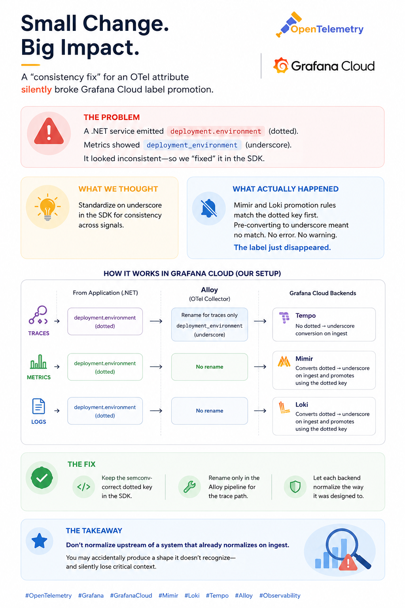
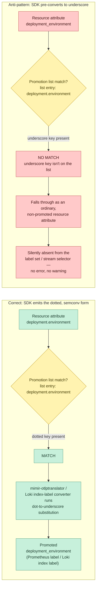
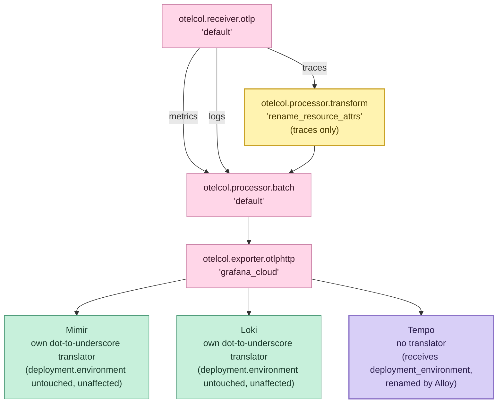

An engineer noticed `deployment.environment` showing up as a dotted key on trace resource attributes
in Tempo, while the equivalent Prometheus label on the same service's metrics was
`deployment_environment`. The instinct was reasonable: pick one spelling, standardize it in the OTel
SDK, ship it everywhere. So the fix went into `Program.cs` — the resource attribute was renamed to
the underscore form at the source, on the theory that Prometheus can't have dots in label names
anyway, so why not just emit the form every backend supposedly wants.

That fix made things worse, and not in a way that throws an error. It fails silently, which is the
dangerous kind of failure. Mimir and Loki both already do dot-to-underscore conversion on ingest —
but the promotion logic in both systems is keyed on matching the _dotted_ form against a static
list. Feed it the underscore form directly and it doesn't match, doesn't promote, and quietly falls
out of the label set it was supposed to join. The mechanism that was supposed to guarantee
consistency across signals is exactly what the fix broke.

---

## TL;DR

Mimir and Loki both convert dotted OTel resource attribute names to underscore form on ingestion —
but the promotion/matching logic in both is keyed on the literal _dotted_ attribute key being
present in the incoming OTLP payload. Pre-converting to underscore in application code doesn't give
you consistency; it gives you an attribute that matches neither promotion list and likely gets
dropped as an unindexed field. Tempo has no such conversion mechanism at all — it passes resource
attribute keys through exactly as received, so it's the only one of the three signals that actually
needs intervention. The fix: keep `deployment.environment` (dotted, OTel semantic-convention
correct) at the SDK, and add a single targeted rename in the Alloy pipeline, scoped to the traces
path only. Mimir and Loki keep working exactly as they already do; Tempo gets brought into line
without touching a single line of application code.

---

## The Problem

Grafana Cloud's three signal backends handle OTel resource attribute naming in three genuinely
different ways, and none of the three docs pages that describe this individually tell you the
combined story.

Here's the mechanism worth walking through step by step, since it's the detail the rest of this
section builds on.

**Stage 1 — match.** Both Mimir and Loki hold a static, hardcoded list of attribute names each is
willing to promote, written in the dotted OTel semantic-convention spelling —
`deployment.environment`, `service.name`, `k8s.cluster.name`, and so on. When a payload arrives, the
promotion logic runs a literal string comparison against that list: is `deployment.environment`
present in this resource's attributes, spelled exactly that way?

**Stage 2 — convert.** Only after an attribute survives stage 1's match does `mimir-otlptranslator`
(or Loki's equivalent) rewrite it from dots to underscores for storage as a label or index field.

```
Stage 1: MATCH             Stage 2: CONVERT
(literal string compare)   (dot → underscore substitution)
```

The SDK rename breaks stage 1, not stage 2. Emitting `deployment_environment` directly looks like
it's producing the output stage 2 would have produced anyway — but it never passes through stage 1
to get there. The match check is doing `"deployment_environment" == "deployment.environment"`, which
is false: the list has one entry, spelled with a dot, and the incoming key no longer has one. Since
the match fails, the attribute is never even considered for promotion. Stage 2 doesn't fail to
convert it — stage 2 never runs at all, because stage 1 gates access to it.

This is also why the failure is worse than an ordinary error. An unmatched resource attribute isn't
an error condition to Mimir or Loki — it's just an ordinary, non-promoted resource attribute.
There's no rejected-sample counter, no ingestion warning, nothing written to a log. From the
system's point of view nothing went wrong; it simply didn't recognize this attribute as one of the
special ones to lift into the label or index set. The data isn't lost — it's still ingested and
stored, as unindexed structured metadata in Loki's case, or simply absent from the label set in
Mimir's case — only its promotion status is. A query like
`count by (deployment_environment) (up{...})` in Mimir, or a Loki stream selector
`{deployment_environment="production"}`, just quietly returns nothing for that service, while every
other correctly-spelled attribute keeps working — which is what makes it look like a per-service
instrumentation gap rather than a spelling mismatch against a list most application engineers don't
know exists, since it's a platform-team-owned distributor flag, not something visible from
application code.

**Mimir** promotes selected OTLP resource attributes to Prometheus labels via
`-distributor.otel-promote-resource-attributes` (YAML: `promote_otel_resource_attributes`), a
distributor-level flag holding a static list of attribute names. Once an attribute is on that list
and present in the incoming resource attributes, it's handed to `mimir-otlptranslator`, which
performs the dot-to-underscore substitution — `deployment.environment` becomes the label
`deployment_environment`. The promotion step and the character-substitution step are two separate
stages, and the first stage is a literal string match against the list.

The default promotion list and the label each entry becomes after `mimir-otlptranslator` runs:

| OpenTelemetry resource attribute (dotted) | Prometheus label after normalization              |
| ----------------------------------------- | ------------------------------------------------- |
| `service.instance.id`                     | `service_instance_id` (also mapped to `instance`) |
| `service.name`                            | `service_name` (also contributes to `job`)        |
| `service.namespace`                       | `service_namespace`                               |
| `service.version`                         | `service_version`                                 |
| `cloud.availability_zone`                 | `cloud_availability_zone`                         |
| `cloud.region`                            | `cloud_region`                                    |
| `container.name`                          | `container_name`                                  |
| `deployment.environment`                  | `deployment_environment`                          |
| `deployment.environment.name`             | `deployment_environment_name`                     |
| `k8s.cluster.name`                        | `k8s_cluster_name`                                |
| `k8s.container.name`                      | `k8s_container_name`                              |
| `k8s.cronjob.name`                        | `k8s_cronjob_name`                                |
| `k8s.daemonset.name`                      | `k8s_daemonset_name`                              |
| `k8s.deployment.name`                     | `k8s_deployment_name`                             |
| `k8s.job.name`                            | `k8s_job_name`                                    |
| `k8s.namespace.name`                      | `k8s_namespace_name`                              |
| `k8s.pod.name`                            | `k8s_pod_name`                                    |
| `k8s.replicaset.name`                     | `k8s_replicaset_name`                             |
| `k8s.statefulset.name`                    | `k8s_statefulset_name`                            |

Note that `deployment.environment` and `deployment.environment.name` are both on the list — Mimir
matches whichever spelling your SDK actually emits, but each is a distinct list entry, not
interchangeable aliases of each other.

**Loki** does the identical shape of conversion for logs, which surprises people who've internalized
"labels are a metrics thing." `default_resource_attributes_as_index_labels` ships with an explicit
list of dotted semantic-convention names — `service.name`, `deployment.environment`,
`deployment.environment.name`, `k8s.cluster.name`, and others — and converts each to its underscore
index-label form automatically, the same two-stage shape as Mimir: match the dotted key, then
convert.

**Tempo** has no comparable mechanism. There's no label storage model in Tempo the way there is in
Mimir or Loki's index — resource and span attributes are stored and queried as-is. Whatever key
arrives in the OTLP payload is the key TraceQL sees.

The failure mode only appears when you look at all three at once. Both Mimir's and Loki's promotion
lists are matched against the literal incoming key, and every entry on both lists is written in the
dotted form because that's the OTel semantic-convention spelling. If the resource attribute arrives
pre-converted to `deployment_environment`, it fails the match on both lists. It doesn't error. It
doesn't warn. It falls through as an unindexed resource attribute in Loki (present in the log line's
structured metadata but absent from the stream selector), and in Mimir it's simply absent from the
metric's label set entirely, because there's no unindexed fallback for a distributor-promoted label
— it just isn't promoted.



The two paths diverge at exactly one point — the promotion-list match — and that point produces no
observable signal either way. A match promotes silently; a miss drops silently. Nothing short of
explicitly checking for the label's presence distinguishes the two at runtime.

---

## Failure Chain

**Phase 1: SDK emits the "consistent" form.** The OTel resource builder is configured to set
`deployment_environment` (underscore) instead of the semantic-convention `deployment.environment`
(dotted). This looks correct in isolation — the attribute shows up fine in any tool that reads
resource attributes verbatim, including a local OTel Collector debug exporter or a raw trace payload
inspector.

**Phase 2: Mimir's and Loki's promotion lists silently fail to match.** Both systems check the
incoming resource attributes against their respective static, dotted-form lists during ingestion.
`deployment_environment` (already underscored) is not a member of either list — the entry on the
list is `deployment.environment`. The match fails. Neither system treats this as an error condition;
there's no rejected-sample counter incrementing, no ingestion warning logged. The attribute is
processed as an ordinary, non-promoted resource attribute.

**Phase 3: The label disappears from queries, but the data doesn't.** In Mimir, the attribute never
becomes a label, so any PromQL query filtering or grouping by `deployment_environment` returns
nothing for series from this service — while every other resource attribute on the promotion list
keeps working normally, making the gap look like a per-service instrumentation bug rather than a
naming-format mismatch. In Loki, the attribute is present as structured metadata on the log line but
absent from the indexed label set, so `{deployment_environment="production"}` as a stream selector
returns zero results even though the log line exists and can be found by full-text search.

**Phase 4: Tempo shows a technically-present but non-standard key.** Tempo takes whatever it's given
— in this case, `deployment_environment` — and stores it verbatim. No cross-check happens against
OTel semantic conventions, no rejection, nothing else observes the discrepancy. The result after all
four phases: traces carry a non-standard resource-attribute key, and metrics/logs have silently lost
a label they previously had. Three signals now disagree with each other in the exact place the fix
was meant to make them agree.

---

## Why It Persists

The half-truth that drives this fix is nearly always the same sentence: "Prometheus doesn't allow
dots in label names, so I should just emit the underscore form everywhere." That's true as a
statement about Prometheus's own label syntax — but it's not a reason to pre-convert upstream of a
system whose entire job is to perform that conversion for you. The translation step exists precisely
so the SDK doesn't have to guess a per-backend spelling; short-circuiting it doesn't save the
translation, it just breaks the lookup that triggers it.

The second reason this keeps happening: when an engineer notices `deployment_environment` missing
from a Mimir label set or a Loki stream selector, the fix they reach for is the layer they control —
application code — because that's the layer that's visible in their own repo, in their own PR
review, in their own CI pipeline. The Mimir distributor flag and the Loki index-label config live in
platform-team-owned Terraform or Helm values, one or two repos away, and checking them first
requires knowing they exist. Ownership boundaries route the fix to the wrong layer even when the
wrong layer is the one that's easiest to change.

---

## Anti-Pattern Code

```csharp
// Context: OpenTelemetry .NET SDK resource configuration — the "consistency fix" attempt

// [WRONG] pre-converts a semconv-correct dotted key to underscore before it ever
// reaches Mimir or Loki, whose promotion lists match on the dotted form
var resourceBuilder = ResourceBuilder.CreateDefault()
    .AddService(serviceName: "checkout-api")
    .AddAttributes(new Dictionary<string, object>
    {
        // Looks reasonable in isolation: "Prometheus can't have dots in labels,
        // so ship the underscore form and be done with it." This is the line that
        // silently drops the label from both Mimir's and Loki's promotion lists —
        // neither list has an entry spelled "deployment_environment".
        ["deployment_environment"] = "production",
    });

var tracerProvider = Sdk.CreateTracerProviderBuilder()
    .SetResourceBuilder(resourceBuilder)
    .AddAspNetCoreInstrumentation()
    .AddOtlpExporter()
    .Build();
```

The danger here is specifically that this code compiles, runs, exports spans successfully, and looks
correct under a debug exporter that prints raw resource attributes verbatim. Nothing about the local
development loop surfaces the problem — it only appears once the payload reaches Mimir's distributor
and Loki's ingester and fails a list match neither system reports as an error.

---

## Correct Design

**Principle:** own the OTel semantic-convention-correct dotted attribute name at the SDK boundary.
Let each backend's own ingestion-time translator do the job it was built for. Intervene only at the
one layer that has no translator of its own — Tempo, via the collector.

| Option                                                       | SDK attribute form       | Tempo                                                     | Mimir                                                   | Loki                                                   | Verdict                                                                  |
| ------------------------------------------------------------ | ------------------------ | --------------------------------------------------------- | ------------------------------------------------------- | ------------------------------------------------------ | ------------------------------------------------------------------------ |
| A: dotted in SDK, no pipeline change                         | `deployment.environment` | Shows the dotted key — no other signal uses this spelling | Promotes correctly                                      | Promotes correctly                                     | Two of three consistent; Tempo is the outlier                            |
| B: dotted in SDK + Alloy transform on traces only (chosen)   | `deployment.environment` | Renamed to `deployment_environment` by Alloy              | Unaffected, already correct                             | Unaffected, already correct                            | All three consistent; zero application code changes                      |
| C: dotted in SDK + Alloy transform on all three signal paths | `deployment.environment` | Renamed                                                   | Redundant — Mimir's own translator would do this anyway | Redundant — Loki's own translator would do this anyway | Works, but doubles the maintenance surface for no additional consistency |

Option B is the minimum-surface-area fix: it touches exactly the one signal path that has no
built-in translation, and leaves the two paths that already work untouched.



```hcl
# Context: Grafana Alloy River config — rename applied only on the traces path

otelcol.receiver.otlp "default" {
  http { }

  output {
    metrics = [otelcol.processor.batch.default.input]
    logs    = [otelcol.processor.batch.default.input]
    // [CORRECT] traces are the only signal routed through the rename —
    // metrics and logs go straight to batch because Mimir and Loki already
    // handle the dotted form correctly on their own ingestion path
    traces  = [otelcol.processor.transform.rename_resource_attrs.input]
  }
}

otelcol.processor.transform "rename_resource_attrs" {
  // error_mode = "ignore" means a missing or malformed attribute drops through
  // without failing the pipeline — acceptable here because the statements are
  // idempotent no-ops when the dotted key isn't present, not a silent data-loss risk
  error_mode = "ignore"

  trace_statements {
    context    = "resource"
    statements = [
      `set(attributes["deployment_environment"], attributes["deployment.environment"])`,
      `delete_key(attributes, "deployment.environment")`,
    ]
  }

  output {
    traces = [otelcol.processor.batch.default.input]
  }
}

otelcol.processor.batch "default" {
  output {
    metrics = [otelcol.exporter.otlphttp.grafana_cloud.input]
    logs    = [otelcol.exporter.otlphttp.grafana_cloud.input]
    traces  = [otelcol.exporter.otlphttp.grafana_cloud.input]
  }
}
```

The `set` / `delete_key` pair matters: `set` copies the value under the new key without touching the
original, and `delete_key` removes the dotted key afterward so Tempo doesn't end up with both
spellings sitting side by side as separate resource attributes. Skipping the `delete_key` step is a
common half-fix that leaves Tempo technically correct but doubled up.

---

## Validation Test

This was confirmed against real ingested data during POC rollout, not just inferred from docs. Five
checks, run directly against Grafana Cloud — each isolating one stage of the pipeline so a pass on
one signal can't hide a failure on another.

Loki — confirms `deployment_environment` is present as an index label (a stream selector), not
merely as unindexed structured metadata. Returns zero results if promotion failed:

```logql
{deployment_environment="production", service_name="checkout-api"}
```

Mimir — confirms the label was promoted onto a metric series for this service. An empty result set
means the attribute never matched Mimir's promotion list:

```promql
count by (deployment_environment) (up{service_name="checkout-api"})
```

Tempo — confirms the Alloy rename applied before export:

```traceql
{ resource.deployment_environment = "production" && resource.service.name = "checkout-api" }
```

And confirms the original dotted key was actually removed by `delete_key`, not left behind alongside
the renamed one. TraceQL requires quoting an attribute name that contains a literal dot, since an
unquoted dot is parsed as a path separator — this should return zero traces once the Alloy transform
is applied:

```traceql
{ resource."deployment.environment" = "production" }
```

Alloy — an end-to-end bookend confirming the transform stage under `error_mode = "ignore"` isn't
silently dropping spans. The OTel Collector's documented per-processor accepted/refused span
counters are specific to the `memory_limiter` processor, not universal across every processor type —
so rather than assume an equivalent counter exists for the `transform` component, compare the
pipeline's own receiver and exporter bookends directly. A sustained non-zero gap means spans are
being lost somewhere between receipt and export, and the transform stage is the first place to
check:

```promql
sum(rate(otelcol_receiver_accepted_spans{receiver="otlp/default"}[5m]))
  -
sum(rate(otelcol_exporter_sent_spans{exporter="otlphttp/grafana_cloud"}[5m]))
```

Run all five together, not just the one that matches the signal you think is broken — the whole
point of this failure mode is that it looks fine on any single signal checked in isolation.

---

## Key Metrics

| Signal                             | Exact name                                                                        | What it tells you                                                                                                                                                                 |
| ---------------------------------- | --------------------------------------------------------------------------------- | --------------------------------------------------------------------------------------------------------------------------------------------------------------------------------- |
| Mimir promotion config             | `-distributor.otel-promote-resource-attributes`                                   | Static, distributor-level list of dotted attribute names Mimir matches before invoking `mimir-otlptranslator`'s dot-to-underscore substitution                                    |
| Loki promotion config              | `default_resource_attributes_as_index_labels`                                     | Same two-stage shape — dotted-name list, then underscore conversion — documented per Loki's OTel ingestion config                                                                 |
| Alloy pipeline health (end-to-end) | `otelcol_receiver_accepted_spans` vs. `otelcol_exporter_sent_spans`               | A sustained gap between receiver-accepted and exporter-sent trace counts means the transform stage (or something else downstream) is dropping spans under `error_mode = "ignore"` |
| Tempo resource attribute presence  | TraceQL `resource.deployment_environment` vs. `resource."deployment.environment"` | Confirms which spelling actually reached Tempo — the dotted form present here means the Alloy rename isn't applying                                                               |

If the exact list contents for a given Grafana Cloud stack aren't visible from the tenant side,
that's a real limitation, not an approximation — the promotion list is provisioned at the
distributor/Loki config layer, which is not always exposed per-tenant in the Grafana Cloud console.

---

## Pattern Generalization

The underlying shape: multiple independent consumers each apply their own normalization step, keyed
on a specific, documented input format. Pre-normalizing upstream of all of them doesn't buy
consistency — it produces a shape none of the consumers recognize as the one they know how to
convert, because their matching logic was written against the original spec form, not against
whatever normalized form you picked.

The same failure shape shows up in Kafka topic-naming conventions when producer teams pre-sanitize
topic names to match what they assume a downstream consumer's routing rules expect, breaking the
consumer's actual pattern-match rules in the process. It shows up in DNS and HTTP header handling,
where case-folding is supposed to happen at the resolver or server layer — a client that
pre-lowercases a header name it assumes needs it can break a downstream system that matches on the
original case for an unrelated reason. And it shows up in Kubernetes label versus annotation key
rules, where a value normalized to fit label syntax constraints upstream of a controller that
expects the annotation's original, unconstrained form will fail that controller's selector match
silently.

The generalizable rule: normalize at the layer that owns the matching logic, not at the layer that
merely produces the data. If you don't control every consumer's matching rules, you can't safely
guess a single upstream normalization that satisfies all of them.

---

## Production Incident

This surfaced during a Grafana Cloud Application Observability rollout, not as a dashboard outage
but as a quieter kind of drift: a query that filtered by `deployment_environment` worked for some
services and returned nothing for others, with no error anywhere in the pipeline. The debugging path
went from "is this an instrumentation gap" to "is this a query problem" before landing on the actual
cause — the promotion-list mechanism in Mimir and Loki, and the fact that both are keyed on the
dotted attribute form specifically. Reading the actual ingestion-time translation logic (rather than
assuming "Prometheus doesn't like dots" was the whole story) is what reframed the fix from
application code to the collector layer. The fix has since been validated against live Loki and
Mimir data in a proof-of-concept environment using the exact queries in the Validation Test section
above. No blast-radius or MTTR figures are cited here deliberately — the mechanism is the
load-bearing part of this story, not a manufactured timeline.

---

## MAANG-Scale Considerations

At the scale of a handful of services, this is a one-time fix in one Alloy config. At hyperscale —
hundreds or thousands of services, heterogeneous OTel SDK versions, multiple teams shipping
instrumentation independently — two things change.

First, Mimir's resource-attribute promotion list is a limit that can be overridden per-tenant via
runtime configuration — but "tenant" in Grafana Cloud maps to an org/stack, not to an individual
team or service. A fleet of hundreds of services across dozens of teams sharing one Grafana Cloud
stack still shares one promotion list. SDKs on different semantic-convention versions — some still
emitting `deployment.environment`, others migrated to the newer `deployment.environment.name` —
can't diverge on promotion policy within that shared tenant; the list has to be a superset that
satisfies every team on the stack, which pushes attribute-naming governance toward a centralized
schema-registry model rather than ad hoc fixes. This is the same problem Avro and Protobuf schema
registries solve for Kafka producers and consumers, applied to resource-attribute naming instead of
message schemas — and OTel already has the primitive for it in `schema_url`, which most collector
pipelines at this scale under-use.

Second, every attribute added to a promotion list is a new label — and a new label on a
high-cardinality resource attribute is a cardinality budget decision, not a free consistency win. At
MAANG scale, promoting an attribute without first estimating its cardinality contribution across
every service and environment combination is how a well-intentioned naming fix turns into an
ingest-cost regression that isn't attributed back to this change until someone audits the next
billing cycle.

---

## Summary Table

| Dimension           | Anti-pattern (SDK rename)                                       | Correct design (Alloy rename, traces only)                           |
| ------------------- | --------------------------------------------------------------- | -------------------------------------------------------------------- |
| Approach            | Rename attribute to underscore form in application code         | Keep dotted form in SDK; rename only on the traces path in Alloy     |
| Failure mode        | Silently fails Mimir's and Loki's promotion-list match          | None — Mimir/Loki untouched, Tempo receives the renamed key          |
| Detection signal    | Missing label in PromQL/LogQL queries, no error logged anywhere | Confirmed present via LogQL/PromQL/TraceQL checks in Validation Test |
| Operational cost    | Requires an application redeploy per service to fix or revert   | Single Alloy config change, applies fleet-wide with no app changes   |
| Fix complexity      | Low effort, high blast radius (touches every service's code)    | Low effort, zero blast radius on application code                    |
| Stack-specific note | Breaks two working ingestion paths to "fix" a third             | Touches exactly the one signal (Tempo) with no built-in translator   |

---

## Conclusion

Audit any OTel resource-attribute renames currently living in application code today. If any exist
purely to "match what Prometheus expects," revert them to the OTel semantic-convention dotted form
and push the translation into the collector layer — scoped only to the signal path that actually
lacks a built-in translator. Don't guess a single upstream spelling to satisfy multiple
independently-normalizing downstream consumers; check what each one actually matches on first.
