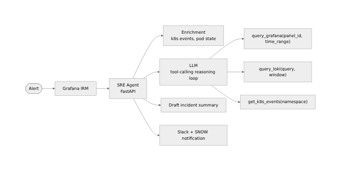

Six months ago, we deployed an LLM-backed SRE agent to our AKS development cluster. Not a chatbot.
Not a dashboard assistant. An agent that, when an alert fires, can autonomously query Grafana,
correlate Loki logs, check Kubernetes events, run pre-approved remediation playbooks, and file a
draft incident report in ServiceNow — all without waking a human at 3am for a flapping pod.

This is what we learned.

## Why we built it

The problem wasn't alert volume — we'd already handled that with BigPanda and AIOps correlation
(80%+ noise reduction). The problem was the gap between _"an alert fired"_ and _"a human is looking
at the right dashboards with the right context"_.

That gap averages 8–12 minutes even on a well-run team. At scale, that's hundreds of
engineering-hours per month spent on:

1. Interpreting an alert notification
2. Opening the right Grafana dashboard
3. Querying Loki for context
4. Deciding if it's a real incident or a transient blip

An SRE agent can close that gap to under 60 seconds.

## Architecture

The agent runs as a FastAPI service on AKS with three components:

**Triage layer** — receives alert webhooks from Grafana IRM. Parses alert metadata, enriches with
cluster state via the Kubernetes API, and determines severity heuristics.

**Reasoning layer** — an LLM (Claude API) with access to a set of tools: `query_grafana()`,
`query_loki()`, `get_k8s_events()`, `run_playbook()`. The system prompt primes it with the runbook
index and escalation policy.

**Action layer** — executes approved actions. Currently: safe read-only queries, pod log fetches,
Slack notifications with context, and SNOW ticket creation. Destructive actions (pod restart,
rollback) are gated behind human approval.

## What worked

**Tool-calling LLMs are surprisingly good at runbook navigation.** We embed our runbook index and
the agent can identify the right playbook for a given alert type with ~85% accuracy. The remaining
15% are novel failure modes that don't map cleanly to existing runbooks — which is exactly what
you'd want a human for.

**Contextual Loki queries beat static alert links.** Rather than linking to a pre-baked dashboard,
the agent constructs a Loki query from the alert labels and time window. The on-call engineer gets
relevant logs in the Slack message, not a dashboard link they have to navigate to.

**Draft post-mortems save time.** Even when humans take over, the agent's draft (timeline +
correlated events + initial hypothesis) cuts post-mortem writing time by 60–70%. The draft is wrong
sometimes, but it's a starting point that forces structure.

## What didn't work

**LLMs hallucinate confidence.** Our first version occasionally stated "the root cause is X" with
high confidence when it had insufficient evidence. We addressed this by requiring the LLM to output
a structured evidence summary with each claim, and having the system validate that every claim is
grounded in an actual tool call result. Claims without evidence get flagged as hypotheses, not
conclusions.

**Playbook drift is a real problem.** Runbooks that aren't kept current are worse than no runbooks —
the agent follows them confidently and misses what's actually happening. We added a staleness check:
any runbook older than 90 days is excluded from the agent's context until reviewed.

**Tool timeout handling required explicit attention.** The Grafana API has rate limits. The Loki
query engine can be slow under load. Without explicit timeout handling and retry logic, the agent
would stall mid-reasoning. We added per-tool SLOs and graceful degradation (the agent notes "Loki
query timed out, operating with reduced context" rather than silently failing).

## The validator gate

The most important design decision: we added a **validator layer** between the reasoning output and
any action.

Every proposed action gets checked against three criteria:

1. **Is it in the approved action set?** (allowlist, not denylist)
2. **Does it match the alert's scope?** (no cross-namespace actions without explicit approval)
3. **Is it within working hours, or is it an emergency-tier alert?** (some actions are night-gated)

This validator runs as a separate Python module with its own test suite. The LLM cannot bypass it.
This is the difference between a tool you can trust in production and one you can't sleep near.

## Current state

The agent has handled ~340 alerts in dev/staging since deployment. Of those:

- 280 were classified and resolved (or correctly escalated) without human intervention
- 52 required human review — the agent escalated appropriately in 48 of these
- 4 were misclassified (false-negative escalations) — we've addressed 3

We're not yet running this in production. The bar for production is: 30 days in staging with zero
incorrect destructive actions. We're at day 18.

## What I'd tell you if you're building something similar

Start with read-only tools and escalation only. Earning trust requires a track record of correct
non-destructive decisions before you add any write path.

Measure the agent's accuracy the same way you'd measure a human's: false positive rate, false
negative escalation rate, time-to-correct-triage. These metrics tell you whether the agent is
actually helping or just automating noise.

The system prompt is load-bearing. Garbage in, garbage out. Spend at least as much time on the
agent's instructions as you do on the tool implementations.

And finally: the goal isn't to remove humans from incident response. It's to make sure humans only
show up when their judgment is actually needed. That's a good deal for everyone — especially the
engineers who'd otherwise be debugging pod crashloops at midnight.
