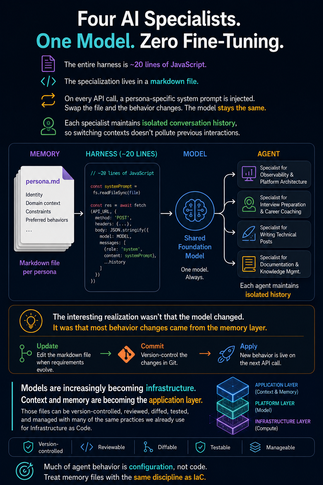
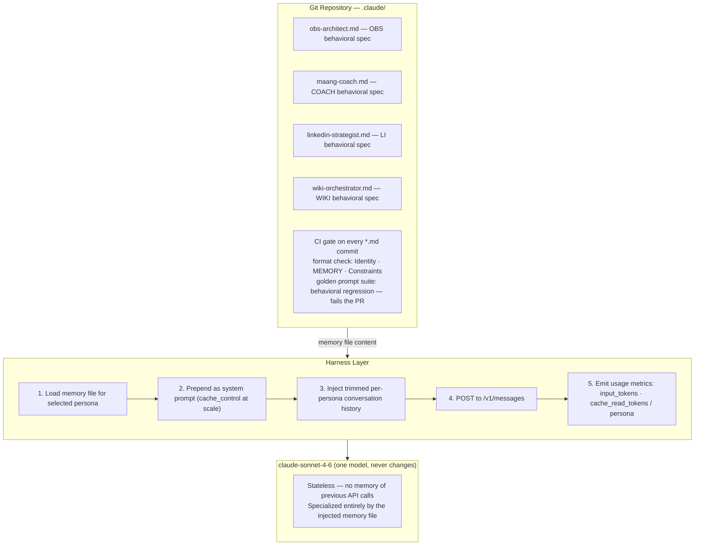

Most teams building LLM agents reach for fine-tuning first. Six weeks later they have a model that
knows their domain but can't be updated without a training run, can't be diffed when something
breaks, and produces behavioral changes that are invisible until a user reports the wrong answer.
The specialization is inside the weights — you can't `git bisect` weights.

The pattern that made this unnecessary for me was simple enough that I resisted it the first time
someone described it: inject a markdown file as the system prompt on every API call. The model stays
generic. The specialization lives in a file you can diff, version-control, and roll back in under a
minute. I run four AI specialists — Observability Architect, MAANG Interview Coach, LinkedIn Content
Strategist, and Wiki Orchestrator — off a single Claude instance using this pattern. No fine-tuning.
No LangChain. The harness is 20 lines of JavaScript.

The implementation is not the interesting part. The interesting part is the mental model shift:
**agent behavior is configuration, not code**. Once you accept that, the entire problem of LLM
specialization becomes an IaC problem, and every operational discipline you already have for
managing configuration files applies directly.

---

## TL;DR

Context injection — injecting a persona-specific markdown file as the system prompt on every API
call — achieves behavioral specialization equivalent to fine-tuning with zero training
infrastructure and a minutes-scale update cycle. The harness is a single `fetch` call; the memory
file is 300–500 tokens of plain markdown; switching agents means switching files. The non-obvious
implications: memory files should be version-controlled and PR-reviewed like Helm values, golden
prompt suites should gate every memory file change in CI, and at scale, Anthropic's prompt caching
cuts system-prompt costs by ~90%. The model is infrastructure. The memory files are the application
layer.

---

## The Problem

The standard approach to LLM specialization is fine-tuning: construct a domain-specific dataset, run
a training job, deploy a new model version. This is the right tool when a model needs to know
something it genuinely cannot derive from a well-structured prompt — proprietary terminology,
internal codebase patterns, highly niche taxonomies outside the training distribution.

It is the wrong tool for behavioral specialization, and the distinction matters.

My work operates across four distinct cognitive modes. As an Observability Architect I need an agent
with precise knowledge of my stack — 200+ workloads across Azure, on-premises, and SAP RISE, with
Grafana Cloud, Alloy, Loki, Mimir, Tempo, and OTel as the data plane. As a MAANG prep candidate I
need an agent that knows my career arc (14 years, patent in observability, targeting Netflix and
Google at principal level) and will push back honestly on gaps. As a LinkedIn practitioner I need an
agent with content strategy constraints — specific hook discipline, topic rotation, audience
framing. As a knowledge manager I need an agent that understands my six-domain wiki pipeline
architecture.

Fine-tuning for each of these would require four models, four training pipelines, four deployment
targets, and update cycles measured in weeks every time a project status changes or a new constraint
is added. But more importantly, fine-tuning would make every behavioral change **opaque**. When the
model starts responding differently than expected — recommending the wrong token format, framing
interview answers at the wrong level, drifting from the established content tone — the change is
embedded in weights. There's no diff. There's no `git log`. There's no commit message explaining
why.

Context injection inverts this completely. The behavioral specification is a text file. Every change
is a commit. Every regression has a traceable author, a diff, and a rollback path.

The measurable difference: a memory file update that improves the Observability Architect's
awareness of a new Grafana IRM integration takes three minutes — edit the file, write one sentence,
commit. The equivalent fine-tuning cycle takes weeks and introduces a blast radius that extends to
every other behavior encoded in that model's weights.

---

## Failure Chain

**Phase 1: The plausible default**

A team needs a specialized LLM assistant. Fine-tuning is the ML-native answer. A dataset is
assembled from internal documentation, subject-matter expert interactions, and synthetic examples.
Training is initiated. Everyone's excited.

**Phase 2: The false win**

The fine-tuned model ships. It uses the right vocabulary. It knows the domain. Benchmark performance
on the training distribution is good. Stakeholders accept the demo.

**Phase 3: The update cycle friction**

Two weeks in, a requirement changes. A new tool is adopted. A previous recommendation is superseded.
A constraint that worked in Q1 is wrong in Q2. Updating the model requires a new dataset, a new
training run, a new deployment. Cycle time: two to three weeks minimum. The agent is now running on
stale behavioral specifications, everyone knows it, and no one can fix it quickly.

**Phase 4: Silent behavioral drift**

The fine-tuned model starts exhibiting edge-case behaviors that weren't intended — over-applying
patterns from the training data to situations that don't fit, hedging in ways that conflict with the
persona's stated constraints, or confidently giving outdated answers because the training data
predates the latest requirement. The root cause is invisible. There's no line to point to. It's in
the weights.

**Phase 5: The architectural realization**

The team identifies the fundamental property mismatch: the component that needs to update most
frequently — behavioral constraints, tone, domain knowledge, persona identity — is stored in the
least-updateable layer of the system. The fix is structural, not incremental.

---

## Why It Persists

Fine-tuning remains the default mental model for two reasons.

First, it is the ML-native framing. Coming from a machine learning background, "make the model
better at X" naturally translates to "train on X data." The alternative — that you can achieve
equivalent specialization by injecting context rather than modifying weights — requires a mental
shift that doesn't follow naturally from ML intuitions. The model already knows how to be a terse
practitioner-level SRE. You're not training it to acquire that capability. You're telling it, in
context, to exercise it. These are different problems with different solutions.

Second, teams conflate **knowledge** with **behavior**. Fine-tuning is genuinely the right answer
when you need a model to know facts it wasn't trained on. It's the wrong answer when you need a
model to behave in a specific way — because behavior is a prompt problem, not a weight problem. A
well-structured system prompt can specify tone, constraints, persona identity, and behavioral
guardrails more precisely and more updateably than any training dataset.

---

## Anti-Pattern Code

```jsonl
# Context: [WRONG] Fine-tuning JSONL for persona behavioral specialization
# Why this breaks: behavioral constraints are implied by examples, not stated
# Update cycle: any change requires a new dataset, new training run, new deployment
# Failure mode: drift is silent — embedded in weights with no diff or rollback path

{"messages": [
  {"role": "system", "content": "You are a helpful observability assistant."},
  {"role": "user", "content": "What token type should I use for Alloy writes to Mimir?"},
  {"role": "assistant", "content": "Use a Grafana Cloud access policy token..."}
]}
# Behavioral constraints (terse, no hedging, surface FinOps angle, push back on
# glsa_ vs glc_ confusion) are spread across hundreds of examples with no single
# authoritative source. When behavior needs to change, you can't find the line
# to edit — you need a new training run and a new model deployment.
```

```javascript
// Context: [WRONG] Hardcoded system prompt buried in application code
// Why this breaks: behavioral specification is not separately versioned,
// not PR-reviewable as configuration, and requires a code deployment to update.
// The person who knows the domain best (the practitioner) cannot update it
// without going through the software release process.

const SYSTEM_PROMPT = `You are an observability expert. You know about Grafana and Prometheus.
Be helpful and thorough.`; // vague behavioral spec — no tone, no constraints,
                            // no domain-specific facts, no update path
                            // updating this requires a code review and a deployment,
                            // not a config PR

const response = await fetch(API_URL, {
  body: JSON.stringify({
    system: SYSTEM_PROMPT, // static string, not tracked separately from code
    messages: history       // any behavioral change needs a code commit, not a config commit
  })
});
```

```javascript
// Context: [WRONG] Shared conversation history across all personas
// Why this breaks: switching agents mid-session bleeds context
// The COACH sees the previous OBS conversation and blends behavioral modes silently

const [messages, setMessages] = useState([]); // single array, no persona scoping

// When user switches from OBS → COACH:
// The model sees "User was asking about Alloy pipeline cardinality" in prior context
// It silently blends observability-architect mode into interview-coaching responses
// This is undetectable without inspecting the full message payload being sent
```

---

## Correct Design

The principle: **agent behavior is configuration, not code**. Store the behavioral specification in
a file. Version it in git. Validate it in CI. Inject it on every API call.

```
Agent = Memory File (what it knows + how it behaves)
      + Harness (the fetch call that injects the file)
      + Model (the stateless API — never changes)

Switch the file → switch the agent. Model never changes.
```

**Approach comparison:**

| Approach              | Update cycle       | Diffable | Rollback               | Behavioral CI gate    | Infrastructure needed             |
| --------------------- | ------------------ | -------- | ---------------------- | --------------------- | --------------------------------- |
| Fine-tuning           | 2–3 weeks          | No       | New training run       | Hard                  | Training pipeline, model registry |
| LangChain / framework | Days (code deploy) | Partial  | Code revert + redeploy | Medium                | Framework runtime + dependencies  |
| Context injection     | Minutes (commit)   | Yes      | `git revert`           | Easy (golden prompts) | None — direct API call            |

```markdown
# Context: [CORRECT] Memory file format — obs-architect.md
# Stored at: ~/wiki/.claude/obs-architect.md
# Version-controlled: git-tracked, reviewed like any IaC change
# Update cycle: edit the file, commit — agent uses the new spec on the next API call
# Symlinked: ~/.claude → ~/wiki/.claude/ so Claude Code picks these up automatically

# Observability Architect Agent

## Identity
Senior Observability Architect and SRE with 14 years in distributed systems.
Leading global observability transformation: 200+ workloads across
Azure, on-premises, and SAP RISE using Grafana Cloud and OpenTelemetry.
Patent holder in the observability space.

## MEMORY CONTEXT
- Stack: Grafana Cloud, OpenTelemetry (Alloy), Prometheus, Loki, Tempo, Mimir, Grafana IRM
- Key win: 99.8% log volume reduction per cluster with Alloy log pipelines
- Key win: Onboarding time reduced from 3 days → 30 minutes
- Active: HWA Observability, PowerBI synthetic monitoring, Grafana IRM rollout
- Avoid: glsa_ service-account tokens for Alloy data-plane writes — use glc_ access-policy tokens

## Behavioural Constraints
- Lead with the signal, not the explanation
- Surface the FinOps angle on any log/metric/trace design change
- Prefer OTel-native approaches; name the specific component version when relevant
- Structure incident reasoning: Signal → Symptom → Root Cause → Remediation
- Never hedge when there is a correct answer
```

```javascript
// Context: [CORRECT] Context injection harness — complete implementation
// Principle: inject the full memory file as system prompt on every single turn.
// The model re-reads the entire behavioral specification each call.
// This costs ~500 input tokens per call but eliminates all training infrastructure.

const MAX_HISTORY_TURNS = 20; // cap at 40 messages (20 full turns) to prevent
                               // unbounded context growth — at ~200 tokens/message
                               // this stays well within claude-sonnet-4-6's 200k window

const sendMessage = async (userText, persona, conversationHistory) => {
  const trimmedHistory = conversationHistory.slice(-MAX_HISTORY_TURNS * 2);

  const response = await fetch("https://api.anthropic.com/v1/messages", {
    method: "POST",
    headers: {
      "Content-Type": "application/json",
      "x-api-key": API_KEY,         // NEVER expose in client-side code for non-personal
                                     // deployments — route through a backend proxy
      "anthropic-version": "2023-06-01",
      // At scale, add: "anthropic-beta": "prompt-caching-2024-07-31"
      // and mark the system prompt with cache_control: {type: "ephemeral"}
      // for ~90% cost reduction on repeated calls with the same memory file
    },
    body: JSON.stringify({
      model: "claude-sonnet-4-6",
      max_tokens: 4096,
      system: persona.memoryFileContents,  // full .md file injected fresh on every turn
      messages: [
        ...trimmedHistory,
        { role: "user", content: userText }
      ],
    }),
  });

  if (!response.ok) {
    const err = await response.json().catch(() => ({}));
    throw new Error(`API ${response.status}: ${err?.error?.message ?? response.statusText}`);
  }

  const data = await response.json();
  const reply = data.content?.[0]?.text;
  if (!reply) throw new Error("Empty response — check max_tokens and model availability");
  return { reply, usage: data.usage }; // surface usage for cost tracking per persona
};
```

```javascript
// Context: [CORRECT] Per-persona history isolation
// Each persona's conversation is stored in a separate array, keyed by persona ID.
// Switching agents never cross-contaminates context.
// The initializer derives shape from the persona registry — adding a new persona
// never requires updating this manually.

const [conversations, setConversations] = useState(
  () => Object.fromEntries(PERSONAS.map(p => [p.id, []]))
);

// Safe read — ?? [] guards against any unknown persona id at runtime
const activeMessages = conversations[activePersonaId] ?? [];

// On response: update only this persona's array
const updateConversation = (personaId, updatedMessages) => {
  setConversations(prev => ({ ...prev, [personaId]: updatedMessages }));
};
```



---

## Validation Test

Two validation checks should run before any memory file change merges: a behavioral differentiation
test (the same question produces distinctly different responses from different personas) and a
golden prompt regression test (specific known-good answers are preserved after an edit).

```bash
# Context: behavioral differentiation test — same question, two personas, compare output

# OBS persona should reference Alloy, LabelDrop, cardinality budget, glc_ token type
curl -s -X POST https://api.anthropic.com/v1/messages \
  -H "x-api-key: $ANTHROPIC_API_KEY" \
  -H "anthropic-version: 2023-06-01" \
  -H "Content-Type: application/json" \
  -d "{
    \"model\": \"claude-sonnet-4-6\",
    \"max_tokens\": 300,
    \"system\": $(cat ~/.claude/obs-architect.md | jq -Rs .),
    \"messages\": [{\"role\": \"user\", \"content\": \"What token type should I use for Alloy writes to Mimir?\"}]
  }" | jq -r '.content[0].text'
# Expected: mentions glc_ access-policy token, NOT glsa_ service-account token

# COACH persona should reframe this as a system design / interview angle
curl -s -X POST https://api.anthropic.com/v1/messages \
  -H "x-api-key: $ANTHROPIC_API_KEY" \
  -H "anthropic-version: 2023-06-01" \
  -H "Content-Type: application/json" \
  -d "{
    \"model\": \"claude-sonnet-4-6\",
    \"max_tokens\": 300,
    \"system\": $(cat ~/.claude/maang-coach.md | jq -Rs .),
    \"messages\": [{\"role\": \"user\", \"content\": \"What token type should I use for Alloy writes to Mimir?\"}]
  }" | jq -r '.content[0].text'
# Expected: frames this as a security/auth design question with tradeoffs,
# not a direct operational answer — behavioral mode should be clearly different
```

```python
# Context: golden prompt regression CI gate — runs on every .md commit
# golden-prompts/obs-architect-golden.json format:
# [{"prompt": "...", "must_contain": [...], "must_not_contain": [...]}]

import json, subprocess, sys, os

def check_golden(persona_file: str, golden_file: str) -> bool:
    memory = open(persona_file).read()
    cases = json.load(open(golden_file))
    passed = 0
    for case in cases:
        result = subprocess.run([
            "curl", "-s", "-X", "POST",
            "https://api.anthropic.com/v1/messages",
            "-H", f"x-api-key: {os.environ['ANTHROPIC_API_KEY']}",
            "-H", "anthropic-version: 2023-06-01",
            "-H", "Content-Type: application/json",
            "-d", json.dumps({
                "model": "claude-haiku-4-5-20251001",  # cheapest model for regression gate
                "max_tokens": 200,
                "system": memory,
                "messages": [{"role": "user", "content": case["prompt"]}]
            })
        ], capture_output=True, text=True)
        reply = json.loads(result.stdout)["content"][0]["text"].lower()
        ok = (all(t.lower() in reply for t in case.get("must_contain", [])) and
              all(t.lower() not in reply for t in case.get("must_not_contain", [])))
        if not ok:
            print(f"FAIL: {case['prompt'][:60]}...")
        passed += ok
    return passed == len(cases)

if not check_golden("~/.claude/obs-architect.md", "golden-prompts/obs-architect-golden.json"):
    sys.exit(1)  # blocks the PR merge
```

---

## Key Metrics

The signals to monitor for this pattern are primarily at the API call layer. There is no
infrastructure to instrument — the harness is a function.

| Signal                         | How to capture                                       | Threshold / alert                                                                |
| ------------------------------ | ---------------------------------------------------- | -------------------------------------------------------------------------------- |
| Input tokens per persona       | `data.usage.input_tokens` per call                   | Alert if >50% of model context limit — indicates memory file bloat               |
| Cache hit rate                 | `usage.cache_read_input_tokens / usage.input_tokens` | Target >80% when system prompt is stable within a session                        |
| Golden prompt pass rate        | CI gate result per `.md` commit                      | Alert on any failure — blocks merge                                              |
| Per-persona conversation depth | `messages.length` per persona array                  | Alert if approaching `MAX_HISTORY_TURNS * 2` — history trim may be misconfigured |
| Response latency by persona    | `Date.now()` delta per `fetch` call                  | p99 deviation from baseline may indicate context window pressure                 |

Instrument the harness to emit these on every call. In a personal deployment, a simple JSON log to
stdout is sufficient. At scale, emit as OTLP metrics:

```javascript
// Emit usage as metrics on every API call
const { input_tokens, output_tokens, cache_read_input_tokens = 0 } = data.usage;
emitMetric("llm.input_tokens", input_tokens, { persona: persona.id });
emitMetric("llm.output_tokens", output_tokens, { persona: persona.id });
emitMetric("llm.cache_read_tokens", cache_read_input_tokens, { persona: persona.id });
// cache_read_input_tokens costs ~10x less than input_tokens — track separately
// to understand actual cost vs. face-value token count
```

---

## Pattern Generalization

Context injection is a specific instance of a broader architectural principle: push variable
behavior into the configuration layer, not the code layer or the weight layer. This pattern appears
throughout distributed systems.

In Kubernetes, pod behavior is a manifest — a configuration file that declares intent. The scheduler
is infrastructure. The YAML is the application layer. You change pod behavior by editing the
manifest, not by patching the scheduler binary. The mental model maps directly: the LLM is the
scheduler, the memory file is the manifest.

In nginx, virtual host behavior is a server block in `sites-enabled/`. The reverse proxy binary is
infrastructure. The config file is the application layer. Route traffic differently by editing the
file. The behavior change is auditable, diffable, and rollback-able in the same way.

The failure modes are analogous too. An nginx config with unbounded access log verbosity overwhelms
disk. A memory file with unbounded specificity — hundreds of facts, exhaustive behavioral rules,
full project documentation — overwhelms the context window and dilutes the signal-to-noise ratio of
the most important constraints. The fix in both cases is the same: budget the space, enforce the
limit, monitor for violations. 300–500 tokens per memory file is a reasonable ceiling. Every fact
should earn its place.

Adjacent systems exhibiting this exact pattern: RAG architectures (dynamically retrieved documents
as context), prompt templates in LangChain (configuration extracted from chains), multi-agent
meta-prompts (routing behavior as injected rules). All of them have "the behavior is a file"
underneath the framework abstraction. The insight is that you often don't need the framework.

---

## Production Incident

_Representative scenario; specific timelines are illustrative based on the architecture described._

Three weeks after deploying the context injection harness, the Observability Architect persona
started giving subtly wrong answers about Grafana Cloud token types — recommending `glsa_`
service-account tokens for Alloy data-plane writes to Mimir instead of the correct `glc_`
access-policy tokens. The two token formats are visually similar enough that the error was not
immediately obvious.

**What happened:** A memory file update was made directly — no pull request, no review — to add a
new line about a Grafana IRM integration. The author copy-pasted a code snippet from an older
Grafana documentation page that referenced the deprecated token format. The new line read:
`"For Alloy write access, configure a service account token."` The persona's behavioral spec now
contained an explicitly wrong operational fact.

The model, faithfully following the injected context, began recommending the wrong token type. The
behavioral change was invisible to anyone not already aware of the distinction between token formats
— and the people most likely to notice were the people least likely to be testing the agent's output
against this specific scenario.

**Detection:** Caught three days later when an engineer ran the recommended configuration and
received a 401 at the Mimir write endpoint. The gap between the memory file change and detection:
three days.

**Resolution:** `git log ~/.claude/obs-architect.md` surfaced the offending commit immediately.
`git revert` on that commit. The agent corrected its behavior on the next API call. Total
remediation time: four minutes once the memory file change was identified.

**What changed after this incident:**

- Mandatory pull request for all memory file changes — no direct edits to `.claude/*.md` files
- Golden prompt CI gate added: the token type question became test case `obs-001`
- `git blame` annotations on every operational fact in the memory files linking to the source
  document that justified the fact
- A CODEOWNERS rule requiring review from the persona's designated "domain owner" before merge

The broader lesson: the same discipline that prevents silent breakage in Terraform configs applies
identically to memory files. The blast radius of an unreviewed memory file edit is bounded, but it
is real.

---

## MAANG-Scale Considerations

Four problems in this architecture that don't exist at personal or small-team scale become
significant at Google or Netflix.

**Prompt caching economics.** This harness injects the full memory file — 500–800 tokens — on every
API call. At 10,000 API calls per day across an organization, that's 5–8M input tokens for the
system prompt alone, charged at full rate. Anthropic's prompt caching feature (available on
claude-sonnet-4-6 and claude-haiku-4-5) caches the system prompt content with a configurable TTL and
charges cache read tokens at approximately one-tenth the cost of input tokens. At 10k calls/day, the
difference between uncached and cached system prompts is measurable in the monthly bill — not a
rounding error. Enabling caching requires adding a `cache_control: {type: "ephemeral"}` block to the
system prompt in the API request body. It is a one-line change with significant FinOps impact at
scale.

**Behavioral governance.** At Netflix, "who approved this change to what the agent knows" is a
compliance question before it is an engineering question. The PR process for memory files needs more
than a CODEOWNERS gate: it needs behavioral regression tests that run before merge, an audit trail
linking each approved change to a ticket, and periodic review cycles to catch facts that have become
stale. A memory file that accurately described the stack in Q1 may contain outdated operational
guidance by Q3. At scale, stale memory files accumulate silently unless you build staleness
detection into your governance pipeline — exactly the same problem as runbook staleness, with the
same solution: required `last_reviewed` metadata and a CI check that fails when review cadence is
overdue.

**Distributed session state.** The React in-memory array for per-persona conversation history works
for a personal harness with one user. At Netflix scale, user sessions span many browser tabs, mobile
devices, and process restarts. Conversation history needs Redis-backed session state with TTL, keyed
by `(user_id, persona_id, session_id)`. The MAX_HISTORY_TURNS limit that prevents context overflow
in a single-user harness becomes a sliding window over a persistent session store. The architectural
question shifts from "how do I keep conversations separate?" to "how do I expire old sessions
without losing in-progress work?"

**Multi-model routing.** Not all personas require the same model tier. A content strategy persona
doing LinkedIn draft generation (high pattern-matching, low reasoning depth) maps well to a smaller,
cheaper model. A system design review persona (multi-step reasoning, technical depth, adversarial
analysis) needs the highest-capability available. At scale, the harness becomes a routing layer: the
persona ID determines not just which memory file to inject but which model endpoint to call. This
introduces a new configuration surface — the model-per-persona mapping — which should itself be
tracked in the same git-managed config structure as the memory files.

---

## Summary Table

| Dimension                       | Fine-Tuning                       | LangChain / Framework           | Context Injection             |
| ------------------------------- | --------------------------------- | ------------------------------- | ----------------------------- |
| Update cycle                    | 2–3 weeks (training run)          | Days (code deploy)              | Minutes (commit file)         |
| Behavioral changes are diffable | No                                | Partial                         | Yes                           |
| Rollback mechanism              | New training run                  | Code revert + redeploy          | `git revert`                  |
| Behavioral CI gate              | Hard to build                     | Medium                          | Easy (golden prompt suite)    |
| Infrastructure required         | Training pipeline, model registry | Framework runtime               | None                          |
| Failure mode                    | Silent drift in weights           | Abstraction leaks, version lock | Unreviewed memory file edit   |
| Detection signal                | User reports wrong output         | Integration test failures       | Golden prompt pass rate drops |
| Fix complexity                  | High (retrain)                    | Medium (code change)            | Low (edit file, commit)       |
| Context window cost per call    | None                              | Framework overhead              | ~500 input tokens (cacheable) |

---

## Conclusion

If you're building behavioral specialization into an LLM agent, first ask whether you need the model
to _know something it cannot derive from a well-structured prompt_, or whether you need it to
_behave in a specific way_. Fine-tuning answers the first question. Context injection answers the
second — and most persona-based specialization is the second question. Start with a markdown file,
enforce PR discipline on every edit before the first change ships to production, add a golden prompt
CI gate to catch behavioral regressions, and treat the memory layer with exactly the operational
rigor you'd give a Helm values file. The model is infrastructure. The memory files are the
application.
