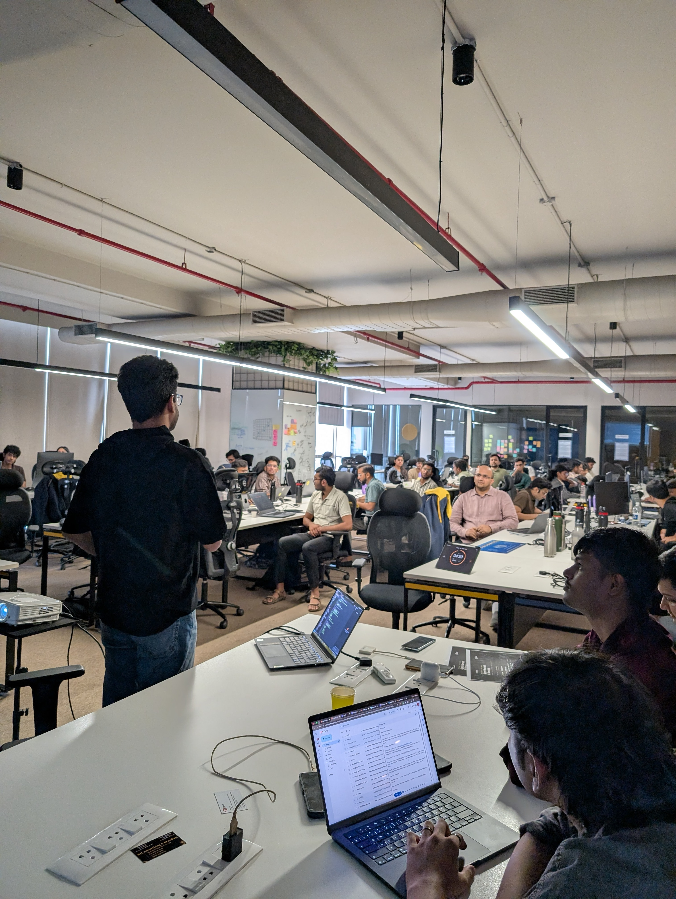

Last week, I had the opportunity to present my project, **"One Model, Many Minds: A Personal Agent
Harness with Context Injection"**, at Build Day: Agent Harness & Memory organized by Build Club and
Mem0.

While my session focused on how a single LLM can behave like multiple specialists through context
injection, persona-specific prompts, memory isolation, and lightweight orchestration, the event
itself highlighted a broader trend:

> The future of Agentic AI will not be determined solely by model intelligence. It will be
> determined by how effectively we manage context, memory, reliability, and control.

This article summarizes some of the most valuable technical insights from the event.

---

# My Presentation: One Model, Many Minds

The core question I explored was: **Can a single LLM instance behave as multiple specialized agents
— without model switching, separate deployments, or inter-agent plumbing?**

The answer is yes, if you treat the context window as the deployment surface.

## Architecture

The harness is built around Claude Code as the orchestration layer. A root `CLAUDE.md` file
auto-loads structured context at session start, before any user message is processed:

```text
┌──────────────────────────────────────────────┐
│               Claude Code Harness            │
├──────────────────────────────────────────────┤
│  Context.md    — role, stack, working prefs  │
│  Memory.md     — project state, open threads │
│  8 Persona files — specialist role prompts   │
│  Auto-memory   — persisted facts per session │
│  ~20 Skills    — reusable task workflows     │
└─────────────────────────┬────────────────────┘
                          │
               ┌──────────┴──────────┐
               │    One LLM Model    │
               └──────────┬──────────┘
                          │
          ┌───────────────┼───────────────┐
          ↓               ↓               ↓
  Observability       MAANG           LinkedIn
   Architect          Coach          Strategist
```

## The Key Insight

The model does not change. The context does.

Rather than running separate agents for each domain, the harness loads the correct persona, memory,
and constraints at the start of each session. An observability question activates the SRE persona
and stack-specific constraints. An interview prep question activates the MAANG coaching voice and
target company calibration.

Context injection replaces agent proliferation.

## What This Avoids

- No separate model deployments per specialist
- No inter-agent communication overhead
- No context drift when agents need to share state
- No cost multiplication from running parallel model instances

The tradeoff: context window size becomes a hard constraint. As personas, memory entries, and skill
definitions grow, curation is mandatory — which is exactly why context engineering is the topic this
event was built around.

---

# The Rise of the Agent Harness

Most AI discussions focus on models.

Most production failures happen everywhere else.

As organizations move from chatbots to autonomous agents, the need for a control layer becomes
obvious.

This is where the **Agent Harness** comes in.

## What is an Agent Harness?

An Agent Harness is the orchestration and governance layer surrounding one or more AI agents.

Instead of allowing an agent to operate directly against tools and data sources, the harness
manages:

- Execution flow
- State persistence
- Permissions
- Human approvals
- Budget controls
- Reliability mechanisms
- Sub-agent coordination

Conceptually:

```text
                ┌─────────────────────┐
                │   Agent Harness     │
                ├─────────────────────┤
                │ State Persistence   │
                │ Memory Management   │
                │ Permissions         │
                │ Budget Controls     │
                │ Human Oversight     │
                │ Reliability Rules   │
                └──────────┬──────────┘
                           │
                 ┌─────────┴─────────┐
                 │      Agent        │
                 └─────────┬─────────┘
                           │
               ┌───────────┴───────────┐
               │ Tools / MCP / APIs    │
               └───────────────────────┘
```

## Agent Loop + State Persistence

One recurring theme was the relationship between:

- Agent loops
- State persistence

Without persistent state, every interaction becomes stateless reasoning.

Without controlled agent loops, autonomous execution can become unpredictable.

The harness acts as the bridge between these two concerns.

```text
Agent
   ↓
Reason
   ↓
Take Action
   ↓
Persist State
   ↓
Evaluate Result
   ↓
Continue / Stop
```

This pattern increasingly resembles workflow engines combined with traditional distributed systems.

---

# Context Engineering: The New Prompt Engineering

For the last few years, prompt engineering has been a dominant topic.

The industry is now shifting toward something more important:

> Context Engineering

The challenge is no longer creating a perfect prompt.

The challenge is ensuring the right information enters the model at the right time.

---

# The Problem: Context Window Degradation

As context grows, model performance does not scale linearly.

Several concepts were discussed:

## Attention Dilution

As more tokens enter the context window:

- Important information competes for attention
- Relevant signals become harder to identify
- Reasoning quality degrades

This phenomenon is sometimes described as **attention dilution**.

---

## Lost in the Middle

Research has shown that LLMs tend to remember:

- Information near the beginning
- Information near the end

But often struggle with information in the middle.

```text
Beginning   Middle    End
   ↑          ↓        ↑
 Strong     Weak    Strong
 Recall    Recall   Recall
```

This creates challenges for long-running agents.

---

## The Context U-Curve

One speaker described a useful mental model:

```text
Performance
    ^
    |
    |        *
    |      *   *
    |     *      *
    |    *          *
    |   *               *
    |  *
    +----------------------->
        Context Size
```

Initially:

- More context improves performance

Eventually:

- Additional context introduces noise

At some point:

- Performance decreases

This is the Context U-Curve.

The implication is clear:

**More context is not always better context.**

---

# MCP and Context Management

The Model Context Protocol (MCP) appeared repeatedly throughout discussions.

One challenge with MCP is that tool schemas themselves consume context.

Consider an agent with:

- 30 tools
- Large schemas
- Extensive descriptions

A significant portion of the context window may be consumed before any actual task data arrives.

Strategies discussed included:

- Dynamic tool loading
- Schema minimization
- Shared-context approaches
- MCP Toolboxes

The goal is reducing context overhead while maintaining tool accessibility.

---

# Memory Systems: Beyond Simple Retrieval

One of the most interesting sessions focused on memory architectures.

Historically, memory systems have followed a simple pattern:

```text
Store
 ↓
Retrieve
 ↓
Inject into Prompt
```

Modern approaches are becoming significantly more sophisticated.

---

# FadeMem and Adaptive Memory

A memorable discussion revolved around concepts from the FadeMem paper — a research approach
proposing time-aware, importance-weighted memory decay for LLM agents, analogous to how human memory
prioritizes recent and significant experiences over stale ones.

The central idea is simple:

Not all memories should be treated equally.

---

## Memory as Structured Tuples

Instead of storing raw conversations:

```text
User likes Grafana
```

Memories can be represented as structured tuples:

```text
(User, prefers, Grafana)
```

This improves retrieval and reasoning.

---

## Similarity-Based Consolidation

When new memories arrive:

```text
User likes Grafana

User prefers Grafana Cloud

User uses Grafana daily
```

The system evaluates:

- Similarity
- Redundancy
- Importance

Rather than storing everything.

---

## Recency Weighting

Humans naturally prioritize recent experiences.

Modern memory systems are beginning to do the same.

```text
Memory Score =
Similarity × Importance × Recency
```

Newer memories receive additional weighting.

---

## Adaptive Memory Fusion

Instead of storing thousands of isolated records:

```text
Memory A
Memory B
Memory C
```

The system may generate:

```text
Consolidated Memory D
```

This reduces noise while preserving knowledge.

---

# Building Agentic Applications with Google ADK

One practical session demonstrated a modern agent architecture built using:

- Google ADK
- Vertex AI
- MCP Toolbox
- Cloud SQL (PostgreSQL)
- Embedding Models
- Cloud Build

The architecture followed a clean separation of responsibilities:

```text
User
  ↓
ADK Agent
  ↓
MCP Toolbox
  ↓
Cloud SQL
```

The MCP Toolbox served as middleware between reasoning and execution.

This pattern provides:

- Better security
- Better observability
- Easier scaling
- Tool abstraction

---

# Embeddings, Vectors, and Semantics

Another recurring theme was semantic retrieval.

Traditional databases answer:

```text
Exact match queries
```

Vector databases answer:

```text
Meaning-based queries
```

Example:

```text
How can I monitor latency issues?
```

May retrieve:

```text
Performance bottlenecks
Response time degradation
Application latency analysis
```

Even without exact keyword matches.

This capability is foundational for long-term memory systems.

---

# From GenAI to Agentic AI to Multi-Agent Systems

The industry appears to be following a predictable evolution.

## Phase 1: Generative AI

```text
Prompt
 ↓
Response
```

Single interaction.

No memory.

No autonomy.

---

## Phase 2: Agentic AI

```text
Goal
 ↓
Reason
 ↓
Take Action
 ↓
Observe
 ↓
Repeat
```

Agents can perform tasks.

---

## Phase 3: Multi-Agent Systems

```text
Planner Agent
      ↓
 ┌────┼────┐
 ↓    ↓    ↓
Research Coding Validation
 Agent  Agent   Agent
```

Specialized agents collaborate toward a shared objective.

This is where orchestration and memory become critical.

---

# The Emergence of Agent SRE

As someone working in observability and reliability engineering, this was perhaps the most
interesting concept discussed.

Traditional systems have SRE.

Agentic systems will likely require Agent SRE.

One architecture proposed:

```text
┌─────────────────────────┐
│ Memory Layer            │
│ Mem0                    │
└───────────┬─────────────┘
            ↓
┌─────────────────────────┐
│ Investigation Layer     │
│ Playwright / OpenClaw   │
└───────────┬─────────────┘
            ↓
┌─────────────────────────┐
│ Reasoning Layer         │
│ Gemini                  │
└───────────┬─────────────┘
            ↓
┌─────────────────────────┐
│ Remediation Layer       │
└─────────────────────────┘
```

This mirrors many established SRE principles:

- Detection
- Investigation
- Root cause analysis
- Remediation
- Reporting

The difference is that AI agents participate in the workflow.

This is not purely theoretical. Internally, we have an SRE agent running in the IEO AKS development
environment, operating against our existing observability stack — Grafana Cloud, Loki, Tempo, Alloy.
The agent follows the same layered architecture described above: Loki and Tempo queries as the
investigation layer, an LLM as the reasoning layer, and runbook automation as the remediation layer.
Human approval gates sit at any action with high blast radius.

The distinction between a traditional SRE runbook and an Agent SRE runbook is meaningful: a
traditional runbook is a procedure a human follows step by step; an agentic runbook is a workflow
the agent executes, surfacing only the decision points that require human judgment. The toil
disappears. The judgment stays human.

---

# My Key Takeaway

The biggest lesson from the event was that we are moving beyond model-centric thinking.

The next generation of AI systems will be defined by:

1. **Agent Harnesses** that provide control and reliability.
2. **Context Engineering** that manages information flow.
3. **Memory Systems** that evolve and adapt over time.
4. **Agent SRE practices** that make autonomous systems trustworthy.

Model capabilities will continue to improve.

But the competitive advantage will increasingly come from how we orchestrate, govern, observe, and
remember.

For anyone building production AI systems today, those are the areas worth investing in.

---

_What aspect do you believe will become the biggest engineering challenge over the next few years:
context management, memory systems, agent reliability, or governance?_
