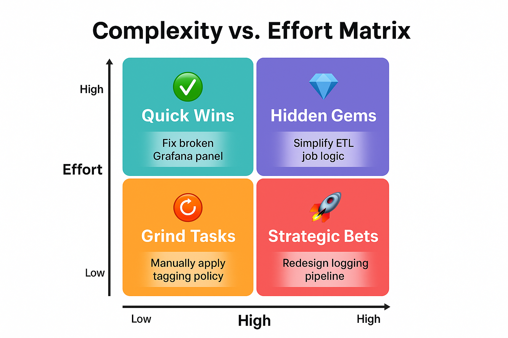

I kept repeating one phrase to myself while juggling observability initiatives across Azure, on-prem
systems, and stakeholder fire drills: "When everything is important, nothing is." I knew I had to
build a system to decide what actually mattered—or risk burning out delivering the wrong things
fast.

That's when I started combining two complementary tools: the **Complexity vs. Effort Matrix** and
the **Eisenhower Decision Matrix**. Together they give a full picture—not just _how hard_ something
is, but _whether it should be done at all right now_. My team shifted from reactive firefighting to
intentional delivery—and sprint planning debates that used to run 60+ minutes now close in under 20.

In this post I'll walk through both tools, why neither one alone is enough, and the five-tier system
I use every Monday to sort my backlog.

---

## The Prioritization Gap (And What It Costs)

Most platform and engineering teams know what good prioritization looks like in theory. In practice:

- You spend days on a low-impact feature that no one uses
- A small config change that could've saved hours sits on page 3 of the backlog
- Sprint planning becomes a negotiation over urgency rather than a deliberate choice

The root cause isn't laziness or bad intentions. It's that urgency and importance _feel_ the same in
the moment—especially in on-call cultures where anything that pages feels critical. Without an
external framework to separate them, every decision is a gut call.

---

## The Complexity vs. Effort Matrix: Technical Lens

> This matrix saved me when I had 17 tasks pending, each championed by a different team. I grabbed a
> whiteboard and plotted them—in fifteen minutes, the right next steps became obvious. Three tasks
> were Quick Wins we shipped the same week. Five Strategic Bets got scheduled with dedicated blocks.
> The remaining nine got delegated or dropped, freeing two engineers who had been stuck in grind
> work for nearly a month.

### How It Works

- **Effort**: Time, energy, or resources required to complete the work
- **Complexity**: Technical difficulty, risk, or uncertainty involved

### The Matrix

|                    | ✨ **Low Complexity**                                                | 🧠 **High Complexity**                                                                                                           |
| ------------------ | -------------------------------------------------------------------- | -------------------------------------------------------------------------------------------------------------------------------- |
| ⏱ **Low Effort**  | ✅ **Quick Wins** — _e.g. Fix broken alert rule, update runbook_     | 💎 **Hidden Gems** — _High complexity, lower time cost: underestimated wins that compound. e.g. Tune Prometheus recording rules_ |
| ⚙ **High Effort** | 🔁 **Grind Tasks** — _e.g. Apply IAM policies across 100+ resources_ | 🚀 **Strategic Bets** — _e.g. Re-architect distributed tracing pipeline_                                                         |

> **Pro Tip:** Color-code tasks on your sprint board by quadrant. It makes trade-offs visible at a
> glance—especially useful when negotiating scope with stakeholders.

---

## The Eisenhower Matrix: Strategic Lens

The Complexity/Effort Matrix tells you _how hard_ something is. It doesn't tell you _whether it
matters_ or _when_. That's where the Eisenhower Matrix adds the missing dimension.

### Two questions

- **Urgent?** → Does this have a near-term deadline or consequence if delayed?
- **Important?** → Does this meaningfully impact business outcomes or user experience?

|                      | ⚡ **Urgent**                                     | ⏳ **Not Urgent**                                          |
| -------------------- | ------------------------------------------------- | ---------------------------------------------------------- |
| ✨ **Important**     | 🔥 **Do Now** — _e.g. Fix active outage_          | 🧠 **Plan & Invest** — _e.g. Design scalable log pipeline_ |
| ❌ **Not Important** | ⏳ **Timebox** — _e.g. Cosmetic dashboard polish_ | 🪑 **Avoid** — _e.g. Refactor code no one runs_            |

---

## Why You Need Both

The Eisenhower Matrix alone can steer you toward urgent-but-shallow work. A "Do Now" task that takes
two weeks of complex engineering may not actually be the right call—a quicker alternative might ship
the same outcome in hours. Conversely, the Complexity/Effort Matrix alone has no notion of business
impact: a "Quick Win" that's low-effort and low-complexity is still waste if no one cares about the
outcome.

Combining both matrices forces two questions _simultaneously_: "Does this matter, and when?" and
"How much does this actually cost?" That overlap is where most prioritization mistakes happen.

---

## The 5 Execution Tiers

Overlaying both matrices produces 16 combinations (4 effort/complexity cells × 4 urgency/importance
cells). For practical day-to-day use, I collapse them into five tiers:

### 🔥 Tier 1 – Must-Do Now

- High urgency, high importance—regardless of complexity
- _e.g._ Patch active production incident, restart failing data pipeline
- **Action**: Start immediately. Resist context-switching away.
- **Constraint**: Cap at one or two per day. If more than two items qualify, something is being
  mis-categorized or stakeholder pressure is inflating urgency—push back and re-classify.

### ✅ Tier 2 – Strategic Leverage

- High importance, investment-worthy effort or complexity
- _e.g._ Redesign log ingestion pipeline, implement trace exemplars, SLO baseline rollout
- **Action**: Break into deliverables. Schedule focused time—don't let Tier 1 fires permanently
  crowd these out.

### 🛠 Tier 3 – Delegate or Automate

- Important, but execution is high-volume and low-complexity—grind work that burns engineers if it
  stays undelegated
- _e.g._ Apply bulk IAM policies, tag 100+ cloud resources, update alert routing config
- **Action**: Script it, delegate it, or batch it into a low-interruption block.

### ⏳ Tier 4 – Timebox or Defer

- Low importance, non-blocking
- _e.g._ Rename a dashboard panel, tweak CLI output style, minor UX polish
- **Action**: Timebox to prevent scope creep. Revisit during retrospectives.

### 🪑 Tier 5 – Eliminate

- No urgency, no measurable value
- _e.g._ Rewrite a script no one runs, rebuild a feature with zero users
- **Action**: Remove from the backlog without guilt.

---

## Optimization by Tier

| Tier   | Priority Level | Strategy                                                                   |
| ------ | -------------- | -------------------------------------------------------------------------- |
| Tier 1 | ✅ Critical    | Start your day here. One or two max—protect the rest of your day.          |
| Tier 2 | 💡 High        | Allocate 30–50% of weekly capacity here. This is where leverage compounds. |
| Tier 3 | 🛠 Medium      | Batch, delegate, or automate. Don't let grind crowd out strategy.          |
| Tier 4 | ⚠ Low         | Review at sprint retro. Two sprints at Tier 4 and it's Tier 5.             |
| Tier 5 | ❌ None        | Prune regularly. A clean backlog is a forcing function for focus.          |

---

## My Personal Workflow: How I Apply This Weekly

Every Monday, I:

1. Review all open backlog items
2. Tag each by effort and complexity (two minutes per task)
3. Classify urgency and importance with stakeholders during a 30-minute sync _(this holds only when
   someone in the room has authority to say no — without that, classification becomes negotiation)_
4. Apply the five-tier filter and re-sort the board
5. Share the priority map before the team standup

The biggest shift wasn't speed—it was that junior engineers could now _see_ why certain tasks sat in
the backlog. That visibility cut planning debates from 60+ minutes to under 20, and made it easier
to hand off Tier 3 work with confidence.

---

## Conclusion: Clarity Over Chaos

These two frameworks in combination aren't about moving faster. They're about making sure the work
that moves the needle gets to the top—consistently, visibly, and without a weekly argument over
urgency.

Whether you're scaling an observability platform, running an on-call rotation, or planning a
multi-cluster Kubernetes rollout—**prioritization is your highest-leverage engineering skill**.

The 4×4 template below is where to start. Fifteen minutes on Monday, consistent every week.

---

## ✅ 4x4 Prioritization Matrix Template

Each cell maps your task's effort/complexity cost (columns) against its urgency/importance context
(rows). Use this in Notion, Miro, or any sprint board.

| **Importance + Urgency ↓ / Effort + Complexity →** | ✅ Low Effort · Low Complexity                                                  | 🔁 High Effort · Low Complexity                                                        | 💎 Low Effort · High Complexity                                              | 🚀 High Effort · High Complexity                                                  |
| -------------------------------------------------- | ------------------------------------------------------------------------------- | -------------------------------------------------------------------------------------- | ---------------------------------------------------------------------------- | --------------------------------------------------------------------------------- |
| 🟢 **Important + Urgent**                          | ✅ **Tier 1: Do Now** — Quick Win — _e.g. Fix broken alert rule_                | ✅ **Tier 1: Do Now** — Accept the grind — _e.g. Bulk-remediate failing health checks_ | ✅ **Tier 1: Do Now** — Move fast — _e.g. Hotfix runaway Prometheus query_   | ✅ **Tier 1: Do Now** — All hands — _e.g. Patch core service under SLA breach_    |
| 🟡 **Important + Not Urgent**                      | 💡 **Tier 2: Plan Soon** — Quick Win — _e.g. Add exemplars to existing metrics_ | 🛠 **Tier 3: Delegate or Schedule** — _e.g. Apply IAM policies across 50 resources_    | 💡 **Tier 2: Investigate** — Hidden Gem — _e.g. Tune Loki label cardinality_ | 💡 **Tier 2: Deep Work** — Strategic Bet — _e.g. Observability platform redesign_ |
| 🔴 **Not Important + Urgent**                      | ⚠️ **Tier 4: Timebox** — _e.g. Rename a dashboard panel_                        | ⚠️ **Tier 4: Timebox** — _e.g. Bulk config formatting update_                          | ⚠️ **Tier 4: Question the urgency** — _e.g. Minor CLI behavior fix_          | ⚠️ **Tier 4: Drop or defer** — _e.g. Refactor low-traffic internal tool_          |
| ⚫ **Not Important + Not Urgent**                  | ⚠️ **Tier 4: Nice-to-Have** — _e.g. Cosmetic dashboard tweaks_                  | 🧹 **Tier 5: Eliminate** — _e.g. Cleanup unused log formatters_                        | 🧹 **Tier 5: Skip** — _e.g. Rewrite CLI for unused legacy script_            | 🧹 **Tier 5: Eliminate Immediately** — _e.g. Rebuild feature with zero users_     |

---

### 📌 Usage Instructions

- **Color-code** in your task manager:
  - Tier 1: ✅ Green
  - Tier 2: 💡 Blue
  - Tier 3: 🛠 Yellow
  - Tier 4: ⚠️ Orange
  - Tier 5: 🧹 Grey / ❌ Red
- **Filter weekly** using this template—15 minutes on Monday prevents hours of misalignment by
  Friday.
- **Visualize in a 4×4 grid** for team syncs or retrospectives.
