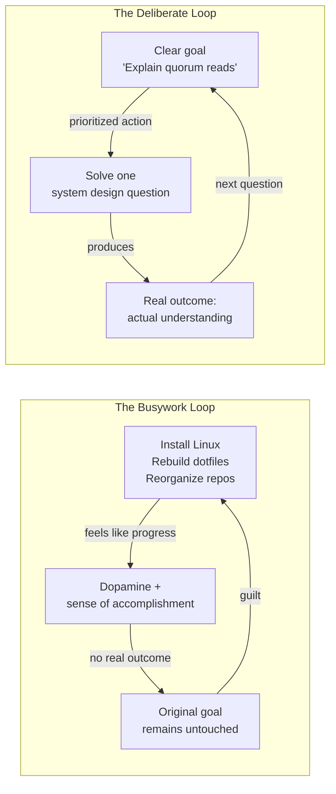

For a long time, I believed I had a discipline problem.

I wasn't wasting hours scrolling social media or binge-watching videos. I was always busy.

I would install a new Linux distribution.

Then configure my shell.

Then rebuild my development environment.

Then redesign my blog.

Then reorganize my Git repositories.

Then migrate my notes.

Then tweak my terminal theme.

Then optimize my project structure.

At the end of the day, I genuinely felt productive.

But one uncomfortable question eventually surfaced:

> **Why was I making so little progress on the things that actually mattered?**

That question led me to discover a pattern I suspect many engineers, developers, architects, and
technical professionals experience without realizing it.

This article is about that pattern.

---

## The Illusion of Progress

Imagine these two days.

### Day One

- Installed Fedora
- Configured Docker
- Installed VS Code
- Fixed terminal fonts
- Organized Git repositories
- Cleaned up an Astro blog
- Updated Terraform modules

Eight hours passed.

The day felt amazing.

Everything looked cleaner.

My machine was faster.

My setup felt "professional."

I slept feeling accomplished.

---

### Day Two

I spent ninety minutes reading a chapter from _Designing Data-Intensive Applications_.

I struggled.

I reread paragraphs.

I drew diagrams.

I questioned whether I really understood distributed systems.

After ninety minutes, I had only learned one concept.

The day felt terrible.

Yet if I compare the two days honestly, the second day contributed far more to my long-term career.

This is the paradox.

Our brain often rewards visible progress rather than meaningful progress.

---

## Productive Procrastination

Most people imagine procrastination as avoiding work entirely.

Scrolling Instagram.

Watching Netflix.

Playing games.

But there is another kind that is much harder to recognize.

It looks like work.

Psychologists sometimes call it **productive procrastination** or **structured procrastination**.

Instead of avoiding work, we replace an important task with another task that feels productive but
has a lower cognitive cost.

For engineers, it often looks like this:

- Installing a new operating system
- Rebuilding development environments
- Reorganizing folders
- Refactoring code that doesn't need refactoring
- Tweaking CI/CD pipelines
- Improving documentation before writing software
- Choosing fonts for a blog
- Migrating note-taking applications
- Learning yet another productivity system

Every one of these activities has value.

The problem begins when they consistently replace the work we claim is important.

---

## The Loop I Found Myself In

After observing my own behavior, I realized it followed a predictable cycle.

```
Large Goal
        ↓
Feels overwhelming
        ↓
Brain searches for an easier task
        ↓
Choose an optimization project
        ↓
Immediate progress
        ↓
Dopamine
        ↓
Sense of accomplishment
        ↓
Original goal remains untouched
        ↓
Guilt
        ↓
Repeat
```

Set side by side with the loop I actually wanted to be running, the contrast looks like this:



Notice something important.

There is no laziness in this loop.

There is plenty of effort.

The effort is simply directed somewhere safer.

---

## Why Engineers Fall Into This Trap

As software engineers, we solve deterministic problems all day.

Consider debugging a bootloader.

```
Problem
↓

Collect logs

↓

Identify root cause

↓

Apply fix

↓

Verify solution

↓

Done
```

The system gives continuous feedback.

Every command either succeeds or fails.

Progress is measurable.

Completion is obvious.

Now compare that with learning distributed systems.

There is no compiler.

There is no green checkmark.

There is no message saying:

> Congratulations. You now understand quorum consistency.

Conceptual learning rarely provides immediate feedback.

That uncertainty makes our brain uncomfortable.

---

## I Thought I Avoided Hard Work

Eventually I realized something surprising.

I don't avoid difficult work.

I've spent entire weekends debugging Kubernetes.

I've fixed broken Linux installations.

I've fought with Terraform.

I've debugged Azure authentication.

I've configured observability platforms.

Those tasks are objectively difficult.

So difficulty wasn't the problem.

The problem was **what kind of difficulty**.

---

## Two Types of Hard

### Mechanical Difficulty

Examples:

- Installing Linux
- Debugging Kubernetes
- Configuring Terraform
- Setting up Grafana
- Writing CI/CD pipelines

Characteristics:

- Usually one correct answer
- External feedback
- Clear finish line
- Progress every few minutes

This type of work feels satisfying.

---

### Conceptual Difficulty

Examples:

- Understanding CAP Theorem
- Designing an observability architecture
- Learning consensus algorithms
- Studying distributed databases
- Solving system design interviews

Characteristics:

- No obvious finish line
- Progress is invisible
- Understanding develops slowly
- Answers are often "it depends"

This type of work feels mentally expensive.

It demands sustained thinking rather than sustained activity.

---

## My Brain Loves Closed Loops

I noticed something else.

Almost all my distractions had one thing in common.

They ended cleanly.

Install complete.

Configuration complete.

Migration complete.

Repository organized.

Theme updated.

Every completed task released a small reward.

Conceptual learning rarely works that way.

Reading twenty pages may leave you with more questions than answers.

Ironically, that is often a sign that real learning has begun.

---

## Optimization Became My Comfort Zone

Optimization feels productive because it genuinely improves something.

A cleaner repository is better.

A faster laptop is better.

Better automation is better.

The problem isn't optimization itself.

The problem is using optimization as a substitute for creation.

Eventually I asked myself a difficult question.

> **Am I improving my tools because they need improvement, or because improving them is easier than
> thinking deeply?**

That question changed how I viewed my habits.

---

## Overwhelm Disguises Itself as Preparation

Suppose I write this in my planner.

> Study Observability

That sounds reasonable.

Until I realize what "observability" includes.

Metrics.

Logs.

Tracing.

Sampling.

Alerting.

SLOs.

Prometheus.

OpenTelemetry.

Grafana.

Distributed systems.

Networking.

Cloud platforms.

The task is enormous.

The brain naturally searches for something smaller.

Instead of studying observability, I install a new Linux distribution.

Now I have a task with a beginning, a middle, and an end.

The overwhelm disappears.

The important work does not happen.

---

## Preparation Has Diminishing Returns

This realization was uncomfortable.

I was spending far more time preparing to learn than actually learning.

Preparing to write.

Preparing to build.

Preparing to study.

Preparing to become productive.

Preparation feels safe because it avoids evaluation.

Real work eventually answers uncomfortable questions.

Do I actually understand this concept?

Can I solve this problem?

Can I explain this architecture?

Preparation never asks those questions.

Creation always does.

---

## The Metric I Was Measuring Was Wrong

I used to evaluate my day like this.

> Was I busy?

The answer was almost always yes.

A better question is:

> Did I spend meaningful time thinking?

Thinking is different from reading.

Thinking is different from configuring.

Thinking is different from watching tutorials.

Thinking means wrestling with ideas.

Drawing diagrams.

Explaining concepts.

Comparing trade-offs.

Solving problems without immediately looking for answers.

That is where expertise develops.

---

## What I'm Changing

Instead of trying to eliminate optimization work, I'm giving it boundaries.

### 1. Separate optimization from learning

Environment improvements get their own backlog.

Unless something blocks my work, I don't stop studying to fix my setup.

---

### 2. Shrink learning tasks

Instead of:

> Learn distributed systems

I write:

- Explain quorum reads.
- Draw consistent hashing.
- Read three pages.
- Solve one system design question.
- Explain fan-out in my own words.

Small conceptual wins reduce overwhelm.

---

### 3. Ask one question before switching tasks

Whenever I catch myself opening a terminal to "fix something," I ask:

> **What thinking am I trying to avoid?**

Sometimes the answer is immediate.

"I was supposed to be reading."

"I was supposed to design."

"I was supposed to solve an interview question."

The awareness alone interrupts the habit.

---

### 4. Measure thinking, not activity

Instead of counting hours worked, I count minutes spent on deliberate thinking.

One hour of focused conceptual work often produces more long-term value than five hours of
optimization.

---

### 5. Build before polish

This has become my new rule.

Before improving tools, create something.

Before reorganizing notes, understand one new concept.

Before redesigning the blog, publish one article.

Before improving infrastructure, build one feature.

Creation comes first.

Optimization comes second.

---

## A Framework I Now Use

Whenever I begin a task, I ask four questions.

#### Does this directly move me toward my long-term goal?

If not, why am I doing it now?

---

#### Is this work necessary, or merely satisfying?

Necessary work stays.

Comfort work goes into the backlog.

---

#### Am I creating something or preparing to create?

Preparation is important.

But it should never dominate creation.

---

#### What difficult thinking am I avoiding?

This question is often the most revealing.

---

## Final Thoughts

The biggest surprise wasn't discovering that I procrastinated.

It was discovering that I procrastinated with work.

The tasks looked productive.

They were useful.

Some of them were genuinely valuable.

But usefulness is not the same as importance.

Installing another operating system will not make me a better architect.

Changing my terminal theme will not improve my understanding of distributed systems.

Reorganizing my notes will not prepare me for system design interviews.

Those things may have their place.

They simply cannot become the work.

The real work is slower.

Messier.

Less rewarding in the moment.

It involves confusion.

Incomplete understanding.

Repeated failure.

Long periods where progress is invisible.

Ironically, that is exactly what mastery looks like.

If this article describes you, remember this:

> **Your career is unlikely to be limited by the quality of your tools. It is far more likely to be
> limited by the amount of time you spend doing difficult thinking.**

Protect that time.

Everything else is secondary.
